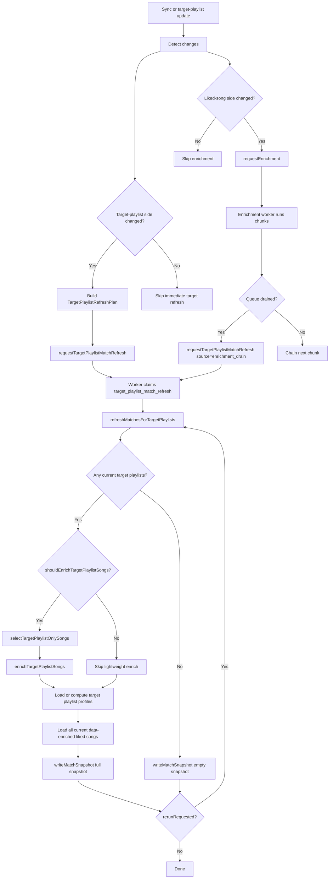

# Target Playlist Match Refresh Implementation Plan

## Goal

Replace the current split profile-side flow (`checkAndRematch` + `playlist_lightweight_enrichment` + inline `requestRematch`) with one clear owner for target-playlist-driven suggestion updates.

This plan keeps the liked-song enrichment pipeline as the owner of candidate-side enrichment and introduces a new `target_playlist_match_refresh` workflow as the owner of snapshot publishing.

The result should be:

- one mental model for suggestion publishing
- less duplicate work
- fewer correctness gaps
- clearer naming in code and database

## Snapshot Invariant

This is the most important rule in the new architecture.

- The latest `match_context` must represent the full current published suggestion set for the account.
- Only `target_playlist_match_refresh` may publish `match_context` and `match_result`.
- The liked-song enrichment pipeline must never publish partial chunk snapshots.
- An empty target set is represented by an explicit empty snapshot, not by deleting old contexts.
- Publishing a snapshot must be atomic so a failed refresh cannot expose a half-written latest snapshot.

This matches how the app already reads suggestion state today through `getLatestMatchContext`.

## Naming To Use

These names should be standardized in code, worker jobs, and database fields.

### Domain Terms

- `targetPlaylist`
- `targetPlaylistSongs`
- `likedSongs`
- `matchSnapshot`

### Workflow And Job Names

- job type: `target_playlist_match_refresh`
- trigger function: `requestTargetPlaylistMatchRefresh`
- worker executor: `executeTargetPlaylistMatchRefreshJob`
- top-level workflow: `refreshMatchesForTargetPlaylists`
- persistence step: `writeMatchSnapshot`
- target-playlist-song enrichment step: `enrichTargetPlaylistSongs`
- selector for enrichment candidates: `selectTargetPlaylistOnlySongs`

### Planning Names

- request/decision object: `TargetPlaylistRefreshPlan`
- source enum: `TargetPlaylistRefreshSource`

## Database Renames

To keep naming coherent, the database should be renamed too.

- `playlist.is_destination` -> `playlist.is_target`
- `user_preferences.rematch_job_id` -> `user_preferences.target_playlist_match_refresh_job_id`
- add job enum value `target_playlist_match_refresh`
- retire old enum values `rematch` and `playlist_lightweight_enrichment` after cutover

Supporting database helpers should be renamed to match:

- `claim_pending_target_playlist_match_refresh_job`
- `sweep_stale_target_playlist_match_refresh_jobs`
- `mark_dead_target_playlist_match_refresh_jobs`

`match_context` and `match_result` do not need renaming.

Important note:

- Postgres enum values should be retired, not removed.

## Ownership Model

There are two independent kinds of changes that affect suggestions.

### Candidate-Side Changes

Definition:

- liked songs were added
- liked songs were removed
- liked songs gained new enrichment artifacts

Owner:

- existing liked-song enrichment pipeline

Responsibility:

- enrich liked songs in chunks
- mark songs as pipeline-processed when enrichment is complete
- request target-playlist refresh after the enrichment queue drains
- never publish `match_context` or `match_result`

### Target-Playlist-Side Changes

Definition:

- target playlists were added, removed, or toggled
- target playlist tracks changed
- target playlist metadata changed
- target-playlist songs need lightweight profile-side enrichment

Owner:

- new `target_playlist_match_refresh` workflow

Responsibility:

- enrich target-playlist songs only when needed
- rebuild the full current published suggestion snapshot
- write a new `matchSnapshot` or an empty snapshot when no targets remain

## Why The Current Design Is Hard To Reason About

Today, target-playlist-side updates are spread across three places:

- `src/routes/api/extension/sync.tsx` calls `checkAndRematch`
- `src/lib/workflows/playlist-sync/trigger-lightweight-enrichment.ts` queues a separate lightweight job
- `src/worker/execute.ts` runs `requestRematch` inline from the lightweight job

At the same time, the chunked liked-song enrichment pipeline also writes match snapshots.

That creates several problems:

- rematch can be triggered twice
- two different workflows can publish competing snapshots
- the latest snapshot can accidentally represent only a chunk subset of songs
- target-playlist changes and liked-song changes are mixed together
- names like `rematch` and `lightweight` describe implementation details, not ownership

## Key Product Rules

These rules should remain true after the refactor.

1. Liked songs are the only suggestion candidates.
2. Target-playlist songs improve target playlist profiles.
3. A song can belong to both liked songs and target playlists.
4. The target-playlist-song enrichment path must exclude currently liked songs.
5. Removing all target playlists should not run matching. It should write an empty snapshot.
6. Removing one target playlist while others remain still requires a refresh against the remaining target playlists.
7. Liked-song removal should remove the song from published suggestions.
8. Target-playlist-song enrichment stays lightweight only by default.

Rule 6 matters because the matching layer stores only top-N results per song. If playlist `A` disappears, playlist `B` may need to move into the visible result set.

## Final Architecture

### Keep As-Is In Principle

- `requestEnrichment(accountId)`
- chunked liked-song enrichment pipeline
- item-status tracking for processed liked songs

### Replace

- `checkAndRematch`
- top-level `triggerLightweightEnrichment`
- `rematch` worker job
- `playlist_lightweight_enrichment` worker job
- chunk-level publishing of match snapshots from the enrichment pipeline

### Introduce

- `requestTargetPlaylistMatchRefresh(accountId, plan)`
- `target_playlist_match_refresh` worker job
- `refreshMatchesForTargetPlaylists(accountId, plan)`

## High-Level Flow



## Flow By Scenario

### 1. Initial Onboarding Sync, No Data Yet

State:

- user has no liked songs in DB
- user has no playlists in DB
- user has not selected any target playlists yet

Flow:

1. sync route imports liked songs, playlists, and playlist tracks
2. sync route queues `requestEnrichment`
3. no target refresh is needed yet
4. liked-song enrichment runs and marks songs as processed
5. no suggestions are published yet because no targets exist

Why this matters:

- this allows enrichment to start early so useful song data is ready when the user later selects targets

### 2. User Selects Target Playlists For The First Time

Flow:

1. onboarding target selection updates `playlist.is_target`
2. server function queues `requestTargetPlaylistMatchRefresh`
3. if target-playlist songs need lightweight enrichment, that runs first
4. the refresh workflow publishes the first full snapshot

### 3. In-App Sync, Only Liked Songs Changed

Flow:

1. sync route detects liked-song changes
2. sync route queues `requestEnrichment`
3. liked-song enrichment runs in chunks
4. when the enrichment queue drains, it queues `requestTargetPlaylistMatchRefresh`
5. the refresh workflow publishes the new full snapshot

Important note:

- if the same sync also removed liked songs, an earlier refresh may remove stale candidates before newly added songs are fully enriched
- those newly added songs appear in the published snapshot only after the enrichment-drain refresh

### 4. Liked Songs Were Removed

Flow:

1. sync route detects liked-song removals
2. queue `requestTargetPlaylistMatchRefresh`
3. set `shouldEnrichTargetPlaylistSongs = false`
4. publish a new full snapshot without the removed candidates

Important note:

- a removed liked song can still remain inside a target playlist, but that overlap does not by itself require target-playlist-song enrichment

### 5. Target Playlist Tracks Changed

Flow:

1. sync route detects that one or more target playlists had track membership changes
2. build a `TargetPlaylistRefreshPlan` with:
   - `shouldEnrichTargetPlaylistSongs = true`
3. queue `requestTargetPlaylistMatchRefresh`
4. worker runs lightweight target-playlist-song enrichment if needed
5. worker publishes the refreshed full snapshot

### 6. Target Playlist Metadata Changed Only

Examples:

- name changed
- description changed

Flow:

1. sync route detects metadata changes on an existing target playlist
2. build a plan with:
   - `shouldEnrichTargetPlaylistSongs = false`
3. queue target refresh
4. worker reuses cached profiles where valid and recomputes only what is stale or missing
5. worker publishes a fresh full snapshot

### 7. One Target Playlist Was Removed Or Toggled Off, Others Remain

Flow:

1. sync or settings update removes a playlist from the target set
2. build a plan with:
   - `shouldEnrichTargetPlaylistSongs = false`
3. queue target refresh
4. worker recomputes against the remaining target playlists only
5. worker publishes the refreshed full snapshot

### 8. All Target Playlists Were Removed

Flow:

1. sync or settings update makes the target playlist set empty
2. build a plan with:
   - `shouldEnrichTargetPlaylistSongs = false`
3. queue target refresh
4. worker sees there are zero current target playlists
5. worker writes an explicit empty snapshot
6. no profile build, no matching, no target-song enrichment

### 9. Non-Target Playlist Changed Only

Flow:

1. sync detects changes only in playlists that are not targets
2. do nothing
3. no enrichment, no refresh, no publish

## TargetPlaylistRefreshPlan

The plan object should stay small and expressive.

```ts
type TargetPlaylistRefreshSource =
  | "sync"
  | "target_playlists_updated"
  | "enrichment_drain"
  | "manual";

type TargetPlaylistRefreshPlan = {
  source: TargetPlaylistRefreshSource;
  shouldEnrichTargetPlaylistSongs: boolean;
  rerunRequested?: boolean;
};
```

Notes:

- this plan can live in `job.progress`
- the job must still re-read current DB state at execution time
- the plan is an optimization hint, not a source of truth
- `rerunRequested` exists so a second pass can run after mid-flight changes
- richer sync-time change classification can exist locally in the sync route or planner, but does not need to be persisted on the job

## Trigger Decision Table

| Event | Queue `requestEnrichment` | Queue `requestTargetPlaylistMatchRefresh` | `shouldEnrichTargetPlaylistSongs` |
| --- | --- | --- | --- |
| new liked songs added | yes | after enrichment drain | n/a |
| liked songs removed only | no | yes | false |
| target playlist added | no | yes | true |
| target playlist toggled on | no | yes | true |
| target playlist tracks changed | no | yes | true |
| target playlist metadata changed | no | yes | false |
| target playlist removed, others remain | no | yes | false |
| target playlist toggled off, others remain | no | yes | false |
| all target playlists removed | no | yes | false |
| non-target playlist changed only | no | no | false |
| both liked songs and target playlists changed | yes if needed | yes | depends on target-playlist side |

## Core Implementation Strategy

### 1. Make Snapshot Publishing Atomic And Shared

The current rematch path and the chunked liked-song pipeline duplicate logic.

`writeMatchSnapshot` should be an app-level wrapper around one atomic database publish step.

Recommended shape:

- build snapshot inputs in TypeScript
- publish the `match_context` and `match_result` rows through a single database function or transactional RPC

Why:

- if publishing fails halfway through, the old latest snapshot should remain the published truth
- retries become safe because a failed publish means nothing new became visible

Refactor shared lower-level steps into reusable helpers:

- load target playlist profiles
- load matching songs and embeddings
- compute context hashes
- atomically write `match_context` and `match_result`

Suggested shared functions:

- `loadTargetPlaylistProfiles`
- `buildMatchingSongs`
- `writeMatchSnapshot`

Important rule:

- extracted publish logic must only be called from target-playlist refresh
- enrichment may reuse read/build helpers, but not the final publish helper

### 2. Build The New Target-Playlist Refresh Workflow

Create a new folder:

- `src/lib/workflows/target-playlist-match-refresh/`

Suggested files:

- `trigger.ts`
- `orchestrator.ts`
- `planner.ts`
- `profiles.ts`
- `types.ts`
- `write-match-snapshot.ts`

Responsibilities:

- `trigger.ts`: idempotent request helper for the job
- `planner.ts`: build `TargetPlaylistRefreshPlan` from sync or settings events
- `orchestrator.ts`: execute refresh branches
- `profiles.ts`: cached profile loading and fallback compute
- `types.ts`: shared types such as `TargetPlaylistRefreshPlan` and `TargetPlaylistRefreshSource`
- `write-match-snapshot.ts`: publish the full snapshot

### 3. Collapse Two Old Jobs Into One New Job

Remove the top-level distinction between:

- `rematch`
- `playlist_lightweight_enrichment`

Replace both with:

- `target_playlist_match_refresh`

Why:

- there is one profile-side owner
- there is one snapshot publisher
- no more speculative rematch job followed by inline rematch inside another job

### 4. Keep The Existing Liked-Song Pipeline, But Change Its Responsibility

Do not fold chunked liked-song enrichment into target-playlist refresh.

That pipeline still owns:

- candidate-side enrichment
- first-time enrichment of liked songs
- item-status and progress tracking
- refresh triggering after the enrichment queue drains

But:

- the liked-song pipeline no longer writes `match_context` or `match_result`

## File-By-File Plan

### Database

Create migrations to:

- add a single atomic snapshot-publish function used by `writeMatchSnapshot`
- rename `playlist.is_destination` -> `playlist.is_target`
- rename `user_preferences.rematch_job_id` -> `target_playlist_match_refresh_job_id`
- add job enum `target_playlist_match_refresh`
- add unique active-job index for that type
- add poll/sweep/dead-letter SQL helpers for the new type
- retire old `rematch` and `playlist_lightweight_enrichment` enum values after code switch

Because this is a single-developer app, a direct rename migration is acceptable.

Important note:

- `is_destination` -> `is_target` is a breaking rename, so the migration and app code must ship together.

### `src/lib/data/jobs.ts`

Add:

- `createTargetPlaylistMatchRefreshJob`
- `getOrCreateTargetPlaylistMatchRefreshJob`
- `claimTargetPlaylistMatchRefreshJob`
- `sweepStaleTargetPlaylistMatchRefreshJobs`
- `markDeadTargetPlaylistMatchRefreshJobs`
- helpers for coalescing and setting `rerunRequested` on the active refresh job via `job.progress`

Remove later:

- `getOrCreateRematchJob`
- `claimRematchJob`
- `claimLightweightEnrichmentJob`

### `src/lib/domains/library/accounts/preferences-queries.ts`

Rename pointer helpers:

- `updateRematchJobId` -> `updateTargetPlaylistMatchRefreshJobId`
- `clearRematchJobId` -> `clearTargetPlaylistMatchRefreshJobId`
- `getRematchJobId` -> `getTargetPlaylistMatchRefreshJobId`

### `src/lib/workflows/enrichment-pipeline/trigger.ts`

Keep:

- `requestEnrichment`

Rules:

- `requestEnrichment` remains candidate-side only
- it does not publish matches

Remove:

- `checkAndRematch`

### `src/lib/workflows/enrichment-pipeline/stages/matching.ts`

Change this file so it no longer publishes snapshots.

Remove responsibilities for:

- creating `match_context`
- inserting `match_result`
- marking songs as `is_new`

If needed, keep only shared readiness or matching-preparation helpers that can be reused elsewhere.

### `src/lib/workflows/enrichment-pipeline/orchestrator.ts`

Keep:

- enrichment execution
- `markPipelineProcessed`

Remove:

- snapshot publishing responsibilities

Add:

- when the final chunk completes with `hasMoreSongs = false`, call `requestTargetPlaylistMatchRefresh({ source: "enrichment_drain", ... })`

Important note:

- drain should be detected from chunk execution completion, not from timers or polling job counts

### `src/lib/workflows/playlist-sync/lightweight-enrichment.ts`

Refactor into target-playlist-refresh-owned helpers.

Changes:

- rename `runLightweightEnrichment` -> `enrichTargetPlaylistSongs`
- add or rename selector helper to `selectTargetPlaylistOnlySongs`
- fix the liked-song exclusion bug: use `unliked_at`, not `deleted_at`
- remove top-level job assumptions from this module
- keep this path lightweight only by default

### `src/routes/api/extension/sync.tsx`

Replace the current end-of-sync behavior.

Current:

- `requestEnrichment(accountId)`
- `checkAndRematch(accountId)`
- direct `triggerLightweightEnrichment(accountId, "sync")`

New:

1. detect liked-song-side changes
2. detect target-playlist-side changes
3. queue `requestEnrichment` only when the liked-song side changed and enrichment is needed
4. queue `requestTargetPlaylistMatchRefresh` for:
   - liked-song removals
   - target-playlist-side changes
5. if new liked songs were added, rely on enrichment drain to request the refresh

Important detail:

- playlist removals need semantic detection before deleting rows
- the sync path must capture whether a removed playlist was a target playlist before it disappears from the database

### `src/lib/workflows/spotify-sync/playlist-sync.ts`

Extend return values so sync can know whether target playlists were affected.

Capture target removals inside `PlaylistSyncService.syncPlaylists` before deletion.

Suggested additions:

- `removedTargetPlaylistIds: string[]`
- `createdTargetPlaylistIds: string[]`
- `updatedTargetPlaylistIds: string[]`
- `hasTargetPlaylistMetadataChanges: boolean`

The same principle applies to playlist track sync: it should expose whether changed playlists intersect the target set.

These richer change facts are for sync-time planning only and do not need to be stored in `TargetPlaylistRefreshPlan`.

### `src/lib/server/onboarding.functions.ts`

When target playlists are saved:

- update `is_target`
- queue `requestTargetPlaylistMatchRefresh`
- optionally queue `requestEnrichment` if liked songs exist and enrichment may still be incomplete

This is the missing first-time-target-selection hook.

### `src/worker/execute.ts`

Remove:

- inline `requestRematch`
- separate lightweight-enrichment executor
- rematch executor

Add:

- `executeTargetPlaylistMatchRefreshJob`

Execution flow:

1. load the plan from `job.progress`
2. call `refreshMatchesForTargetPlaylists(accountId, plan)`
3. if mid-flight changes requested another pass, rerun once with `rerunRequested`
4. mark job completed or failed

Rule:

- this is the only path that calls `writeMatchSnapshot`
- on a running refresh job, new triggers should set `rerunRequested` in `job.progress` rather than creating another active refresh job

### `src/worker/poll.ts`

Keep worker priority order:

1. enrichment job
2. target playlist match refresh job

Important note:

- priority does not change the single-publisher rule
- enrichment finishing later must request refresh after drain

### `src/worker/index.ts`

Rename stale-job sweep and dead-letter calls to the new job type.

## Detailed Behavior Inside `refreshMatchesForTargetPlaylists`

Suggested control flow:

1. read current target playlists from DB
2. if zero target playlists exist:
   - call `writeMatchSnapshot` with zero playlists and zero matches
   - return
3. if `plan.shouldEnrichTargetPlaylistSongs` is true:
   - `selectTargetPlaylistOnlySongs`
   - `enrichTargetPlaylistSongs`
4. load target playlist profiles:
   - reuse cached profiles when valid
   - compute only missing or stale profiles
5. load all current data-enriched liked songs
6. call `writeMatchSnapshot` to publish the full snapshot
7. if `rerunRequested` was set during execution, run one more pass against current DB state

`writeMatchSnapshot` should:

- compute context metadata for the full current candidate set plus target set
- compare `contextHash` to the latest equivalent snapshot
- no-op when unchanged
- write new `match_context`
- write new `match_result`
- mark songs with suggestions as `is_new`
- handle the zero-target case without a separate writer
- fail atomically so the previous latest snapshot remains current on publish errors

Profile cache validity should remain owned by `PlaylistProfilingService`.

- do not add a second cache policy in the planner
- call the profiling service normally and let its `contentHash` / `modelBundleHash` logic decide reuse

## Edge Cases And Things Easy To Overlook

### 1. First Target Selection After Initial Sync

The current architecture under-serves this case. The new target refresh flow must make it explicit.

### 2. Removed Target Playlist Detection During Sync

If playlist rows are deleted before the planner sees them, the sync route loses the fact that a target playlist disappeared. Capture that fact inside `PlaylistSyncService` before deletion.

### 3. Liked-Song Removal Only

Liked-song removal should refresh the snapshot, but should not trigger target-playlist-song enrichment.

### 4. Target-Playlist Removal Only

- if zero targets remain: write empty snapshot only
- if targets remain: refresh snapshot against remaining targets

### 5. No Liked Songs Exist

Target refresh should still be valid and cheap. It should simply produce an empty snapshot.

### 6. Target Refresh While Another Target Refresh Is Running

Use the same active-job pattern as enrichment, but add `rerunRequested` so one follow-up pass can run after mid-flight changes.

### 7. Target Refresh While Enrichment Is Running

Refresh may run before enrichment finishes, but enrichment must request another refresh after drain. Enrichment itself never publishes the snapshot.

### 8. Cached Profiles Missing During Removal-Only Refresh

Do not assume cached profiles always exist. If an unchanged remaining target playlist has no cached profile, compute it.

### 9. Refresh Publish Failure

If `writeMatchSnapshot` fails, the old latest snapshot must remain current. Job retry should be safe and should never leave a partially-published latest snapshot visible.

### 10. Partial Playlist Track Sync Failures

The current sync path can silently skip some per-playlist failures. The planner must not build a false refresh plan from incomplete track sync data.

### 11. Current Selector Bug

`src/lib/workflows/playlist-sync/lightweight-enrichment.ts` uses `deleted_at` against `liked_song`. The real column is `unliked_at`. Fix this as part of the refactor.

## Explicitly Not Chosen

### Keep `checkAndRematch` And Add A Boolean Gate

Not chosen because it preserves split ownership and still leaves hidden correctness gaps.

### Keep Separate `lightweight` And `rematch` Jobs

Not chosen because it keeps the mental model fragmented and duplicates job plumbing.

### Let The Enrichment Pipeline Publish Chunk Snapshots

Not chosen because latest-context reads make chunk snapshots unsafe as the global published state.

### Store Every Score For Every Playlist So Removals Can Be Pure Filtering

Not chosen for now because it adds storage and complexity just to avoid some refresh work. For this app, recomputing the remaining target-set snapshot is simpler and cleaner.

## Testing Plan

Add or update tests for these cases:

1. initial sync with no target playlists selected does not publish suggestions
2. first target playlist selection publishes the first full snapshot
3. new liked songs trigger refresh only after enrichment drain
4. liked-song removal republishes snapshot without removed songs
5. target playlist track changes run lightweight target-song enrichment and republish
6. metadata-only target changes skip lightweight enrichment and republish
7. target playlist removed while others remain republishes against remaining targets
8. all target playlists removed writes an explicit empty snapshot
9. target-playlist-song selector excludes currently liked songs
10. concurrent refresh requests coalesce with `rerunRequested`
11. enrichment finishing during refresh causes one follow-up refresh after drain
12. target refresh is the only writer of `match_context` and `match_result`
13. target refresh no-ops when resulting `contextHash` is unchanged

## Rollout Plan

1. fix the `deleted_at` -> `unliked_at` bug in target-playlist lightweight enrichment
2. add atomic snapshot-publish DB support, DB renames, new job type, and retire-old-enum strategy
3. extract shared read/build/profile helpers
4. remove snapshot publishing from the enrichment pipeline
5. add target-playlist refresh workflow as the sole publisher
6. switch sync, onboarding, liked-song removal, and enrichment-drain triggers to request refresh
7. add coalescing via `rerunRequested`
8. remove old rematch and lightweight job execution paths
9. delete obsolete helpers and finalize renames

## Success Criteria

The refactor is successful when all of the following are true:

- there is one clear owner for target-playlist-side suggestion refreshes
- `target_playlist_match_refresh` is the only publisher of match snapshots
- latest `match_context` always represents the full current published suggestion set
- snapshot publishing is atomic; failed refreshes leave the previous snapshot current
- `checkAndRematch` no longer exists
- top-level `playlist_lightweight_enrichment` and `rematch` jobs no longer exist
- first target selection after onboarding reliably creates suggestions
- liked-song removal republishes without target-song enrichment
- all-target removal writes an empty snapshot without running matching
- removal-only target changes skip unnecessary target-song enrichment
- liked-song enrichment pipeline still owns candidate-side enrichment
- enrichment requests refresh after queue drain, not after every chunk
- naming consistently uses `target playlist` rather than vague `destination` or implementation-specific `rematch`
