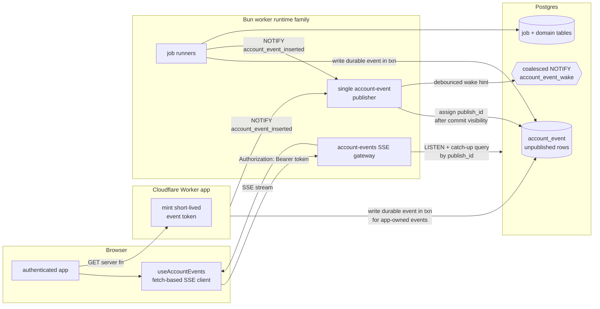

# Account events and browser push

Status: **proposed major follow-up refactor, confirmed by transport/host spike and hardened for build**.

Goal: replace browser polling for background-job freshness with a **portable, account-scoped push system** that keeps PostgreSQL as the source of truth and does **not** make Supabase Realtime part of the core app contract.

---

## 1. Decision summary

### Chosen direction

Build a new **account-events subsystem** with these pieces:

1. a durable Postgres `account_event` outbox for semantic account events
2. a single-writer publish-order step that assigns the SSE replay cursor after rows are visible, avoiding BIGSERIAL out-of-order commit skips [spike Q5][spike S17]
3. `LISTEN` / `NOTIFY` as a coalesced low-latency wake-up path, not the durable source of truth [spike Q4][spike S12]
4. a Bun-hosted **fetch-based SSE gateway** in the worker runtime family (same VPS-side world as the job worker, not the Cloudflare app tier) [spike S8]
5. a browser subscription hook that updates React Query caches and route-specific read models
6. existing polling retained only as a fallback when the stream is unavailable

### Why this, not Supabase Realtime

Supabase Realtime would likely be the shortest path to browser push, but it would also make the app depend on:

- Supabase publications
- Supabase RLS policies for live tables
- Supabase JWT issuance / shape
- Supabase-specific client behavior in a core user-facing path

That is a bad trade if leaving Supabase should stay practical later. This plan depends only on:

- PostgreSQL tables + `LISTEN` / `NOTIFY`
- plain HTTP SSE
- app-issued auth tokens

**"Realtime" is a Supabase server, not a Postgres feature.** Postgres itself has
no browser-push product — it has the *ingredients*: `LISTEN` / `NOTIFY` for
wake-ups and logical replication / logical decoding for change-data-capture.
Supabase Realtime is a separate Elixir/Phoenix service that reads the WAL via
logical replication, authorizes channels through Supabase RLS, and fans out to
browsers over its own WebSocket protocol. Self-hosting Supabase means that server
is already running on the box — but using it re-couples the core push path to
Supabase's WAL publications, RLS model, and client library. This plan instead
builds the browser-facing tier directly on the portable Postgres primitives
(the same CDC ingredients Realtime uses internally, minus the coupling), so the
push path survives a move off the Supabase stack.

**Load-bearing premise (firm as of 2026-07-08):** portability off the Supabase
stack is a hard product requirement, which is the sole reason Supabase Realtime
is rejected here. If that ever softens — if self-hosted Postgres is the permanent
home — Realtime (already running under self-hosted Supabase) is dramatically less
work than this subsystem, and this initiative should be reopened rather than
continued. Every task below inherits this premise; it is the single assumption
that, if it flips, invalidates the plan.

### Why this, not a Cloudflare-owned SSE/WS fanout layer

Cloudflare Workers can stream SSE responses, but the app tier is intentionally **stateless** and separate from the Bun worker process. If the Cloudflare tier owned long-lived browser connections, it would also need to own **connection coordination** across instances. In practice that means introducing another stateful subsystem such as Durable Objects or another external bus.

That would give us **two** cross-process coordination systems:

- PostgreSQL for jobs and durable state
- Cloudflare coordination for browser fanout

The Bun worker side is already always-on and already talks to Postgres directly. Hosting the push gateway there keeps the stateful coordination boundary in one place.

---

## 2. Current pull points this plan replaces

### 2.1 Core browser polling in scope

| Path | Current behavior | Replacement |
| --- | --- | --- |
| `src/lib/hooks/useActiveJobs.ts` | polls `getActiveJobs()` every 5 s while work is active, 15 s while idle | bootstrap snapshot + SSE-driven cache updates; keep a slow fallback poll only while disconnected |
| `src/routes/_authenticated/route.tsx` (`useActiveJobCompletionEffects`) | infers completion edges from polled booleans, then invalidates queries | consume terminal account events directly in the app shell |
| `src/routes/_authenticated/match.tsx` | bounded 3 s building-recovery poll while `/match` is still `{status:"building"}` | retry deck on `match_snapshot_published`; keep bounded fallback only for cold-start/disconnect |
| `src/routes/_authenticated/match.tsx` (future parked-on-`/match` refresh gap) | no reliable trigger after background append completes | refetch active deck on `match_deck_appended` |
| `src/features/liked-songs/hooks/useLikedSongsPageData.ts` | polls liked-song stats every 5 s while enrichment is running | invalidate stats on enrichment progress / terminal events |
| `src/features/liked-songs/hooks/useLikedSongsCollection.ts` | polls collection every 5 s while any loaded row is unsettled | invalidate or patch collection from enrichment events; retain fallback only when stream is unavailable |

### 2.2 Adjacent account-state polls worth absorbing later

These are not worker-completion-specific, but the same account-events pipe can carry them later:

| Path | Current behavior | Later event |
| --- | --- | --- |
| `src/features/billing/hooks/usePostPurchaseReturn.ts` | polls `getBillingState()` every 2 s for up to 30 s after checkout return | `billing_state_changed` |
| `src/features/onboarding/hooks/useCheckoutPolling.ts` | same 2 s / 30 s billing poll during onboarding | `billing_state_changed` |

### 2.3 Polls explicitly **out of scope** for phase 1

These are browser ↔ extension or browser-local checks, not worker-completion freshness:

| Path | Why it stays separate |
| --- | --- |
| `src/lib/extension/useExtensionSyncStatus.ts` | polls extension-owned `GET_STATUS`; truth lives in the extension, not the Bun worker |
| `src/features/dashboard/hooks/useDashboardSync.ts` | orchestrates extension install / Spotify reconnect / extension sync state |
| `src/features/onboarding/components/InstallExtensionStep.tsx` | polls local extension presence + Spotify connection |
| `src/lib/extension/useSpotifyReconnectState.ts` | polls the extension for token recovery |

### 2.4 Worker-side polling that should gain notify wake-ups too

This doc is primarily about **browser push**, but the same design review found obvious worker wake-up opportunities:

| Path | Current behavior | Future change |
| --- | --- | --- |
| `src/worker/poll.ts` | library-processing jobs poll every 5 s | add `NOTIFY` fast path; keep poll as safety net |
| `src/worker/poll-match-deck-jobs.ts` | deck jobs poll every 5 s | add `NOTIFY` fast path; keep poll as safety net |
| `src/worker/poll-audio-feature-backfill.ts` | audio backfill jobs poll every 5 s | optional later `NOTIFY` fast path |
| `src/worker/poll-extension-sync.ts` + `src/worker/notify-listener.ts` | already uses `LISTEN` / `NOTIFY` as primary wake-up | keep as the pattern to copy |

Notable existing constraint:

- `supabase/migrations/20260706000010_enqueue_match_review_deck_job.sql` explicitly skipped `pg_notify` for deck jobs to keep scope tight.

### 2.5 Timers considered and intentionally left as timers

A full codebase sweep (not just the tables above) surfaced these timer-driven
mechanisms. They are deliberately **not** in scope — listed here so the inventory
is provably complete rather than silently omitting them:

| Path | Timer | Why it stays a timer |
| --- | --- | --- |
| `src/worker/sweep.ts` | 60 s | Stale-lease reclaim / dead-letter / idle-enrichment recovery — a wall-clock repair path; `NOTIFY` is the wrong tool for "a lease went stale". |
| `src/worker/poll-match-deck-jobs.ts` (`startMatchDeckJobSweep`) | 60 s | Deck-job stale-lease sweep, same rationale. |
| `src/worker/poll-audio-feature-backfill.ts` (sweep) | 60 s | Audio-backfill stale-lease sweep, same rationale. |
| `src/worker/execute.ts` (`startHeartbeat`) | 30 s | Per-job lease renewal while a job runs — liveness, not freshness. |
| `src/worker/keep-alive.ts` | 4 d | DB keep-warm ping; not freshness. |
| `src/worker/db-backup.ts` | 24 h | Backup scheduler; not freshness. |
| `src/features/dashboard/hooks/useDashboardSync.ts` | 4 s (second loop) | Extension-installed / Spotify-connected detection, separate from the `GET_STATUS` poll; extension-owned truth (§2.3). |
| `src/routes/_authenticated/checkout/success.tsx` | 35 s one-shot | UI "taking longer" affordance, not a data poll (billing switch is §2.2 / phase 6). |

The worker sweeps in particular are the **repair path by design** — the same
role the browser fallback polls keep after the switch. They stay as timers.

Housekeeping noticed during the sweep (not part of this plan): a stale doc
comment in `src/features/onboarding/hooks/useOnboardingNavigation.ts` references
a `usePolledPhaseJobIds()` hook that no longer exists — worth deleting whenever
that file is next touched.

---

## 3. Deployment constraints that shape the design

Current runtime split:

- **Cloudflare Worker** hosts the TanStack Start app and all HTTP routes / server functions
- **Bun worker** on the VPS claims and executes queued jobs
- both runtimes share PostgreSQL but **do not share memory**

This means a true parked-browser completion signal is **not** a local refactor. It needs a new subsystem that can bridge:

- worker process → durable database state
- durable database state → connected browser clients
- reconnect / missed-event recovery across process restarts and horizontal scale

### Cloudflare-specific notes

Cloudflare Workers support streaming responses and can implement SSE, but that only solves **"can this runtime emit an event stream?"** It does **not** solve:

- where connection state lives
- how a separate Bun worker process reaches the right connected browser
- how multiple app instances coordinate ownership of open streams

Cloudflare Durable Objects exist precisely to add stateful coordination, fanout, and long-lived connection ownership to an otherwise stateless Workers architecture. Adopting them here would mean introducing another stateful control plane beside Postgres.

For this app, Postgres is already the durable shared substrate and the Bun worker is already always-on, so the simpler portable choice is to keep browser push on the **Bun + Postgres** side.

---

## 4. Target architecture



The publisher is the chosen mitigation for BIGSERIAL replay gaps: producers may allocate insert ids before commit, but only the single publisher assigns the externally visible SSE cursor after rows are committed and visible [spike Q5][spike S17].

### High-level rules

1. **Postgres stays the source of truth.**
2. **Durable semantic events are stored in `account_event`.**
3. **The SSE cursor is `publish_id`, not insertion-time `id`.** `publish_id` is assigned by one publisher after commit visibility so `WHERE publish_id > :last_seen` cannot skip a later-committing lower insert id [spike Q5][spike S17].
4. **`NOTIFY` is only a wake-up hint.** If it is missed, the gateway must recover from the outbox.
5. **`NOTIFY` is coalesced.** The publisher batches wake-ups and relies on cursor catch-up to deliver all rows [spike Q4][spike S12].
6. **Browser push is one-way.** Use fetch-based SSE, not native `EventSource` or WebSockets [spike S8].
7. **Cloudflare app tier mints auth tokens, but does not own connection fanout.**
8. **Polling remains as fallback, not the primary freshness path.**

---

## 5. Major architecture change

This plan adds a new first-class subsystem:

### 5.1 `account_event` durable outbox

Proposed shape:

```sql
CREATE SEQUENCE public.account_event_publish_seq;

CREATE TABLE public.account_event (
  id BIGSERIAL PRIMARY KEY,
  publish_id BIGINT UNIQUE,
  account_id UUID NOT NULL REFERENCES account(id) ON DELETE CASCADE,
  type TEXT NOT NULL,
  payload JSONB NOT NULL DEFAULT '{}'::jsonb,
  created_at TIMESTAMPTZ NOT NULL DEFAULT now(),
  published_at TIMESTAMPTZ
);

CREATE INDEX idx_account_event_account_id_publish_id
  ON public.account_event (account_id, publish_id)
  WHERE publish_id IS NOT NULL;

CREATE INDEX idx_account_event_unpublished_id
  ON public.account_event (id)
  WHERE publish_id IS NULL;
```

`id` is the producer-side insertion identity. It is **not** the SSE replay cursor.

The SSE replay cursor is `publish_id`, assigned by a single account-event publisher after rows are committed and visible. This is the default mitigation for the BIGSERIAL out-of-order commit gap: `nextval()` happens at insert time, so two transactions can commit out of id order and a plain `WHERE id > last_seen_id` reader can permanently skip the lower id [spike Q5][spike S17].

Why choose the single-writer publish-order mitigation by default:

- it preserves immediate durable writes from worker / app transactions
- it does not require guessing a safe delay window for every transaction shape
- it keeps reconnect replay deterministic with `WHERE publish_id > :last_seen_publish_id ORDER BY publish_id`
- it avoids the advisory-lock visibility-ceiling complexity unless later profiling proves the publisher is the bottleneck [spike Q5][spike S17]

The rejected default is a pure safety-lag window. It is acceptable only as a deliberate simplification if the implementation also proves a conservative upper bound for out-of-order commit delay; otherwise it turns a correctness requirement into a timing assumption [spike S17].

The other real alternative is a **transaction-id watermark**: add an `xid8` column
and let readers take only rows whose inserting transaction has left the in-flight
set (`WHERE xmin_col < pg_snapshot_xmin(pg_current_snapshot())`). This is the
modern form of the "advisory-lock visibility ceiling" and needs no publisher
process. It is rejected here for one concrete reason: it makes the *reconnect
cursor* awkward — a client would resume from an xid watermark plus the set of ids
that were skipped-but-are-now-visible, instead of a single monotonic integer. The
single-writer publisher's whole value is that it collapses replay to
`WHERE publish_id > :cursor ORDER BY publish_id`, trivial to persist, compare, and
reason about across reconnects. Keep the publisher; the xmin watermark is the
fallback only if the publisher ever proves to be the bottleneck [spike S17].

Publisher behavior:

- every publish batch is serialized by a transaction-scoped advisory lock (`pg_try_advisory_xact_lock(...)` so idle candidates skip the cycle instead of queueing behind the active batch) inside the same database transaction and session that claims rows, assigns `publish_id`, and commits; do not rely on a session lock held on a different connection, because concurrent publish transactions could commit out of order and move the skip bug from producer `id` to `publish_id` [spike Q5][spike S17]
- multiple publisher candidates may run, but only the transaction holding the advisory lock may publish a batch
- claim unpublished rows with `FOR UPDATE SKIP LOCKED`, ordered by producer `id`
- assign `publish_id = nextval('public.account_event_publish_seq')` and `published_at = clock_timestamp()`
- producers wake the publisher with an empty `NOTIFY account_event_inserted` in the same transaction that inserts durable events; the publisher `LISTEN`s to that channel and also runs a short fallback poll so missed notifications only add latency [spike Q4][spike S11][spike S12]
- emit coalesced browser wake-up notifications after publishing
- if a publisher candidate restarts, another candidate can acquire the transaction-scoped advisory lock and continue from rows where `publish_id IS NULL`

Retention can be short (for example 24–72 h for published rows) because the table exists to bridge reconnect gaps, not to become a permanent analytics log. Unpublished rows must not be pruned.

### 5.2 Account-events gateway

Run a dedicated HTTP fetch-SSE handler on the Bun side.

Preferred deployment shape:

- same repository
- same VPS-side runtime family as the worker
- separate module / port / route ownership from job execution
- may live in the same container as the worker if operationally simpler

The crucial requirement is architectural, not process-count-specific:

> the gateway must live in the **always-on Bun world**, not in the stateless Cloudflare request world.

The gateway sends heartbeat comment frames every 20 s by default (`: ping\n\n`), with the allowed range kept around 15–25 s. This stays below the nginx 60 s idle default and the Cloudflare ~100 s / 524 idle chain noted by the spike; verify the exact gateway proxy path before tightening the value [spike Q7][spike S35][spike S36].

The gateway disables response buffering at the proxy layer where applicable so heartbeat and event frames flush promptly [spike S35].

### 5.3 Browser subscription hook

Add a new client hook, likely mounted once from `src/routes/_authenticated/route.tsx`:

- opens the fetch-based SSE stream
- reconnects with jittered exponential backoff, not fixed-delay retries
- carries the last seen `publish_id` as the event cursor
- dedupes by event id because delivery is at-least-once
- updates React Query caches and triggers invalidations
- tears down cleanly on logout / route shell unmount

Default reconnect policy:

- start around 500 ms–1 s
- use full jitter so many clients do not reconnect in lockstep
- cap around 30 s while preserving the slow polling fallback
- reset the backoff after a stable connection

This is operationally important during deploys and restarts, where many streams may drop together [spike Q7][spike S38].

### 5.4 Event-writing boundary

Worker and app code that currently only mutates tables or invalidates local caches will need explicit event writes at the boundary where cross-process freshness changes become visible.

Those producers write durable `account_event` rows in their own transactions and leave `publish_id` null. They do **not** publish directly to connected browsers and do **not** rely on their insertion-time `id` as a cursor [spike Q5][spike S17].

The single publisher owns `publish_id` assignment and coalesced `NOTIFY` emission. That keeps wake-up rate bounded while the gateway catch-up query batches all published rows for each account [spike Q4][spike S12].

### 5.5 Operational constraints

These are part of the architecture, not post-build tuning:

- provision file descriptors in the service definition, for example `LimitNOFILE=65535` or higher in the systemd unit / container spec; a shell `ulimit -n` does not persist for the gateway service [spike Q7][spike S22]
- keep the gateway's `LISTEN` connection on a direct Postgres connection or PgBouncer session pool; never route it through transaction pooling [spike Q7][spike S25][spike S26]
- keep the publisher's `LISTEN account_event_inserted` connection and publish transaction connection direct or session-pooled as well; transaction pooling breaks `LISTEN` semantics, and publish locking must not depend on a session that can be swapped underneath it [spike Q7][spike S25][spike S26]
- budget one long-lived gateway `LISTEN` connection per gateway instance plus the publisher candidate connections against Postgres `max_connections`, alongside worker and app pools [spike Q7][spike S27]
- run a load test on the target droplet before assuming the spike's 10k-connection / ~16 KB-per-connection estimate is real for this Bun implementation [spike S23][spike S28]

---

## 6. Connection and auth model

### 6.1 Use **fetch-based SSE**, not native `EventSource`

Native `EventSource` is attractive, but it cannot attach custom auth headers. In this topology, the browser should not send Better Auth cookies directly to the Bun gateway, and event tokens must not be placed in the URL query string [spike S8][spike S16].

Use a fetch-based SSE client instead:

- `GET /account-events/stream`
- `Accept: text/event-stream`
- `Authorization: Bearer <short-lived-event-token>`
- custom reconnect logic in the hook
- `Last-Event-ID` or a custom cursor header carrying the last seen `publish_id` on reconnect

### 6.2 Short-lived event token

The Cloudflare app mints a short-lived signed token for the gateway.

Recommended claims:

- `sub = accountId`
- `exp` (for example 5 minutes)
- `iat`
- `jti`
- `sid` or equivalent session identifier
- `sessionVersion` / `tokenVersion` for revoke-all semantics

The Bun gateway validates the token signature and `exp` locally, then checks the session/version claim at connect time. There should be no per-event auth DB lookup, but a connect-time version check is the chosen revoke-all mechanism for stateless tokens [spike Q6][spike S20][spike S21].

Mid-stream expiry is enforced. When `exp` is reached, the gateway closes the stream and the client re-mints a token through the Cloudflare app tier, then reconnects with its last seen `publish_id`. This is the default over connect-time-only validation because expiry remains a security boundary during long streams [spike Q6][spike S16].

Revocation path:

- bump the account/session token version in the app database
- send an internal revoke signal to gateway instances, for example a small Postgres `NOTIFY` on a separate revoke channel or an authenticated internal admin call
- each gateway closes local connections whose account/session/version matches the revoked scope
- clients reconnect, receive a fresh token only if the app tier still authorizes the session, and replay from `Last-Event-ID`

### 6.3 Reconnect flow

1. browser notices disconnect, server-initiated expiry close, or revoke close
2. browser uses jittered exponential backoff before reconnecting
3. browser fetches a fresh event token from the app tier if needed
4. browser reconnects with the last seen `publish_id`
5. gateway validates the token and session/version claim
6. gateway replays durable events after that cursor with `WHERE account_id = :account_id AND publish_id > :last_seen_publish_id ORDER BY publish_id`
7. gateway also sends a fresh active-jobs snapshot to repair any missed non-durable progress ticks

The replay cursor must be `publish_id`, not producer `id`, because producer ids can commit out of order [spike Q5][spike S17].

---

## 7. Event model

Separate **durable semantic events** from **repairable live snapshots**.

### 7.1 Durable semantic events

These go into `account_event` and are replayable after the publisher assigns `publish_id`. SSE `id:` uses `publish_id`; clients treat delivery as at-least-once and dedupe by that id [spike Q5][spike S17].

Initial set:

- `match_snapshot_published`
- `match_snapshot_failed`
- `match_deck_appended`
- `enrichment_completed`
- `enrichment_stopped`

Later set:

- `billing_state_changed`

### 7.2 Live snapshot / progress events

These do **not** need durable replay if the client can repair from a fresh snapshot.

Initial set:

- `active_jobs_snapshot`
- optional `job_progress_changed`

Rule:

- on initial connect and every reconnect, the gateway sends `active_jobs_snapshot`
- if an intermediate progress tick is missed, the next snapshot repairs the cache
- if a connection's bounded buffer overflows, close or force snapshot repair rather than accumulating unbounded per-client deltas [spike Q7][spike S37]

### 7.3 Why keep `firstVisibleMatchReady` derived

`firstVisibleMatchReady` should remain a derived read-model signal.

Do **not** persist it as an event milestone.

Instead:

- refresh it through `getActiveJobs()` snapshots
- invalidate the dependent read models on relevant semantic events

That preserves the existing boundary from `openspec/specs/library-processing/spec.md`: the signal is derived, not promoted to control-plane state.

---

## 8. Where events should be emitted

### 8.1 Library-processing / enrichment

Emit from the worker boundary where the outcome is known.

Primary producers:

- `src/lib/workflows/library-processing/runner.ts` or the helper layer it already uses for `enrichment_completed` / `enrichment_stopped`
- `src/worker/poll.ts` if the final job-settled boundary is easier there

Needed outputs:

- durable `enrichment_completed`
- durable `enrichment_stopped`
- live `active_jobs_snapshot` / `job_progress_changed`

### 8.2 Match snapshot refresh

Emit when the refresh workflow publishes or fails.

Primary producers:

- library-processing change application boundary for `match_snapshot_published` / `match_snapshot_failed`

Needed outputs:

- durable `match_snapshot_published`
- durable `match_snapshot_failed`
- live active-job updates while running

### 8.3 Match deck append

This is the missing event for the parked-on-`/match` UX.

Primary producer:

- `src/worker/poll-match-deck-jobs.ts`
- specifically after successful `append_sessions` settlement, when `appendedCount > 0`

Why here:

- `match_snapshot_published` fires too early for an already-open deck
- the user-visible freshness change is **"new queue items were appended into the active session"**, not just **"a snapshot was published"**

Needed output:

- durable `match_deck_appended`
  - payload: `accountId`, `orientation`, `sessionId`, `snapshotId`, `appendedCount`

### 8.4 Billing

Later producer points:

- Stripe webhook fulfillment boundary
- any direct state transition that changes `getBillingState()`

Needed output:

- durable `billing_state_changed`

---

## 9. React Query / route switch map

### 9.1 Global shell

#### `src/lib/hooks/useActiveJobs.ts`

Current:

- polls `getActiveJobs()` every 5 s / 15 s

Target:

- becomes a thin reader over a cache hydrated by:
  - initial `getActiveJobs()` bootstrap
  - SSE `active_jobs_snapshot`
  - optional `job_progress_changed`
- retains a **slow fallback poll** only while the event stream is disconnected

#### `src/routes/_authenticated/route.tsx`

Current:

- mounts `useActiveJobCompletionEffects(...)`
- infers completion edges from polled booleans

Target:

- mount a single `useAccountEvents(...)` / provider here
- respond to terminal semantic events directly
- keep query invalidation ownership in the shell

### 9.2 Match route

#### `src/routes/_authenticated/match.tsx`

Current:

- bounded 3 s building-recovery poll while still building
- no reliable signal when `append_sessions` lands after a background refresh

Target:

- on `match_snapshot_published`: retry the bounded deck read if the page is still building
- on `match_deck_appended`: invalidate `matchDeckKeys.deck(accountId, orientation)` immediately
- keep the bounded building poll only as a fallback when the stream is unavailable or during first connect race windows

### 9.3 Liked songs

#### `src/features/liked-songs/hooks/useLikedSongsPageData.ts`

Current:

- polls stats every 5 s while enrichment is running

Target:

- invalidate liked-song stats on enrichment progress / terminal events
- derive header progress from active-jobs cache instead of a second poll

#### `src/features/liked-songs/hooks/useLikedSongsCollection.ts`

Current:

- polls the collection every 5 s while any loaded row is unsettled

Target:

- invalidate or patch the collection from enrichment events
- keep a bounded fallback self-heal if the stream is down

### 9.4 Dashboard / consumers

These do not own polling logic, but they consume the polled data and therefore switch indirectly:

- `src/features/dashboard/sections/DashboardHeader.tsx`
- `src/features/liked-songs/LikedSongsPage.tsx`

They should continue reading the same hook contract if possible; the implementation underneath changes.

### 9.5 Billing later

#### `src/features/billing/hooks/usePostPurchaseReturn.ts`
#### `src/features/onboarding/hooks/useCheckoutPolling.ts`

Current:

- 2 s polling for up to 30 s

Later target:

- subscribe to `billing_state_changed`
- fall back to current polling only when the event system is unavailable

---

## 10. Worker wake-up switch map

This plan should also unify worker wake-up around the same **Postgres notify + poll fallback** pattern already used by extension sync.

### Already in place

- `src/worker/notify-listener.ts`
- `src/worker/poll-extension-sync.ts`
- `supabase/migrations/20260612090100_add_extension_sync_orchestration.sql`

### Add next

- library-processing enqueue path → `NOTIFY` wake-up for `src/worker/poll.ts`
- deck-job enqueue path → `NOTIFY` wake-up for `src/worker/poll-match-deck-jobs.ts`
- optional later audio-backfill enqueue path → `NOTIFY` wake-up for `src/worker/poll-audio-feature-backfill.ts`

Rule:

- the poll loops stay in place as the at-least-once repair path for missed notifications
- the notify path is the low-latency fast path
- wake-up notifications are debounced / coalesced before commit rates can approach the cluster-wide lock-convoy zone observed at sustained high NOTIFY write rates [spike Q4][spike S12]

Coalescing policy:

- producer-to-publisher wake-ups use an empty `account_event_inserted` `NOTIFY` from the producer transaction, with the publisher fallback poll as repair; this channel may run at durable-event write rate, so monitor it against the same cluster-wide NOTIFY ceiling [spike Q4][spike S11][spike S12]
- browser account events: coalesce by `account_event_wake` channel and flush at most one `NOTIFY` per 100–250 ms publisher window, regardless of how many account ids became dirty; this keeps the nominal browser-event wake rate around 4–10/sec per publisher, far below the spike's lock-convoy zone [spike Q4][spike S12]
- the browser wake payload should be empty or a tiny range hint such as `{minPublishId,maxPublishId}`; gateways use their local subscribed account ids plus cursor catch-up queries to find the rows they need [spike S11][spike S12]
- worker job wake-ups: at most one wake per queue/channel per 100–250 ms window, with the existing poll loop as the repair path
- never put event bodies in the `NOTIFY` payload; keep payloads below the hard 8000-byte limit and rely on database catch-up queries [spike S11]
- if sustained coalesced NOTIFY volume still approaches the spike's **hundreds–1k/sec cluster-wide** estimate, replace or supplement the wake path before changing the durable outbox or browser transport [spike S12][spike S14]

The exact debounce window is an operational knob. Start at 100 ms for low perceived latency, widen toward 250 ms if the database shows notification lock contention or elevated commit latency.

**PostgreSQL 19 largely dissolves the lock-convoy ceiling.** The global
commit-serialization lock behind the convoy is removed in PG19 (core commit
282b1cde); PG19 reached Beta 1 on 2026-06-04, GA expected ~September 2026. Because
the database is self-hosted Supabase Postgres, that fix is an in-house upgrade
away, not a vendor roadmap item. This does **not** change the design — the outbox
+ coalesced wake path stays correct and cheap on every version — but it means the
`account_event_inserted` producer→publisher channel (which may run at
durable-event write rate) and task 14's worker-parity NOTIFYs carry far less risk
than the spike's worst case implies. Do not over-engineer coalescing for a ceiling
that is about to move; keep the debounce simple and revisit only if a pre-PG19
window shows real contention [spike S12][spike S14].

---

## 11. Horizontal-scale story

This plan is intentionally safe for more than one gateway instance.

### 11.1 Gateways

If multiple Bun gateway instances are running:

- every instance `LISTEN`s to the same wake-up channel
- every instance maintains only its **local** connected clients
- every instance can query `account_event` for replay / catch-up
- no cross-instance in-memory coordination is required

If two instances both receive the same wake-up:

- that is fine
- each instance only pushes to its own local subscribers
- replay is cursor-based per client connection, so duplicate fanout across instances is not a correctness issue

### 11.2 Workers and publisher

Worker, publisher, and gateway can be the same process family or separate sibling processes, as long as they can:

- validate event tokens where they serve streams
- reach Postgres directly
- survive restarts independently

Only one publisher batch should be active at a time. Horizontal deployments may start a publisher candidate in each instance, but the transaction-scoped Postgres advisory lock makes exactly one publish transaction assign `publish_id` and emit account-event wake-ups [spike Q5][spike S17].

### 11.3 Why this avoids sticky routing requirements

Open streams do not need sticky routing to one globally unique coordinator because:

- Postgres is the durable event source
- client cursors are per-connection
- reconnect to any healthy gateway instance can replay from the last seen `publish_id`

### 11.4 When to reconsider the host

There is no pure-cost switch trigger. Under the fixed constraints, Durable Objects and managed pub/sub do not beat the VPS on cost; Durable Objects are only cost-viable with the Hibernation API and still fail the portability constraint, while managed pub/sub fails portability except self-hosted Centrifugo / NATS, which are another VPS-side binary [spike S5][spike S6][spike S31][spike S32][spike S33][spike S34].

Reconsider the host only for these triggers:

1. **More than ~50k–100k concurrent connections on one box.** First add more gateway instances, which this design supports. If the Bun implementation becomes the bottleneck after that, escalate to a portable self-hosted fanout tier such as Centrifugo or NATS, not Durable Objects or managed pub/sub by default [spike S23][spike S28].
2. **Sustained coalesced NOTIFY volume approaching ~hundreds–1k/sec cluster-wide.** Coalesce more aggressively or replace the wake path; do not switch browser transport or abandon the Postgres outbox for this reason [spike S12][spike S14].
3. **Multi-region edge-local latency becomes a product requirement.** This is the one scenario where Durable Objects could be justified, and only with Hibernation plus an explicit acceptance of the portability trade-off [spike S6].

The 50k–100k and NOTIFY-rate numbers are spike thresholds, not promises. Validate them with load tests on the actual droplet and database before treating them as capacity commitments [spike S23][spike S28].

---

## 12. Rollout plan

### Phase 1 — foundation

1. create `account_event` with `publish_id` and the publisher sequence
2. add an event-write helper in the Bun / server layers that writes unpublished durable rows
3. add the single account-event publisher with advisory-lock ownership, `publish_id` assignment, and coalesced `NOTIFY` emission [spike Q5][spike S17]
4. add a Bun fetch-SSE gateway module with heartbeat, bounded buffers, direct/session-mode `LISTEN`, and `LimitNOFILE` provisioning [spike Q7][spike S22][spike S25]
5. add short-lived event token minting in the app tier with session/token-version claims [spike Q6][spike S20][spike S21]
6. add a client `useAccountEvents()` hook with jittered reconnect and `publish_id` cursor support [spike Q7][spike S38]

### Phase 2 — replace global polling first

1. bootstrap `useActiveJobs()` from one snapshot
2. drive subsequent updates from the stream
3. mount the subscription in `src/routes/_authenticated/route.tsx`
4. keep a slow fallback poll only while disconnected

### Phase 3 — fix the match deck gap cleanly

1. emit `match_deck_appended`
2. switch `src/routes/_authenticated/match.tsx` to event-driven invalidation
3. keep bounded polling only as fallback

### Phase 4 — liked songs / dashboard

1. remove liked-song stats polling
2. remove liked-song collection polling
3. use stream-driven invalidation / cache updates

### Phase 5 — worker wake-up parity

1. add notify fast path to library-processing jobs
2. add notify fast path to deck jobs
3. optionally add notify fast path to audio backfill

### Phase 6 — billing

1. emit `billing_state_changed`
2. replace checkout polling hooks with stream-first behavior

---

## 13. Non-goals

This subsystem should **not** try to replace everything that is currently called “polling”.

Do not include in the first phase:

- extension install detection
- Spotify web-session detection inside the extension
- general browser-local timers / UI motion timers
- same-request local optimistic invalidation after foreground mutations

It is specifically for **cross-process account freshness**.

---

## 14. Spec follow-up if adopted

Adopting this architecture will require updating specs that currently codify polling-only freshness assumptions, especially:

- `openspec/specs/library-processing/spec.md`
- `openspec/specs/data-flow/spec.md`

Those docs currently describe polling / invalidation as the refresh mechanism and explicitly defer Realtime-style delivery. This plan is the architectural follow-up that would supersede that assumption.

---

## 15. External references

- Backing research spike for this revision: `./research.md`
- Cloudflare Workers Streams API — Workers can stream HTTP responses, including SSE: <https://developers.cloudflare.com/workers/runtime-apis/streams/>
- Cloudflare Durable Objects overview — stateful coordination and real-time fanout in Cloudflare’s model: <https://developers.cloudflare.com/durable-objects/>
- Cloudflare Durable Objects WebSocket guidance: <https://developers.cloudflare.com/durable-objects/best-practices/websockets/>
- PostgreSQL `NOTIFY`: <https://www.postgresql.org/docs/current/sql-notify.html>
- PostgreSQL asynchronous notifications (`LISTEN` / `NOTIFY`): <https://www.postgresql.org/docs/current/libpq-notify.html>
- Transactional outbox pattern overview: <https://microservices.io/patterns/data/transactional-outbox.html>

---

## Revision notes

- Added the single-writer `publish_id` mitigation for BIGSERIAL out-of-order commit replay gaps; replay now uses `publish_id`, not insertion `id` [spike Q5][spike S17].
- Added explicit NOTIFY coalescing policy and break-even thresholds for lock-convoy risk [spike Q4][spike S12][spike S14].
- Hardened auth around close-on-expiry, token re-mint + reconnect, session/token-version revocation, and server-side connection closes [spike Q6][spike S20][spike S21].
- Added operational defaults for heartbeat interval, jittered reconnect, fd provisioning, PgBouncer topology, and load-test caveats [spike Q7][spike S22][spike S25][spike S35][spike S36][spike S38].
- Added explicit host-reconsideration triggers and clarified that there is no pure-cost switch to Durable Objects or managed pub/sub under the fixed constraints [spike S5][spike S6][spike S31][spike S32][spike S33][spike S34].
- Tightened publisher mechanics after review: publish batches now require transaction-scoped advisory locking on the same connection, an unpublished-row index, producer-to-publisher wake-up, and publisher connection budgeting [spike Q5][spike S17][spike S25][spike S26].
