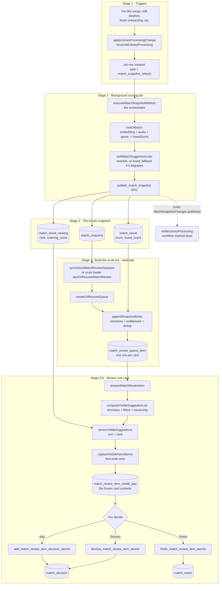
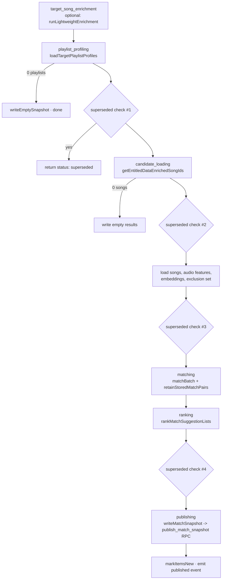
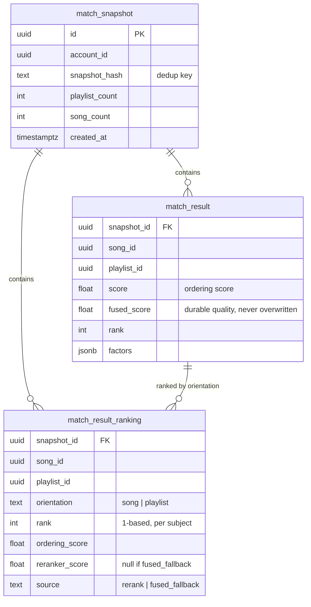
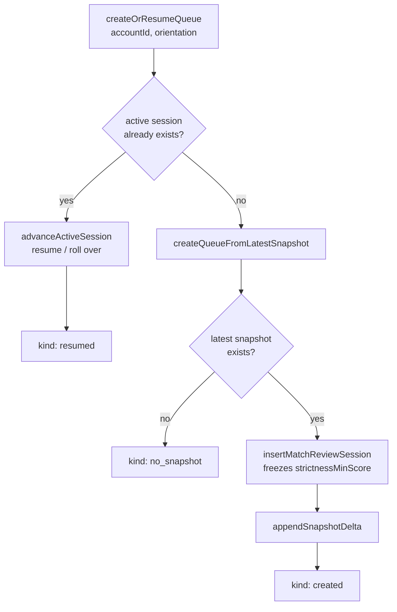
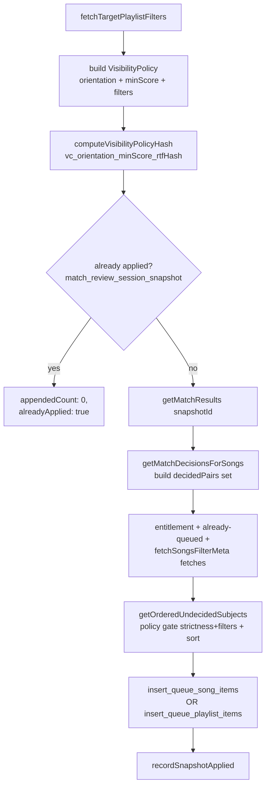
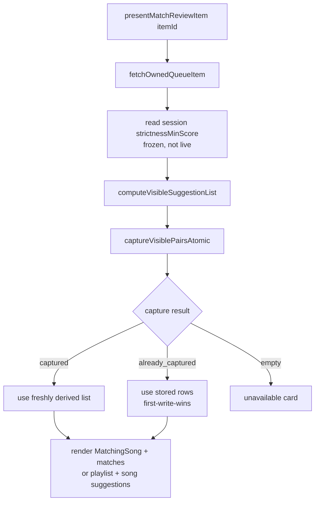
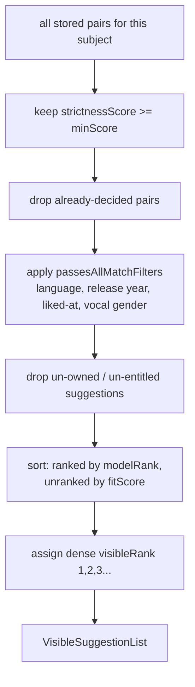
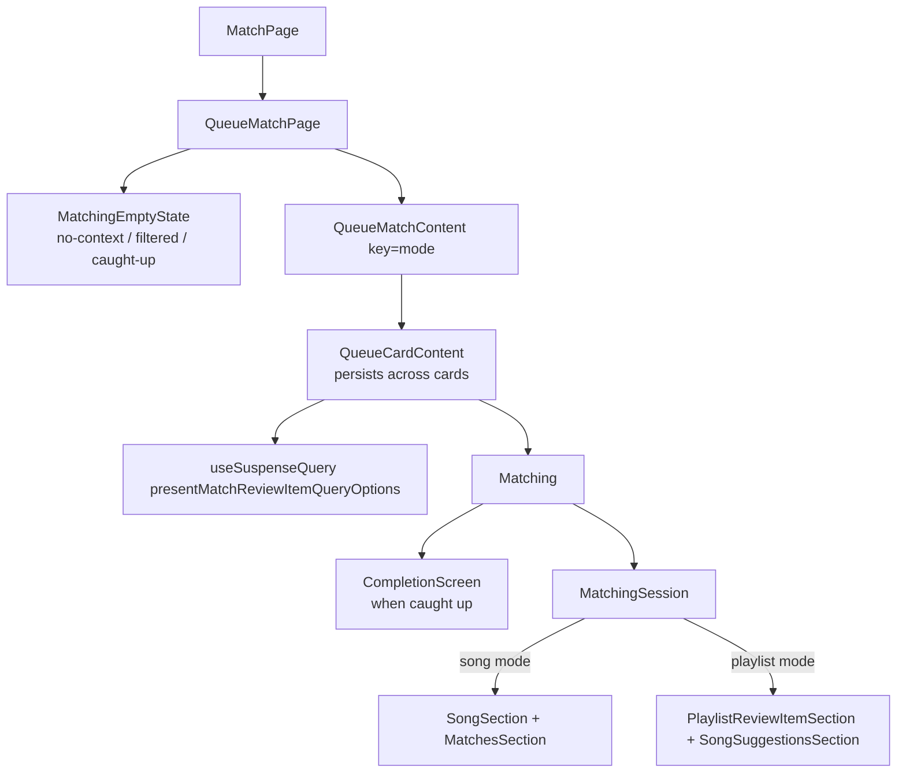

# Match System Architecture — From Matching to Review

How a liked song travels from "we scored it against your playlists" all the way to a
swipeable review card, using the real names in the codebase. Written to be readable without
deep knowledge of the code, but every box maps to a real file, function, table, or RPC so
you can jump straight to it.

The system has two halves that meet at a **snapshot**:

- **The producer** — a background job (`match-snapshot-refresh`) scores every song against
  every playlist and freezes the result into a snapshot.
- **The consumer** — the review queue reads that snapshot, turns it into a to-do list of
  cards, and walks you through them one at a time.

They are deliberately decoupled: the background job never touches the review queue. It only
writes snapshot tables and emits a "published" event. The queue is built later, on the read
side, the next time the app syncs or you open `/match`.

---

## Table of contents

1. [The whole system at a glance](#1-the-whole-system-at-a-glance)
2. [Glossary — plain word → real name](#2-glossary--plain-word--real-name)
3. [Stage 1 — What triggers a refresh](#3-stage-1--what-triggers-a-refresh)
4. [Stage 2 — The snapshot refresh workflow (scoring)](#4-stage-2--the-snapshot-refresh-workflow-scoring)
5. [Stage 3 — What a snapshot actually stores](#5-stage-3--what-a-snapshot-actually-stores)
6. [Stage 4 — Building the review queue](#6-stage-4--building-the-review-queue)
7. [Stage 5 — Presenting one card (the capture)](#7-stage-5--presenting-one-card-the-capture)
8. [Stage 6 — Decisions: add / dismiss / finish](#8-stage-6--decisions-add--dismiss--finish)
9. [Stage 7 — The route and UI](#9-stage-7--the-route-and-ui)
10. [Cross-cutting ideas worth understanding](#10-cross-cutting-ideas-worth-understanding)
11. [Table reference](#11-table-reference)
12. [File reference](#12-file-reference)

---

## 1. The whole system at a glance



The single most important architectural fact: **scoring and queue-building happen at
different times, in different places.** The background job (Stages 1–3) freezes scores into
the snapshot tables and stops. The queue (Stage 4 onward) is built lazily on the read side —
when the client calls `syncActiveMatchReviewSessions`, or when the `/match` route loader runs
`startOrResumeMatchReview`. That is why your queue can stay stable while new matches are
computed: the snapshot is frozen, and new snapshots are *appended* without disturbing cards
you've already seen.

---

## 2. Glossary — plain word → real name

| Plain word | Real name in code | Where |
|---|---|---|
| The background scoring job | `match-snapshot-refresh` workflow / `executeMatchSnapshotRefresh` | `src/lib/workflows/match-snapshot-refresh/orchestrator.ts` |
| The scorer | `MatchingService.matchBatch` | `src/lib/domains/taste/song-matching/service.ts` |
| The re-ranker | `RerankerService` / `rankMatchSuggestionLists` | `src/lib/integrations/reranker/service.ts`, `enrichment-pipeline/match-ranking.ts` |
| A frozen scoreboard | a **snapshot** = one `match_snapshot` row + its `match_result` + `match_result_ranking` rows | DB |
| Quality bar | `strictnessScore(row)` vs `strictnessMinScore` | `song-matching/strictness.ts` |
| Preferences (language, year, …) | `passesAllMatchFilters` / `PlaylistMatchFiltersV1` | `match-filters/predicates.ts` |
| Which direction you review | `orientation` (`"song"` \| `"playlist"`) | `match-review-queue/types.ts` |
| Your to-do list | `match_review_session` + its `match_review_queue_item` rows | DB |
| Building the to-do list | `createOrResumeQueue` → `appendSnapshotDelta` | `match-review-queue/service.ts` |
| One card | a `match_review_queue_item` (the *subject*) | DB |
| The card's frozen contents | `match_review_item_visible_pair` (the *captured pairs*) | DB |
| The list you actually see | `VisibleSuggestionList` / `deriveVisibleSuggestions` | `match-review-queue/visible-suggestion-list.ts` |
| Your final yes/no | `match_decision` (`added` \| `dismissed`) | DB |

---

## 3. Stage 1 — What triggers a refresh

Scoring never runs on a timer. It runs in response to **library-processing change events**.
Something happens (you like songs, a playlist's tracks change, onboarding target selection is
confirmed, songs are unlocked, etc.), and that change is routed through
`applyLibraryProcessingChange` → `reconcileLibraryProcessing`
(`src/lib/workflows/library-processing/`).

The reconciler decides whether the `matchSnapshotRefresh` workflow is now *stale* (a newer
request exists than what was last satisfied). If it is, it emits an effect:

```
{ kind: "ensure_match_snapshot_refresh_job", accountId, satisfiesRequestedAt }
```

The scheduler (`executeEffect` → `ensureMatchSnapshotRefreshJob`) upserts a row in the `job`
table with `type = 'match_snapshot_refresh'`. A debounce map
(`MATCH_REFRESH_DEBOUNCE_MS_BY_CHANGE`) delays noisy triggers — e.g. a playlist-management
session flush waits 8 seconds (`available_at`), while most changes fire immediately (0 ms).

The triggers that matter:

| Change kind | When it requests a refresh |
|---|---|
| `onboarding_target_selection_confirmed` | always |
| `library_synced` | liked songs added/removed, target playlist tracks changed, profile text changed |
| `enrichment_completed` | new candidates available *and* there are target playlists |
| `playlist_management_session_flushed` | target membership or scoring config changed (8 s debounce) |
| `songs_unlocked` / `unlimited_activated` | when there are target playlists |
| `candidate_access_revoked` | always |

---

## 4. Stage 2 — The snapshot refresh workflow (scoring)

A worker claims the job (`runClaimedJob` → `runMatchSnapshotRefreshJob` →
`executeMatchSnapshotRefreshJob` → `executeMatchSnapshotRefresh`). The orchestrator runs a
fixed sequence of stages, persisting progress between each, and checking **four times**
whether a newer request has superseded it — so a stale run bails out early instead of
publishing outdated scores.



### How a score is computed (`matchBatch`)

The scorer is a two-pass process over the full (song × playlist) matrix:

1. **Pass A — raw signals** (`computeRawScored`). For every pair it computes three signals:
   - **Embedding similarity** — `cosineSimilarity` of the song vs playlist vectors (`semantic.ts`).
   - **Audio features** — `computeAudioFeatureScore`, a weighted difference over 9 features
     like energy, valence, danceability, tempo, loudness (`scoring.ts`).
   - **Genre overlap** — `scoreGenres` / `bandedCredit`: full credit for exact genre matches,
     partial for adjacent genres (`service.ts`).
2. **Normalization** (`normalization.ts`) — each signal is normalized across the whole
   candidate set (z-score by default) so the three are comparable.
3. **Pass B — fusion** (`fuse`). Weights are chosen by `selectBaseWeights` (genre-pill-aware:
   `{embedding 0.5, audio 0.3, genre 0.2}` by default) and redistributed by
   `computeAdaptiveWeights` when a signal is missing. The weighted sum becomes
   **`fusedScore`** (clamped 0–1). This is the durable quality number.
4. **`rankAndFilter`** drops anything below the write-time floor (**0.35**) and keeps the top
   ~10 per song.

`retainStoredMatchPairs` then expands the kept set to the union of each song's top-10 *and*
each playlist's top-10, so neither review direction is starved.

### Ranking (`rankMatchSuggestionLists`)

After scoring, the workflow orders each subject's suggestions using the `RerankerService` (a
cross-encoder via the ML provider). It runs in both directions —
`rankSongSuggestionLists` (a song's playlists) and `rankPlaylistSuggestionLists` (a
playlist's songs) — producing `match_result_ranking` rows with `rank`, `ordering_score`,
`reranker_score`, `source`, and `document_mode`.

When reranking succeeds, the ordering score is a blend:
`0.7 × fusedScore + 0.3 × crossEncoderScore`. When the ML provider is unavailable or errors,
the ranker **degrades gracefully** to `source = "fused_fallback"`: it orders purely by
`fusedScore` and records `reranker_score = null`. Either way every pair gets a deterministic
rank, so the read path never breaks.

### Publishing

`writeMatchSnapshot` computes a `snapshot_hash` over the inputs and calls the
`publish_match_snapshot` RPC — the **only** path allowed to write `match_snapshot` +
`match_result` + `match_result_ranking`, atomically. If the new `snapshot_hash` equals the
latest one, the RPC returns `null` (a no-op: nothing changed, no new snapshot). On success it
returns the new `snapshotId`, marks the matched songs "new" (`markItemsNew`), and the worker
emits `MatchSnapshotChanges.published`.

That published event flows back through `settleLibraryProcessing` and only settles the
workflow's bookkeeping. **It does not build the review queue.** That happens later, on the
read side.

---

## 5. Stage 3 — What a snapshot actually stores



The key distinction that the read side relies on:

- **`fused_score`** is the durable quality signal — the pre-rerank weighted sum, never
  overwritten. The quality gate reads this.
- **`score`** is the ordering score (it mirrors the reranked ordering for the song
  orientation). It's a fallback for old rows that predate `fused_score`.

This is exactly what `strictnessScore(row)` encodes:

```ts
export function strictnessScore(row: { score: number; fused_score: number | null }): number {
  return row.fused_score ?? row.score;
}
```

---

## 6. Stage 4 — Building the review queue

This is where a frozen snapshot becomes a personal to-do list. It runs on the read side via
two entry points that both converge on `createOrResumeQueue`:

- The `/match` route loader calls the `startOrResumeMatchReview` server function.
- A background sync calls `syncActiveMatchReviewSessions`, which runs `syncActiveQueue` for
  both orientations.



A `match_review_session` is one review run in one direction. Exactly one active session is
allowed per `(account, orientation)` — enforced by a unique partial index. The session
**freezes** `strictnessMinScore` at creation (`resolveMinMatchScore`), so the quality bar
can't shift under a card you're already reviewing.

### `appendSnapshotDelta` — the heart of queue-building



Walking through what each step protects against:

1. **Visibility hash.** `computeVisibilityPolicyHash(policy)` produces a key like
   `vc_song_0.5_rtf_1a2b3c`. It captures the three things the `VisibilityPolicy` says decide
   *which subjects are visible*: direction, quality bar, and the hash of every target
   playlist's filter config (`computeReadTimeFiltersHash`).
2. **Idempotency.** `match_review_session_snapshot` has a composite primary key
   `(session_id, snapshot_id, visibility_config_hash)`. If this exact combination was already
   applied, the append is a no-op. This is what lets the same snapshot be re-applied safely,
   and lets a *changed* setting (e.g. you loosened a filter, so a new hash) append the
   newly-visible subjects **without duplicating** the ones already queued.
3. **Visibility policy.** `getOrderedUndecidedSubjects` keeps only subjects that have at least
   one *undecided* suggestion that is **visible under the current `VisibilityPolicy`** — i.e. it
   clears `strictnessMinScore` *and* passes the target playlist's read-time filters
   (`passesAllMatchFilters`) against the suggestion song's metadata. The same shared pair
   predicate (`passesVisibilityPolicyForPair`) is used here and at card presentation, so a
   subject is queue-eligible exactly when at least one of its pairs would be visible on the card.
   It also computes `hiddenReviewItemCount` — undecided subjects with no pair visible under the
   current visibility settings (the "loosen strictness / filters to see more" count).
4. **Entitlement / ownership.** Songs are filtered through
   `select_entitled_data_enriched_liked_song_ids`; playlists through `fetchOwnedPlaylistIds`.
5. **Insert.** `insert_queue_song_items` (song mode) or `insert_queue_playlist_items`
   (playlist mode) — both `SECURITY DEFINER`, both `ON CONFLICT DO NOTHING` against the
   per-orientation unique index, so a concurrent append can't create duplicate cards.

Each resulting `match_review_queue_item` carries its `source_snapshot_id`, `position`,
lifecycle `state` (`pending` → `active` → `resolved`), and eventual `resolution` (`added` /
`dismissed` / `skipped` / `unavailable`).

> **Visibility policy.** Strictness and playlist filters are both visibility inputs. Queue
> derivation and card presentation use the same policy semantics: a subject is queue-eligible
> only when at least one undecided pair is visible under the current policy. The session still
> stores `strictness_min_score` today, so strictness remains fixed for the current session; the
> policy abstraction exists so that strictness can become live between cards later without
> rewriting queue/card visibility logic. Once a card is presented, its visible pairs are
> captured and decisions always use the captured rows. (This closes the earlier M1 asymmetry,
> where filters ran only at present time and a card could enter the queue with nothing to show.)

---

## 7. Stage 5 — Presenting one card (the capture)

When you open a card, the `presentMatchReviewItem` server function is the single
authoritative path. It derives the exact list you'll see, then **freezes it** so your
decisions are deterministic even across tabs, retries, or a snapshot changing underneath you.



`computeVisibleSuggestionList` is the funnel that narrows all stored pairs down to what you
actually see. The pure core is `deriveVisibleSuggestions`:



Two details worth knowing:

- **Filters fail closed.** If a song's metadata is missing, it's treated as all-null, so any
  active filter rejects it — there is no "unknown ⇒ pass" loophole (`NULL_SONG_FILTER_METADATA`,
  via the shared `passesPlaylistFilters` helper that both queue and card paths call).
- **Ranked + unranked.** Pairs with a `match_result_ranking` row sort by their stored
  `modelRank`; pairs without one get a synthetic rank appended after the ranked block, so the
  list is always contiguous and deterministic. This is also why a `fused_fallback` ordering
  is fine — it still produces ranks.

Then `captureVisiblePairsAtomic` calls the `capture_match_review_item_visible_pairs_atomic`
RPC, which takes a `FOR UPDATE` lock on the queue item and is **first-write-wins**: the first
present captures the rows into `match_review_item_visible_pair` and flips the item to
`active`; any later present returns the already-captured rows verbatim. From that moment, the
card's contents are frozen — decisions read from these rows, never from a fresh derivation.

The route also prefetches upcoming cards with `getMatchReviewItem` (the
`matchReviewItemQueryOptions` query), which runs the same derivation **without** capturing —
a safe, side-effect-free warm-up. (It returns `unavailable` for playlist items; the
authoritative render always uses the present path.)

---

## 8. Stage 6 — Decisions: add / dismiss / finish

Every decision goes through a `SECURITY DEFINER` RPC that first takes `FOR UPDATE` on the
queue-item row and reads ranks from the **captured** `match_review_item_visible_pair` rows —
so concurrent tabs and retries can't corrupt the outcome.

```mermaid
sequenceDiagram
    participant UI as QueueCardContent (UI)
    participant SF as server function
    participant RPC as SECURITY DEFINER RPC
    participant DB as tables

    Note over UI: Add a suggestion
    UI->>SF: addSongToPlaylistFromQueueItem(itemId, suggestionId)
    SF->>RPC: add_match_review_item_decision_atomic
    RPC->>DB: FOR UPDATE item; verify pair is visible;<br/>check ownership/entitlement
    RPC->>DB: INSERT match_decision (added) + match_event
    Note right of RPC: card NOT resolved — you can add more

    Note over UI: Dismiss the whole card
    UI->>SF: dismissMatchReviewItem(itemId)
    SF->>RPC: dismiss_match_review_item_atomic
    RPC->>DB: FOR UPDATE; require captured pairs
    RPC->>DB: INSERT match_decision (dismissed) for non-added pairs
    RPC->>DB: item -> resolved / dismissed

    Note over UI: Finish (skip remaining)
    UI->>SF: finishMatchReviewItem(itemId)
    SF->>RPC: finish_match_review_item_atomic
    RPC->>DB: count added decisions for this item
    RPC->>DB: item -> resolved / added (if any) or skipped
    RPC->>DB: INSERT match_event (skipped) for non-added pairs
```

The semantic difference between the three:

- **Add** records a durable `match_decision` (`added`) for one suggestion but leaves the card
  open, so you can add several. It validates the suggestion against the captured pairs and
  checks ownership/entitlement (`is_account_song_entitled`, playlist ownership).
- **Dismiss** writes `dismissed` decisions for every captured pair you didn't add, then
  resolves the card. A dismiss is durable — those pairs won't come back.
- **Finish** resolves the card as `added` (if you added anything) or `skipped` (if you
  didn't). **Skips are events only** (`match_event`), never decisions — so a skipped subject
  can resurface in a later snapshot, while a dismissed one stays gone.

Both `dismiss` and `finish` require `visible_pairs_captured_at` to be set (i.e. the card was
actually presented) — otherwise they return `no_captured_pairs` and the UI won't advance.

---

## 9. Stage 7 — The route and UI

**Route:** `src/routes/_authenticated/match.tsx`.

- `/match` is song mode (canonical). `/match?mode=playlist` is playlist mode. `/match?mode=song`
  is non-canonical and `beforeLoad` redirects it to `/match`.
- The loader calls `startOrResumeMatchReview` (which builds/resumes the queue), then prefetches
  card 0 three ways: the queue summary (`matchReviewQueryOptions`), the warm read
  (`matchReviewItemQueryOptions`), and the authoritative capture
  (`presentMatchReviewItemQueryOptions`) — so the first card renders instantly from cache.

**Component tree:**



`MatchingSession` (`src/features/matching/sections/MatchingSession.tsx`) is a discriminated
union on `mode`: song mode shows the song on the left and candidate playlists on the right;
playlist mode shows the playlist on the left and candidate songs on the right. The reject
animation (the card flinging off-screen) fires the real `onDismiss` in parallel with the
animation so the UI feels instant while the server round-trip happens.

**Advancing the queue.** `QueueCardContent` is deliberately *not* keyed by `itemId` — it
persists across cards. It tracks `unresolvedIds` (from the server) minus `locallyResolvedIds`
(resolved this session but not yet dropped from the server snapshot), giving
`effectiveItemIds`. After each resolve it computes the next card with
`nextItemIdAfterResolved` and prefetches the next couple of cards (warm reads only). When the
last card resolves, `CompletionScreen` shows the recap: total additions, dismissed/skipped
counts, and a fan of up to five reviewed items.

---

## 10. Cross-cutting ideas worth understanding

**Orientation.** The same matches are reviewable from either end. `orientation = "song"` means
"one song → which playlists?"; `orientation = "playlist"` means "one playlist → which songs?".
The DB uses a discriminated `MatchReviewSubject` and a CHECK constraint so a queue item has
exactly one of `song_id` / `playlist_id` — illegal half-filled states are unrepresentable.

**Two frozen layers.** There are two independent "freezes," and they protect different things:
- The **snapshot** freezes *scores* so the numbers don't move during a review pass.
- The **captured visible pairs** freeze *one card's contents* so your decisions are
  deterministic even if the snapshot changes or two tabs race.

**Visibility policy (strictness + filters).** Both narrow what you see, and both are now part
of one `VisibilityPolicy` (`orientation` + `minScore` + `filtersByPlaylistId`). Strictness
(`strictnessMinScore`) and filters (`passesAllMatchFilters`) are applied together at *both*
queue-build time and present time, through one shared pair predicate
(`passesVisibilityPolicyForPair`). So a subject only enters the queue if at least one undecided
pair is visible under the policy — the earlier M1 asymmetry (filters at present time only) is
gone. `minScore` is still read from the frozen session row today; the policy isolates it so it
can become live between cards later without touching queue/card visibility logic.

**Idempotency everywhere on the write paths.** `appendSnapshotDelta` keys on
`(session, snapshot, visibility hash)`; the insert RPCs use `ON CONFLICT DO NOTHING`; capture
is first-write-wins under a row lock; decisions upsert on `(account, song, playlist)`. The net
effect: retries, concurrent tabs, and re-syncs converge instead of duplicating or corrupting.

**Graceful degradation in the reranker.** If the ML provider is down, ranking falls back to
`fused_fallback` (order by `fusedScore`) rather than failing the whole job. The read path
handles unranked pairs with synthetic ranks, so nothing downstream breaks.

---

## 11. Table reference

| Table | What it holds | Written by |
|---|---|---|
| `match_snapshot` | One scoring run for an account (hashes, counts) | `publish_match_snapshot` RPC |
| `match_result` | One row per (snapshot, song, playlist) pair: `score`, `fused_score`, `rank`, `factors` | `publish_match_snapshot` RPC |
| `match_result_ranking` | Orientation-aware ordering: `rank`, `ordering_score`, `reranker_score`, `source` | `publish_match_snapshot` RPC |
| `match_decision` | Your durable yes/no: `added` / `dismissed` per pair | decision RPCs / `upsertMatchDecision` |
| `match_event` | Lighter-weight events incl. `skipped` | decision RPCs |
| `match_review_session` | One review run in one direction; freezes `strictness_min_score` | `insertMatchReviewSession` |
| `match_review_queue_item` | One card (subject): `state`, `resolution`, `source_snapshot_id`, `position` | `insert_queue_song_items` / `insert_queue_playlist_items` |
| `match_review_session_snapshot` | Idempotency ledger: `(session, snapshot, visibility_config_hash)` | `recordSnapshotApplied` |
| `match_review_item_visible_pair` | A card's frozen contents: `model_rank`, `visible_rank`, `fit_score` | `capture_match_review_item_visible_pairs_atomic` |

## 12. File reference

**Scoring / workflow**
- `src/lib/workflows/match-snapshot-refresh/orchestrator.ts` — `executeMatchSnapshotRefresh`
- `src/lib/workflows/match-snapshot-refresh/write-match-snapshot.ts` — `writeMatchSnapshot`
- `src/lib/domains/taste/song-matching/service.ts` — `MatchingService.matchBatch`, `fuse`
- `src/lib/domains/taste/song-matching/normalization.ts` — signal normalization
- `src/lib/domains/taste/song-matching/strictness.ts` — `strictnessScore`, `STRICTNESS_MIN_SCORE`
- `src/lib/integrations/reranker/service.ts` — `RerankerService`
- `src/lib/workflows/enrichment-pipeline/match-ranking.ts` — `rankMatchSuggestionLists`
- `src/lib/workflows/library-processing/reconciler.ts` — trigger reconciliation

**Filters**
- `src/lib/domains/taste/match-filters/predicates.ts` — `passesAllMatchFilters`, `SongFilterMetadata`
- `src/lib/domains/taste/match-filters/schemas.ts` — `parseStoredMatchFilters`
- `src/lib/domains/taste/match-filters/types.ts` — `PlaylistMatchFiltersV1`

**Review queue (domain)**
- `src/lib/domains/taste/match-review-queue/service.ts` — `createOrResumeQueue`, `appendSnapshotDelta`
- `src/lib/domains/taste/match-review-queue/visibility-policy.ts` — `VisibilityPolicy`, `passesVisibilityPolicyForPair`, `passesPlaylistFilters`, `computeVisibilityPolicyHash`, `computeReadTimeFiltersHash`, `NULL_SONG_FILTER_METADATA`
- `src/lib/domains/taste/match-review-queue/review-subject-selector.ts` — `getOrderedUndecidedSubjects` (pure, policy-driven)
- `src/lib/domains/taste/match-review-queue/filter-metadata-queries.ts` — `fetchSongFilterMeta`, `fetchSongsFilterMeta`, `fetchPlaylistsMatchFilters`
- `src/lib/domains/taste/match-review-queue/visible-suggestion-list.ts` — `computeVisibleSuggestionList`, `deriveVisibleSuggestions`
- `src/lib/domains/taste/match-review-queue/capture-visible-pairs.ts` — `captureVisiblePairsAtomic`
- `src/lib/domains/taste/match-review-queue/queries.ts` — DB access + decision RPC callers
- `src/lib/domains/taste/match-review-queue/types.ts` — domain types / DTOs

**Server functions**
- `src/lib/server/match-review-queue.functions.ts` — `startOrResumeMatchReview`, `getMatchReview`, `getMatchReviewItem`, `presentMatchReviewItem`, `addSongToPlaylistFromQueueItem`, `dismissMatchReviewItem`, `finishMatchReviewItem`, `syncActiveMatchReviewSessions`

**Route / UI**
- `src/routes/_authenticated/match.tsx` — route, loader, `QueueCardContent`
- `src/features/matching/queries.ts` — query options + keys
- `src/features/matching/match-search.ts` — mode normalization
- `src/features/matching/Matching.tsx` — `Matching`, `isLastItem`
- `src/features/matching/sections/MatchingSession.tsx` — song/playlist split
- `src/features/matching/sections/CompletionScreen.tsx` — recap
- `src/features/matching/components/` — `SongSection`, `MatchesSection`, `PlaylistReviewItemSection`, `SongSuggestionsSection`
