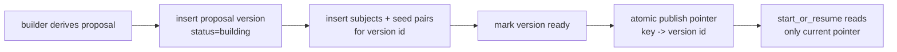

# Immutable match-deck proposal versions — implementation plan

Status: **proposed follow-up refactor**. This is the root-cause cleanup behind the
short-term promotion guard described in
[`deck-promotion-count-guard-handoff.md`](./deck-promotion-count-guard-handoff.md).

The count guard is the small PR-safe fix: it prevents `start_or_resume_match_deck`
from promoting a `ready` proposal whose child rows are mid-rewrite. This plan is
the larger design that removes the rewrite race entirely.

---

## 1. Problem statement

Today `buildOneProposal` mutates one logical proposal in place:

1. upsert `match_review_proposal` as `status = 'building'`
2. delete existing `match_review_proposal_subject` rows
3. insert replacement subjects
4. insert replacement seed pairs
5. update the proposal to `status = 'ready'`

Those are separate PostgREST calls, not one database transaction. A request-path
inline build and a worker `build_proposals` job can overlap on the same
`(account_id, orientation, snapshot_id, visibility_config_hash)` proposal. The
short-term fixes reduce or guard the visible blast radius, but the underlying
shape remains awkward:

- child rows are destructively rewritten
- `status = 'ready'` is treated as if it proves children are complete
- readers and writers coordinate by convention, not by a database publication
  primitive
- a failed or interrupted rebuild can leave an old logical proposal in an
  ambiguous intermediate state

Root cause: **the proposal aggregate is mutable, but readers need an immutable,
complete snapshot.**

---

## 2. Target model

Make proposal builds immutable/versioned.

A build creates a new proposal version. It inserts that version's subjects and
seed rows exactly once. Only after all rows exist does it publish the version by
atomically updating a small current-pointer row. Readers only follow the pointer;
they never scan an in-progress version.



Core invariant:

> A proposal version is never modified after publication, and a reader can only
> promote the version named by the publication pointer.

Destructive `DELETE ... WHERE proposal_id = ...` disappears from the build path.
Old versions may be garbage-collected later, but never as part of publishing a
new version.

---

## 3. Proposed schema

### 3.1 Reinterpret `match_review_proposal` as the version table

Keep the existing table name to minimize downstream churn, but change its role:
each row is a build/version, not the unique mutable proposal for a policy.

Add columns:

```sql
ALTER TABLE public.match_review_proposal
  ADD COLUMN build_id UUID NOT NULL DEFAULT gen_random_uuid(),
  ADD COLUMN ready_at TIMESTAMPTZ,
  ADD COLUMN failed_at TIMESTAMPTZ,
  ADD COLUMN failure_code TEXT,
  ADD COLUMN failure_message TEXT;
```

Then remove the current natural-key uniqueness:

```sql
ALTER TABLE public.match_review_proposal
  DROP CONSTRAINT match_review_proposal_account_id_orientation_snapshot_id_visibility_config_hash_key;
```

Replace it with read/build indexes, not uniqueness:

```sql
CREATE INDEX idx_match_review_proposal_key_created
  ON public.match_review_proposal (
    account_id,
    orientation,
    snapshot_id,
    visibility_config_hash,
    created_at DESC
  );

CREATE INDEX idx_match_review_proposal_build_id
  ON public.match_review_proposal (build_id);
```

The existing child tables continue to point at `match_review_proposal(id)`. Since
`id` now means version id, no child-table rename is required in the first pass.
A later cosmetic migration can rename `proposal_id` to `proposal_version_id` if
worth the churn.

### 3.2 Add a publication/current-pointer table

```sql
CREATE TABLE public.match_review_proposal_publication (
  account_id UUID NOT NULL REFERENCES account(id) ON DELETE CASCADE,
  orientation TEXT NOT NULL CHECK (orientation IN ('song', 'playlist')),
  snapshot_id UUID NOT NULL REFERENCES match_snapshot(id),
  visibility_config_hash TEXT NOT NULL,
  current_proposal_id UUID NOT NULL
    REFERENCES public.match_review_proposal(id) ON DELETE RESTRICT,
  published_at TIMESTAMPTZ NOT NULL DEFAULT now(),
  PRIMARY KEY (account_id, orientation, snapshot_id, visibility_config_hash)
);
```

Indexes:

```sql
CREATE INDEX idx_match_review_proposal_publication_current
  ON public.match_review_proposal_publication (current_proposal_id);
```

RLS follows the proposal tables: enabled with deny-all policies; service-role
access comes through existing default privileges.

### 3.3 Enforce pointer/key consistency

Postgres cannot express "the pointed proposal row has the same four key columns"
with a simple FK unless the key is duplicated into a composite unique constraint.
Use one of these, in order of preference:

1. **RPC-only publication plus validation query** — simplest initial step. The
   only writer is `publish_match_review_proposal_version`, which updates the
   pointer only when the version row's key matches the pointer key.
2. **Trigger guard** — add a `BEFORE INSERT OR UPDATE` trigger on
   `match_review_proposal_publication` that raises if `current_proposal_id` does
   not match the publication key. Use this if future code may write the table
   outside the RPC.

The trigger is cleaner long-term, but the RPC-only guard is enough if all table
access stays encapsulated.

---

## 4. New database API

Move publication into one SQL function. TypeScript can still derive subjects and
seed pairs; the database owns persistence and the final pointer swap.

### 4.1 `publish_match_review_proposal_version`

Shape:

```sql
publish_match_review_proposal_version(
  p_account_id UUID,
  p_orientation TEXT,
  p_snapshot_id UUID,
  p_visibility_config_hash TEXT,
  p_strictness_preset TEXT,
  p_strictness_min_score DOUBLE PRECISION,
  p_read_time_filters_hash TEXT,
  p_total_subjects INTEGER,
  p_hidden_review_item_count INTEGER,
  p_subjects JSONB,
  p_seed_pairs JSONB,
  p_now TIMESTAMPTZ DEFAULT now()
) RETURNS UUID
```

Behavior inside one transaction:

1. Validate orientation and JSON row shapes.
2. Insert a new `match_review_proposal` row with `status = 'building'`.
3. Bulk-insert subjects for the new proposal id from `p_subjects`.
4. Bulk-insert seed pairs for the new proposal id from `p_seed_pairs`.
5. Validate internal counts:
   - subject row count equals `p_total_subjects`
   - no duplicate subject identities
   - no duplicate `(subject_position, visible_rank)` seed ranks
   - all seed rows point to inserted subjects through the existing FK
6. Re-check latest snapshot for the account.
7. Mark the version:
   - latest snapshot: `status = 'ready'`, `ready_at = p_now`
   - superseded snapshot: `status = 'stale'`, `ready_at = p_now`
8. If latest, atomically upsert the publication pointer:

   ```sql
   INSERT INTO public.match_review_proposal_publication (..., current_proposal_id, published_at)
   VALUES (..., v_proposal_id, p_now)
   ON CONFLICT (account_id, orientation, snapshot_id, visibility_config_hash)
   DO UPDATE SET
     current_proposal_id = EXCLUDED.current_proposal_id,
     published_at = EXCLUDED.published_at;
   ```

9. Optionally mark the previously published version for the same key `stale`.
   This is metadata only; the pointer is the source of truth.
10. Return the new proposal version id.

Expected failure behavior:

- Validation/insert errors abort the transaction. No partial child rows survive.
- If desired, a separate best-effort failure logging RPC can insert a failed
  proposal row, but do not trade atomic publication for failure observability.

### 4.2 Why JSONB input is acceptable here

The builder already has the ordered subject list and seed rows in memory. Passing
JSONB lets SQL perform one transactional publish without moving derivation into
plpgsql. This keeps ranking/filtering logic in TypeScript while moving the
aggregate write boundary into the database, where it belongs.

---

## 5. Read-path changes

`start_or_resume_match_deck` should stop selecting directly from
`match_review_proposal` by `status = 'ready'`.

Current shape:

```sql
FROM public.match_review_proposal p
WHERE p.account_id = p_account_id
  AND p.orientation = p_orientation
  AND p.snapshot_id = v_latest_snap
  AND p.visibility_config_hash = p_visibility_config_hash
  AND p.status = 'ready'
```

Target shape:

```sql
FROM public.match_review_proposal_publication pub
JOIN public.match_review_proposal p
  ON p.id = pub.current_proposal_id
WHERE pub.account_id = p_account_id
  AND pub.orientation = p_orientation
  AND pub.snapshot_id = v_latest_snap
  AND pub.visibility_config_hash = p_visibility_config_hash
  AND p.status = 'ready'
```

Promotion continues to bulk-copy from `match_review_proposal_subject` and
`match_review_proposal_seed_pair` using the selected version id. Because that id
is immutable, the copied subject set cannot change underneath the promotion.

The short-term subject-count guard can remain as a belt-and-suspenders check,
but it should become redundant once all reads follow the publication pointer and
all writes publish through the transactional RPC.

---

## 6. TypeScript changes

### 6.1 Proposal builder

Replace the mutable write tail in `buildOneProposal`.

Current write tail:

```text
upsert proposal -> delete children -> insert children -> insert seed -> update ready
```

Target write tail:

```text
derive subjects -> derive seed rows -> call publish_match_review_proposal_version
```

The builder should no longer call:

- `.upsert(... onConflict: account_id,orientation,snapshot_id,visibility_config_hash)`
- `.delete().eq('proposal_id', proposalId)`
- direct child inserts outside the publish RPC
- direct `status = 'ready'` updates

Return shape can stay `Result<void, DbError>` initially. If useful for logging or
repair, return the new proposal version id later.

### 6.2 Worker and request miss path

Once immutable publication is in place, a request-path inline build and a worker
build can safely overlap:

- they create distinct version ids
- neither deletes the other's children
- only a complete version can publish
- the last publisher for the same key wins, and the outputs should be
  deterministic for the same `(snapshot, hash, nowMs)`

Keep the existing job in-flight checks at first. After production soak, simplify:

- remove the post-build re-check in `match-deck-miss-path.ts`
- keep or remove the step-0 worker defer based on product latency preference,
  not data safety
- keep `23505`/deadlock handling only where still relevant

### 6.3 Repair and warm scripts

Repair/warm paths should call the same builder and therefore the same publish
RPC. Do not add a separate repair writer that mutates child rows directly.

### 6.4 Type generation

After migrations, regenerate Supabase types and update the generated RPC call in
`proposal-builder.ts`. Keep the RPC wrapper typed; avoid `any` and avoid unsafe
non-null assertions.

---

## 7. Migration sequence

Prefer an additive, reversible sequence. Do not combine all of this into one
large migration unless local and staging rehearsal are both clean.

### Phase 0 — prerequisite safety guard

Ship the count guard from
[`deck-promotion-count-guard-handoff.md`](./deck-promotion-count-guard-handoff.md)
first. It protects production while the larger refactor is developed.

### Phase 1 — schema additions

1. Add version metadata columns to `match_review_proposal`.
2. Add `match_review_proposal_publication`.
3. Backfill publication rows from existing ready proposals:

   - one row per `(account_id, orientation, snapshot_id, visibility_config_hash)`
   - choose the most recent `ready` proposal by `updated_at DESC, created_at DESC`
   - skip non-ready proposals

4. Add indexes and RLS deny-all policy.
5. Add the optional trigger guard if chosen.

Do **not** drop the old natural-key unique constraint yet.

### Phase 2 — read path uses publication pointer

1. Replace branch-2 proposal lookup in `start_or_resume_match_deck` with the
   publication join.
2. Keep the count guard during transition.
3. Verify existing sessions and new promotions behave identically.

At this point existing writes still upsert the single proposal row, and the
publication table points to it. No versioning yet, but reads are ready for it.

### Phase 3 — transactional publish RPC

1. Create `publish_match_review_proposal_version`.
2. Update `buildOneProposal` to call it.
3. Stop direct child-row mutation from TypeScript.
4. Add SQL tests for:
   - complete publish creates a version and pointer
   - failed publish leaves no pointer to a partial version
   - superseded snapshot creates stale version and does not move pointer
   - two publishes for the same key leave pointer on one complete version

The old unique constraint must be dropped in this phase because multiple
versions for the same key become valid.

### Phase 4 — remove race-specific request-path hardening

After a production soak with publication metrics:

1. Remove the post-build in-flight re-check.
2. Reword `match-deck-miss-path.ts` comments around worker races.
3. Keep product-oriented defer behavior only if it improves latency/load.

### Phase 5 — cleanup and retention

1. Add a scheduled cleanup job for old unreferenced versions:
   - never delete the current publication target
   - never delete a proposal referenced by `match_review_session.active_proposal_id`
   - keep recent failed/building rows for debugging, e.g. 7-14 days
2. Optional cosmetic rename:
   - `match_review_proposal` -> `match_review_proposal_version`
   - child `proposal_id` columns -> `proposal_version_id`
3. Remove redundant count guard only if the team wants less SQL noise. Keeping it
   is harmless and useful as an invariant assertion.

---

## 8. Backfill details

Backfill publication rows deterministically:

```sql
WITH ranked AS (
  SELECT
    p.*,
    row_number() OVER (
      PARTITION BY account_id, orientation, snapshot_id, visibility_config_hash
      ORDER BY updated_at DESC, created_at DESC, id DESC
    ) AS rn
  FROM public.match_review_proposal p
  WHERE p.status = 'ready'
)
INSERT INTO public.match_review_proposal_publication (
  account_id,
  orientation,
  snapshot_id,
  visibility_config_hash,
  current_proposal_id,
  published_at
)
SELECT
  account_id,
  orientation,
  snapshot_id,
  visibility_config_hash,
  id,
  COALESCE(ready_at, updated_at, created_at)
FROM ranked
WHERE rn = 1
ON CONFLICT (account_id, orientation, snapshot_id, visibility_config_hash)
DO UPDATE SET
  current_proposal_id = EXCLUDED.current_proposal_id,
  published_at = EXCLUDED.published_at;
```

Do not use DB-derived id sets fed back through Supabase `.in()` filters in the
application. Backfill belongs in SQL migrations/RPCs, where joins and window
functions can keep the predicate in the database.

---

## 9. Concurrency behavior after the refactor

### Same key, two builders

Both builders insert distinct versions. Both can complete. The publication
pointer ends on whichever transaction publishes last. Since the build is derived
from the same snapshot and visibility hash, either version is valid. If `nowMs`
can affect visibility hash or ordering, pass a stable build timestamp through the
job/request and include it in the derivation inputs so same-key builds are truly
equivalent.

### Older snapshot finishes late

The publish RPC re-checks latest snapshot before moving the pointer. An older
snapshot version can be recorded as `stale`, but it must not update
`match_review_proposal_publication`.

### Reader during publish

Before commit, the pointer still targets the previous complete version or is
absent. After commit, it targets the new complete version. There is no committed
state where the pointer targets a half-populated version.

### Worker crash mid-build

The transaction aborts if the crash happens inside the publish RPC. If the crash
happens before calling the RPC, no proposal version exists. If the process dies
after commit, the version and pointer are already complete.

---

## 10. Observability

Add structured events/captures around publication, not around child-row steps:

- `match_deck_proposal_version_publish_started`
- `match_deck_proposal_version_publish_succeeded`
- `match_deck_proposal_version_publish_failed`
- `match_deck_proposal_publication_moved`

Useful fields:

- `accountId`
- `orientation`
- `snapshotId`
- `visibilityConfigHash`
- `proposalVersionId`
- `subjectCount`
- `seedPairCount`
- `source`: `worker | request_miss | repair | warm_script`
- `durationMs`

Sentry should capture only unexpected publish failures. Expected stale-snapshot
outcomes should be normal structured logs/events, not exceptions.

---

## 11. Tests

### SQL / integration tests

- Backfill creates one publication per ready key.
- `start_or_resume_match_deck` ignores ready versions not named by publication.
- `start_or_resume_match_deck` promotes the published version's subjects.
- Publishing a second version for the same key changes future promotions but does
  not mutate sessions already created from the first version.
- Superseded snapshot publish does not move publication.
- Failed publish leaves no pointer to partial data.

### TypeScript unit tests

- `buildOneProposal` calls the publish RPC with derived subjects and seed rows.
- No direct proposal subject delete is called.
- Worker `build_proposals`, repair, warm script, and request miss path all share
  the same builder path.
- Request miss path still maps a miss to `{ status: "building" }` when no
  publication exists.

### Regression tests for removed races

Simulate interleaving at the DB level:

1. existing published version V1
2. build V2 starts but does not publish
3. `start_or_resume_match_deck` still promotes V1 or misses, never V2
4. V2 publishes
5. later `start_or_resume_match_deck` promotes V2

---

## 12. Rollback strategy

Before dropping the old natural-key unique constraint, rollback is simple:

- revert read-path SQL to select from `match_review_proposal`
- leave the unused publication table in place

After versioned writes are enabled, rollback must choose one current version per
key and restore the natural-key uniqueness. Plan this as a forward fix instead:

1. keep old direct-write code available only until Phase 3 ships
2. deploy Phase 3 during a low-traffic window
3. if it fails, disable builders/workers, repair the publication pointer or
   builder RPC, then resume

Avoid a down migration that deletes history to recreate the old mutable model.

---

## 13. Open decisions

1. **Pointer table vs key table.** This plan uses a compact publication pointer
   table. A fuller `match_review_proposal_key` table would make metadata more
   explicit but adds another entity. Choose it only if key-level metadata grows.
2. **Last-writer-wins vs deterministic tie-break.** Last-writer-wins is valid if
   same-key builds are deterministic. If not, publish should compare
   `build_started_at` or a monotonic generation and reject older versions.
3. **Retention window.** Pick an operational default, likely 7-14 days for
   unreferenced non-current versions.
4. **Cosmetic renames.** Renaming tables/columns improves clarity but increases
   migration risk. Defer until versioning has soaked.

---

## 14. Definition of done

- No production code path deletes proposal subjects as part of rebuilding a
  proposal.
- `start_or_resume_match_deck` reads proposals only through the publication
  pointer.
- A proposal version's child rows are inserted before publication and never
  mutated after publication.
- Concurrent request-path and worker builds cannot create a partial session.
- Existing session promotion semantics, progress counters, and capture-ahead
  behavior remain unchanged from the caller's perspective.
