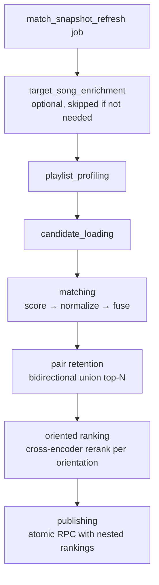
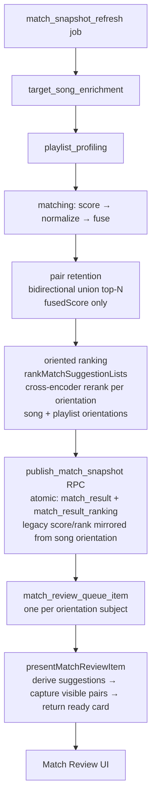

# Matching Overview

Canonical quick reference for how `match_snapshot_refresh` turns enriched songs into playlist matches, oriented ranked suggestion lists, and review queue items.

## 1. Runtime shape

The workflow has seven named stages. Provider reranking is not a stage — it runs inside `oriented ranking`, after fusion and pair retention.



## 2. Inputs

### Candidate songs

Loaded by `getEntitledDataEnrichedSongIds(accountId)`.

A candidate song is:

- a liked song for the account (not unliked)
- entitled / unlocked
- genre-tagged
- analyzed (`song_analysis` row)
- embedded (`song_embedding` row)

Audio features are optional. A song can still be matched without them.

`language`, `vocal_gender`, and `release_year` are carried as metadata but do not influence candidacy, profiling, or scoring.

### Target playlists

Loaded from playlists where `is_target = true` (`getTargetPlaylists`).

These are the playlists the user wants the system to match into.

### Excluded pairs

Before scoring, an exclusion set of `(song, playlist)` pairs is loaded (`loadExclusionSet`) and skipped. A pair is excluded when:

- the user already decided it — an `added` or `dismissed` `match_decision` row exists, or
- the song is already in that playlist (`playlist_song`)

Exclusion is per pair, not per song: a song dismissed from one playlist can still match another.

## 3. Playlist profiling

Before any song is scored, each target playlist gets a profile.

Profile inputs:

- the playlist's current songs
- the songs' embeddings
- the songs' audio features
- the songs' genres
- the playlist's name
- the playlist's `match_intent` (passed as the profile's description text)
- optional declared genre pills (`genre_pills`)

Profile outputs:

- **embedding centroid** — mean of the playlist songs' embeddings, blended with an intent embedding when intent text exists
- **audio centroid** — mean of the nine audio feature dimensions
- **genre distribution** — observed genres, blended with declared genre pills (pills take ~50% share when both are present)
- **intent-aware embedding** — playlist text influences the profile, weighted higher for sparse or cold-start playlists; a fully empty playlist with intent text falls back to an LLM-expanded prototype (HyDE)

## 4. Raw scoring per song × playlist pair

For every eligible `(song, target playlist)` pair, the matcher computes three raw factors.

### A. Embedding similarity

- cosine similarity between the song embedding and the playlist embedding
- clamped to `[0, 1]`

### B. Audio score

- weighted similarity between song audio features and playlist audio centroid
- weighted absolute differences across:
  - energy
  - valence
  - danceability
  - acousticness
  - instrumentalness
  - speechiness
  - liveness
  - tempo
  - loudness

### C. Genre score

- weighted overlap between the song's genres and the playlist's genre distribution
- exact matches get full credit
- adjacent / related genres get partial, capped credit
- distant genres get no credit

## 5. Normalization and fusion

The matcher scores the whole candidate matrix first, then computes signal stats across that full matrix.

That means normalization happens across:

- all candidate songs
- against all target playlists

not per song and not per playlist. Each raw factor is z-score normalized over the full matrix and mapped back into `[0, 1]`, so signals stay comparable along both axes.

Then each signal is fused into one score.

### Base weights

Default playlists:

```txt
embedding 0.50
audio     0.30
genre     0.20
```

Playlists with declared genre pills:

```txt
embedding 0.35
audio     0.25
genre     0.40
```

### Adaptive redistribution

If a signal is missing for a pair, its weight is redistributed proportionally across the available signals.

Examples:

- no audio features → embedding + genre absorb the audio weight
- no genres → embedding + audio absorb the genre weight

### Fused score

```txt
score = w_embed * normalized_embedding
      + w_audio * normalized_audio
      + w_genre * normalized_genre
```

Then:

- scores are clamped to `[0, 1]`
- results below `minScoreThreshold` are dropped
- the top `maxResultsPerSong` survive per song

Current defaults:

- `minScoreThreshold = 0.35`
- `maxResultsPerSong = 10`

## 6. Provider reranking (inside oriented ranking)

Provider reranking is **not** a standalone pipeline stage. It runs inside `rankMatchSuggestionLists` (§8), per orientation, on the already-retained pairs. There is no cross-encoder call between fusion and pair retention — at retention time only `fusedScore` exists.

Within each orientation, `RerankerService` calls the cross-encoder (`Qwen/Qwen3-Reranker-0.6B`, served by DeepInfra in production):

1. build a query from playlist name + `match_intent` + genre pills (same `buildIntentText` used for profiling)
2. build a document per song
   - metadata one-liner (`name by artists. Genres: …`), or
   - that metadata plus the flattened `song_analysis` prose (truncated to ~1600 chars), when analysis is available
3. rerank the retained candidates (`topN = 50`) with the cross-encoder
4. blend: `ordering_score = 0.7 * fused_score + 0.3 * reranker_score`

The `reranker_score` this step produces is an input to `ordering_score` only. Neither score is the strictness or display score — see the invariant in section 8 below. The original `fused_score` is always preserved.

When the cross-encoder is unavailable or fails, the step is skipped and oriented ranking falls back to `fused_score` order (source: `'fused_fallback'`).

## 7. Pair retention

After fusion, the system determines which `(song, playlist)` pairs to store.

Retention uses a **bidirectional union**: a pair survives if it appears in the top-N for the song *or* the top-N for the playlist.

```txt
retained = song-top-N UNION playlist-top-N
```

Constants:

- `MATCH_STORED_PAIRS_PER_SONG = 10`
- `MATCH_STORED_PAIRS_PER_PLAYLIST = 10`

The union matters because the review UI serves two orientations. A pair that does not rank in a song's top-10 playlists might still rank in a playlist's top-10 songs, and it needs to be stored for the playlist-orientation queue.

## 8. Oriented ranking

`rankMatchSuggestionLists` produces a `RankedSuggestionLists[]` — one set of ranked rows per orientation.

Orientations: `song` and `playlist`.

For each orientation:

1. Build an ordered suggestion list — for song orientation, each item is a (song, candidate playlists[]) pair; for playlist orientation, each item is a (playlist, candidate songs[]) pair.
2. Rerank the suggestions using `RerankerService` when available. The instruction used is `RERANK_INSTRUCTION_BY_ORIENTATION[orientation]` — a different task instruction per orientation, because "which playlist fits this song" and "which song fits this playlist" are asymmetric questions.
3. When the reranker is unavailable, fall back to `fused_score` order (`source: 'fused_fallback'`).

Each ranked row is stored in `match_result_ranking`:

| column | meaning |
|---|---|
| `snapshot_id` | the parent snapshot |
| `song_id` | the song |
| `playlist_id` | the playlist |
| `orientation` | `'song'` or `'playlist'` |
| `rank` | 1-based position within this orientation's ordered list |
| `ordering_score` | blend when reranker ran; `fused_score` when fallback |
| `reranker_score` | cross-encoder output, or null when fallback |
| `source` | `'rerank'` or `'fused_fallback'` |
| `document_mode` | `'analysis'` or `'metadata'` — which document type was sent to the reranker |

The schema version constant `MATCH_RANKING_SCHEMA_VERSION = 'oriented-suggestion-lists-v1'` is included in the `rankingConfigHash`. The hash (prefix `rk_`) is a component of the snapshot hash, so changing the ranking schema or reranker instruction invalidates existing snapshots.

### Strictness score invariant (A5/E7)

```txt
strictnessScore(row) = fused_score ?? score
```

This is the ONLY value used for:

- strictness read-time filtering (queue visibility gate)
- the match percent displayed to the user (`fitScore` in UI types)
- queue ordering (`sourceScore` / `maxScore` in derivation)

`reranker_score`, `ordering_score`, and `match_result_ranking.rank` control presentation order — not the score shown to users or the gate for visibility.

## 9. Publishing

Publishing writes a new `match_snapshot` plus its `match_result` and `match_result_ranking` rows atomically via the `publish_match_snapshot` RPC. The write is hash-deduped — an unchanged result set (same snapshot hash) is a no-op.

The RPC receives `rankings` nested inside each result entry. The TypeScript orchestrator mirrors legacy fields onto `match_result` before calling the RPC:

### Legacy compatibility fields (I1/I2)

`match_result` carries two legacy columns that exist only for backward compatibility with read paths that predate oriented ranking:

- `match_result.score` — "legacy compatibility ordering score": the `ordering_score` from the song-orientation ranking row for this pair
- `match_result.rank` — "legacy compatibility rank": the `rank` from the song-orientation ranking row for this pair, when available

No production read path uses these as the authoritative orientation-specific rank or as a display/strictness score. All ranked reads go through `match_result_ranking.ordering_score` (for ordering) and `strictnessScore` (for display/filtering).

## 10. Queue and session orientation

The match review queue is oriented. Each orientation has its own independent session and ordered item list.

`match_review_session.orientation` — one active session per user per orientation (`'song'` or `'playlist'`).

`match_review_queue_item` subject:

- for song orientation: `(orientation: 'song', song_id)`
- for playlist orientation: `(orientation: 'playlist', playlist_id)`

`getOrderedUndecidedSubjects` returns the ordered undecided subjects for a given orientation, sorted by descending `maxScore` (max `strictnessScore` across the subject's suggestions).

`visibility_config_hash` is an idempotency key per `(snapshot, filter config)`. It is composed by `computeVisibilityConfigHash(orientation, minScore, readTimeFiltersHash)`. When the hash changes — because the user changed a filter — `appendSnapshotDelta` bypasses the idempotency guard and appends newly visible subjects without triggering a full snapshot refresh.

## 11. Captured visible pairs

Before a review card is shown to the user, the server captures the exact suggestion list the user will see.

`capture_match_review_item_visible_pairs_atomic` RPC writes rows into `match_review_item_visible_pair`. This happens inside `presentMatchReviewItem` before returning the card data.

Each captured pair row stores:

| column | meaning |
|---|---|
| `model_rank` | the rank from `match_result_ranking.rank` for this orientation |
| `visible_rank` | dense 1..N position after read-time filters are applied |
| `fit_score` | `strictnessScore(row)` — never `reranker_score` or `ordering_score` |

The capture is first-write-wins: if a pair was already captured for this review item, re-presenting the same item will not overwrite it. This ensures mutation RPCs (add, dismiss, finish, skip) always read from the captured snapshot, not from live `match_result` rows that might have changed since the card was shown.

## 12. Read-time filters

Read-time filters are applied at presentation time to the stored `match_result` rows, narrowing the suggestion list the user actually sees.

`computeReadTimeFiltersHash` hashes the current filter config. `passesAllMatchFilters` is the predicate applied per suggestion row.

`computeVisibilityConfigHash` combines `orientation + minScore + readTimeFiltersHash` into a single hash. A changed visibility hash bypasses the idempotency guard in `appendSnapshotDelta`, allowing newly visible subjects to appear in the queue when the user loosens a filter — without waiting for the next full snapshot refresh.

## 13. Refresh coalescing

Multiple triggers (song enrichment, playlist changes, config changes) can request a snapshot refresh within a short window. The system coalesces these to avoid redundant work.

`MATCH_REFRESH_DEBOUNCE_MS_BY_CHANGE` maps each change type to a debounce window. A pending refresh job gets an `available_at` timestamp in the future; subsequent requests within the window merge into the same job rather than enqueuing a new one (`ensureMatchSnapshotRefreshJob`).

When a job starts executing, `isMatchRefreshJobSuperseded` checks whether a newer request arrived while the job was waiting. If superseded, the job exits early and the newer job proceeds. `recoverTerminalLibraryProcessingRefs` (`src/lib/workflows/library-processing/terminal-recovery.ts`) runs in the terminal recovery path to pick up any jobs that were marked superseded but whose replacement never ran.

## 14. Presentation authority

Two server functions serve match review card data with different authority levels.

`presentMatchReviewItem` is the authoritative path. It:

1. derives the visible suggestion list (applying read-time filters)
2. calls `capture_match_review_item_visible_pairs_atomic` to persist the visible pairs
3. returns `MatchReviewItemRead.ready` — a discriminated union by `mode`:
   - `mode: "song"` — `reviewItem: MatchingSong`, `suggestions: MatchingPlaylistMatch[]`
   - `mode: "playlist"` — `reviewItem: MatchingPlaylistForReview`, `suggestions: MatchingSongSuggestion[]`

`getMatchReviewItem` is a non-authoritative warming prefetch only. It pre-fetches the card data so the UI can start rendering before the user taps. Known limitation: it returns `unavailable` for playlist-mode items because it does not expand to the full playlist data path. The authoritative path for playlist-mode items is always `presentMatchReviewItem`.

## 15. Mental model diagram



## 16. Read this next

- [`../system-overview.md`](../system-overview.md) — whole-system flow
- [`score-normalization.md`](./score-normalization.md) — why normalization is matrix-wide
- [`reranker.md`](./reranker.md) — provider reranker behavior, replay harness, and ranking vs reranking terminology
