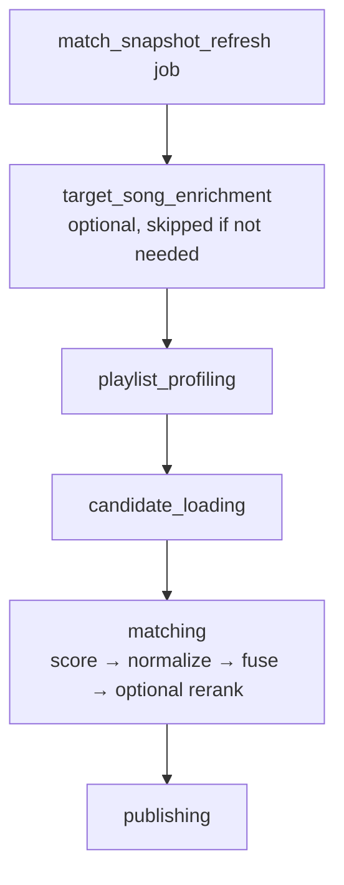
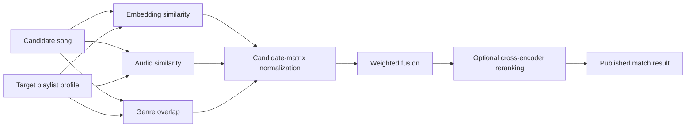

# Matching Overview

Canonical quick reference for how `match_snapshot_refresh` turns enriched songs into playlist matches.

## 1. Runtime shape

The workflow has five named stages. Reranking is **not** a stage — it runs inside `matching`, after fusion.



## 2. Inputs

### Candidate songs

Loaded by `getEntitledDataEnrichedSongIds(accountId)`.

A candidate song is:

- a liked song for the account (not unliked)
- entitled / unlocked
- genre-tagged
- analyzed (`song_analysis` row)
- embedded (`song_embedding` row)

Audio features are optional. A song can still be matched without them.

`language`, `vocal_gender`, and `release_year` are carried as metadata but do **not** influence candidacy, profiling, or scoring.

### Target playlists

Loaded from playlists where `is_target = true` (`getTargetPlaylists`).

These are the playlists the user wants the system to match into.

### Excluded pairs

Before scoring, an exclusion set of `(song, playlist)` pairs is loaded (`loadExclusionSet`) and skipped. A pair is excluded when:

- the user already decided it — an `added` or `dismissed` `match_decision` row exists, or
- the song is already in that playlist (`playlist_song`)

Exclusion is per pair, not per song: a song dismissed from one playlist can still match another.

## 3. Playlist profiling

Before any song is scored, each target playlist gets a profile.

Profile inputs:

- the playlist's current songs
- the songs' embeddings
- the songs' audio features
- the songs' genres
- the playlist's name
- the playlist's `match_intent` (passed as the profile's description text)
- optional declared genre pills (`genre_pills`)

Profile outputs:

- **embedding centroid** — mean of the playlist songs' embeddings, blended with an intent embedding when intent text exists
- **audio centroid** — mean of the nine audio feature dimensions
- **genre distribution** — observed genres, blended with declared genre pills (pills take ~50% share when both are present)
- **intent-aware embedding** — playlist text influences the profile, weighted higher for sparse or cold-start playlists; a fully empty playlist with intent text falls back to an LLM-expanded prototype (HyDE)

## 4. Raw scoring per song × playlist pair

For every eligible `(song, target playlist)` pair, the matcher computes three raw factors.

### A. Embedding similarity

- cosine similarity between the song embedding and the playlist embedding
- clamped to `[0, 1]`

### B. Audio score

- weighted similarity between song audio features and playlist audio centroid
- weighted absolute differences across:
  - energy
  - valence
  - danceability
  - acousticness
  - instrumentalness
  - speechiness
  - liveness
  - tempo
  - loudness

### C. Genre score

- weighted overlap between the song's genres and the playlist's genre distribution
- exact matches get full credit
- adjacent / related genres get partial, capped credit
- distant genres get no credit

## 5. Normalization and fusion

The matcher scores the **whole candidate matrix first**, then computes signal stats across that full matrix.

That means normalization happens across:

- all candidate songs
- against all target playlists

not per song and not per playlist. Each raw factor is z-score normalized over the full matrix and mapped back into `[0, 1]`, so signals stay comparable along both axes.

Then each signal is fused into one score.

### Base weights

Default playlists:

```txt
embedding 0.50
audio     0.30
genre     0.20
```

Playlists with declared genre pills:

```txt
embedding 0.35
audio     0.25
genre     0.40
```

### Adaptive redistribution

If a signal is missing for a pair, its weight is redistributed proportionally across the available signals.

Examples:

- no audio features → embedding + genre absorb the audio weight
- no genres → embedding + audio absorb the genre weight

### Fused score

```txt
score = w_embed * normalized_embedding
      + w_audio * normalized_audio
      + w_genre * normalized_genre
```

Then:

- scores are clamped to `[0, 1]`
- results below `minScoreThreshold` are dropped
- the top `maxResultsPerSong` survive per song

Current defaults:

- `minScoreThreshold = 0.35`
- `maxResultsPerSong = 10`

## 6. Optional reranking

After fusion, results are reranked per playlist with a cross-encoder (`Qwen/Qwen3-Reranker-0.6B`, served by DeepInfra in production).

Shape:

1. group retrieved matches by playlist
2. build a query from playlist name + `match_intent` + genre pills (same `buildIntentText` used for profiling)
3. build a document per song
   - metadata one-liner (`name by artists. Genres: …`), or
   - that metadata plus the flattened `song_analysis` prose (truncated to ~1600 chars), when analysis is available
4. rerank the top candidates (`topN = 50`) with the cross-encoder
5. blend: the displayed `score` becomes `0.7 * fused + 0.3 * reranker`, while the original `fusedScore` is preserved

So there are two ranking layers persisted per match:

- **`fusedScore`** — the fused multi-signal retrieval score
- **`score`** — the rerank-blended score used for display

## 7. Publishing

Publishing writes a new `match_snapshot` plus its `match_result` rows via the `publish_match_snapshot` RPC. The write is hash-deduped — an unchanged result set is a no-op. Each `match_result` stores `score`, `fused_score`, `rank`, and the raw + normalized factors.

The snapshot feeds the match review queue, which powers the Match Review UI at `/match`.

## 8. Mental model in one diagram



## 9. Read this next

- [`../system-overview.md`](../system-overview.md) — whole-system flow
- [`score-normalization.md`](./score-normalization.md) — why normalization is matrix-wide
- [`reranker.md`](./reranker.md) — reranker behavior and replay harness
