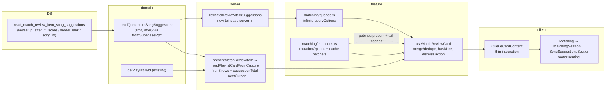

# First-page-fast playlist match cards + match-review client seam

## Context

`presentMatchReviewItem` renders playlist cards from the captured read-model RPC (`0eaab65f`), but still returns **every** active suggestion in one payload — a legacy 845-pair card serializes ~845 song rows before first paint (`readPlaylistCardFromCapture` calls `readQueueItemSongSuggestions(itemId, accountId)` with no limit). Requirement: the ~4–6 rows `ReviewListScroll` shows initially should paint immediately; the rest should page in lazily.

This plan now deliberately pairs the fast-card fix with the newest 2026-07-02 architecture findings, but only at the seam this work already touches:

- **Deepening #2 (match review session)**: do not add more mutation/query/cache logic inline to `src/routes/_authenticated/match.tsx`. This work creates a feature-level card/session seam (`useMatchReviewCard` as the first tracer-bullet slice of the larger `useMatchReviewSession` refactor) that owns tail paging, merged suggestions, and suggestion-dismiss mutation state.
- **Patterns #2 (mutation convention)**: first `mutationOptions` factory in the repo, on per-suggestion dismiss. Paged caches need principled dismiss surgery anyway, and `@tanstack/react-query@^5.90.21` has `mutationOptions`.
- **Patterns ledger “stop raw `.from()` in the server-fn layer”**: `readPlaylistCardFromCapture`'s raw playlist read is replaced with the existing `getPlaylistById` (`src/lib/domains/library/playlists/queries.ts`) — already account-scoped, returns `Result<Playlist | null, DbError>`; no new domain function needed.
- **Patterns #3 (`fromSupabaseRpc`)**: the validated-RPC wrapper is created here and adopted for this one RPC (first of ~12 sites; rest are follow-up). Zod 4 (`^4.3.6`) is in place — `z.looseObject`, `z.uuid()` available.
- **Phase 5 guardrail**: dev/test-only URL-length throw on the admin Supabase client + a `CLAUDE.md` rule, so the 414 class fails locally instead of in prod.

This is **not** the progressive match-feed architecture. `docs/architecture/matching/proposals/progressive-match-feed-plan.md` now says that refactor is future/gated; this plan fixes a concrete per-card read/render bottleneck without changing snapshot or queue publication semantics.

## Design decisions already validated

- **Keyset cursor, not offset**: dismissals anti-join rows out server-side, so offsets drift mid-review (skipped rows on a review card = wrong decisions). Cursor = the sort key `(fitScore DESC, modelRank ASC, songId ASC)` — a strict total order (songId unique per item). A dismissed cursor row is harmless: the WHERE compares sort-key _values_, not row existence. Matches the repo's existing cursor-based infinite queries (`playlistTracksInfiniteQueryOptions`, liked-songs).
- **Server returns the cursor**: `MatchingSongSuggestion` (matching.functions.ts) is `{ song, fitScore }` — no `modelRank` — so the client can't derive it.
- **One code path builds the playlist response**: the derivation arm already falls through to `readPlaylistCardFromCapture` post-capture, so trimming lands in exactly one function.
- **Lazy display, not lazy capture**: new playlist cards still capture the top `PLAYLIST_CARD_SUGGESTION_CAP` visible pairs up front; the response displays the first page. Whole-card dismiss/finish continues to operate on all captured pairs, including unloaded tail rows. That preserves today's decision authority and retry semantics.
- **No manual prefetch effect**: an `enabled`-gated `useInfiniteQuery` auto-fetches its first tail page as soon as the card data provides a non-null cursor — background page-2 warm-up for free.
- **`suggestionTotal` = `min(totalActiveCount, PLAYLIST_CARD_SUGGESTION_CAP)`**: safe because the only current consumer is `SuggestionsControls`'s singular/plural “Reject Match(es)” label — never a rendered number. Tail paging on legacy >100-pair cards may run past the cap (matching today's render-all behavior); that's acceptable and bounded by user scrolling.
- **`total_active_count` semantics under keyset**: the window count runs post-WHERE, so it counts rows _after the cursor_ on tail calls. It equals the full active total **only on the cursorless call** — the only place the server reads it (`readPlaylistCardFromCapture` first page). `listMatchReviewItemSuggestions` ignores it.

## Shape



## Implementation steps (each independently green; roughly one commit each)

### 1. Keyset RPC migration + regenerated types

New `supabase/migrations/20260703000000_read_match_review_item_song_suggestions_keyset.sql`:

- `DROP FUNCTION IF EXISTS public.read_match_review_item_song_suggestions(UUID, UUID, INTEGER, INTEGER)` (avoids PostgREST overload ambiguity), recreate with `p_limit INTEGER DEFAULT NULL, p_after_fit_score DOUBLE PRECISION DEFAULT NULL, p_after_model_rank INTEGER DEFAULT NULL, p_after_song_id UUID DEFAULT NULL`. Same RETURNS TABLE, same song join + dismissed anti-join, same `LANGUAGE sql STABLE SECURITY DEFINER SET search_path = public`, REVOKE from PUBLIC/anon/authenticated + GRANT to service_role **on the new signature**, `NOTIFY pgrst, 'reload schema'` (mirror the `20260702120000` file).
- Keep `total_active_count = count(*) OVER ()`, but comment the cursor caveat: it is a full active count only on the cursorless first-page call; with a cursor, it counts the remaining post-cursor rows and must not be used as total.
- Keyset WHERE written out explicitly (row-value tuple comparison can't mix DESC/ASC):
  ```sql
  AND (
    p_after_fit_score IS NULL
    OR vp.fit_score < p_after_fit_score
    OR (vp.fit_score = p_after_fit_score AND vp.model_rank > p_after_model_rank)
    OR (vp.fit_score = p_after_fit_score AND vp.model_rank = p_after_model_rank AND vp.song_id > p_after_song_id)
  )
  ```
- `supabase db reset` locally, then `bun run gen:types` + `bunx biome format --write src/lib/data/database.types.ts`. Verify `p_offset` is gone from generated Args and the three `p_after_*` args exist.

### 2. Domain layer: `fromSupabaseRpc` + cursor read + playlist read moves home

- `src/lib/shared/utils/result-wrappers/supabase.ts`: add `fromSupabaseRpc(schema, rpcPromise)` per patterns review #3 — parses `data ?? []` with the Zod schema, maps PostgREST errors via the existing private `mapPostgrestError`, parse failure → `DatabaseError({ code: "rpc_shape_mismatch", message: "..." })`, returns `Result<z.infer<S>, DbError>`. Add the `zod` import. Do **not** use a `cause` field; `DatabaseError` currently only accepts `{ code, message }`.
- `src/lib/domains/taste/match-review-queue/queries.ts`: change `readQueueItemSongSuggestions(itemId, accountId, options)` signature to `{ limit?: number; after?: QueueItemSongSuggestionCursor }` (cursor replaces offset; no other caller passes offset today). Export:
  ```ts
  export interface QueueItemSongSuggestionCursor {
    fitScore: number;
    modelRank: number;
    songId: string;
  }
  ```
  Internally call the RPC through `fromSupabaseRpc` with a `z.looseObject` row-array schema; keep the external `QueueItemSongSuggestionRow` shape unchanged (map snake→camel as today).
- `src/lib/server/match-review-queue.functions.ts` (`readPlaylistCardFromCapture`): replace the raw `supabase.from("playlist")...` read with the existing `getPlaylistById(accountId, playlistId)` from `@/lib/domains/library/playlists/queries` — `Result.isError` → retryable (via `reportQueueError`), `value === null` → `not-entitled`. `getPlaylistById` selects `*`; the mapper keeps using the same fields.

### 3. Server: first-page present + `listMatchReviewItemSuggestions`

`src/lib/server/match-review-queue.functions.ts`:

- Constants next to `PLAYLIST_CARD_SUGGESTION_CAP`:
  ```ts
  const PLAYLIST_CARD_FIRST_PAGE_SIZE = 8;
  const PLAYLIST_CARD_TAIL_PAGE_SIZE = 24;
  ```
- The playlist `ready` variant of `MatchReviewItemRead` gains `suggestionTotal: number` and `nextCursor: QueueItemSongSuggestionCursor | null`. Song variant untouched.
- `readPlaylistCardFromCapture`: suggestions read with `{ limit: PLAYLIST_CARD_FIRST_PAGE_SIZE }`; `suggestionTotal = Math.min(rows[0]?.totalActiveCount ?? 0, PLAYLIST_CARD_SUGGESTION_CAP)`; `nextCursor` built from `rows.at(-1)` when `rows.length === PLAYLIST_CARD_FIRST_PAGE_SIZE && rows.length < suggestionTotal`, else null. Zero-rows → `countCapturedVisiblePairs` disambiguation unchanged. Extract row→`MatchingSongSuggestion` into `mapSuggestionRow` for sharing with the new list fn.
- New `listMatchReviewItemSuggestions` server fn (POST, `authMiddleware`, Zod input `{ itemId: z.uuid(), cursor: z.object({ fitScore: z.number(), modelRank: z.number(), songId: z.uuid() }).nullable() }`):
  - ownership via `fetchOwnedQueueItem`;
  - not-owned or non-playlist item → `{ suggestions: [], nextCursor: null }`;
  - reads `{ limit: PLAYLIST_CARD_TAIL_PAGE_SIZE, after: cursor ?? undefined }`;
  - DB error → `reportQueueError` and throw a generic retryable load-more error so the infinite query enters `error` state instead of silently ending pagination;
  - `nextCursor` from the last row when a full page came back (a final empty fetch is acceptable and standard).
- Export the page result type and cursor alias for the client, e.g. `ListMatchReviewItemSuggestionsPage` and `MatchReviewItemSuggestionCursor`.

### 4. Feature seam: infinite tail query + optimistic dismiss mutation behind `useMatchReviewCard`

This is the “kill two birds” slice: the first-page-fast client work lands inside a feature seam instead of making `match.tsx` deeper.

- `src/features/matching/queries.ts`: add `matchReviewItemSuggestionsInfiniteQueryOptions(itemId, initialCursor)` using `infiniteQueryOptions`:
  - key `[...matchReviewKeys.item(itemId), "suggestions"]` (item keys stay excluded from `reviewsRoot` invalidation);
  - `initialPageParam: initialCursor`;
  - queryFn calls `listMatchReviewItemSuggestions({ data: { itemId, cursor: pageParam } })`;
  - `getNextPageParam: (p) => p.nextCursor ?? undefined`;
  - `enabled: initialCursor !== null`;
  - `staleTime: 30 * 60_000`.
- New `src/features/matching/mutations.ts` — first adoption of patterns #2:
  - `dismissSuggestionMutation(qc, itemId)` via `mutationOptions`;
  - `mutationFn` calls `dismissMatchReviewItemSuggestion` and returns its `{ success, reason? }` result;
  - `onMutate` cancels both queries, snapshots both caches, filters the suggestion from the present cache (song and playlist arms), filters every `InfiniteData` tail page, and decrements `suggestionTotal` on the playlist arm (floor 0);
  - `onSuccess` **must rollback when `!result.success`**. Server functions return `{ success: false }`; they do not throw, so relying only on `onError` would leave a bad optimistic state;
  - `onError` restores both snapshots + `captureRouteError` for thrown/network failures;
  - cache patchers are exported as pure helpers for unit tests.
- New `src/features/matching/useMatchReviewCard.ts` (or `useMatchReviewSession.ts` if doing the larger extraction now):
  - takes `itemId`, `itemData`, and `queryClient`;
  - derives `initialCursor` from playlist-ready `itemData.nextCursor`, else null;
  - calls `useInfiniteQuery(matchReviewItemSuggestionsInfiniteQueryOptions(itemId, initialCursor))` unconditionally (enabled gates network work);
  - calls `useMutation(dismissSuggestionMutation(queryClient, itemId))`;
  - maps server read data to `MatchingReviewItem` + `MatchingSuggestion[]`;
  - playlist mode merges first-page suggestions + `tailQuery.data?.pages.flatMap(p => p.suggestions)`, **deduped by song id** (guards a present-query refetch whose fresh first page overlaps stale tail pages);
  - exposes `suggestionTotal`, `hasMoreSuggestions`, `isLoadingMoreSuggestions`, `loadMoreSuggestions`, `loadMoreError`, `retryLoadMore`, and `dismissSuggestion`.
- `hasMoreSuggestions` is **not** just `tailQuery.hasNextPage`. Before the first auto tail page resolves, `hasNextPage` can be false. Derive it as:
  ```ts
  const hasMoreSuggestions =
    initialCursor !== null && (!tailQuery.data || tailQuery.hasNextPage);
  ```
  `loadMoreSuggestions` should still guard `tailQuery.hasNextPage && !tailQuery.isFetchingNextPage` so the sentinel does not duplicate the auto first-page fetch.
- `src/routes/_authenticated/match.tsx` (`QueueCardContent`): stays responsible for unavailable/retryable cards, add/skip/dismiss-item navigation, analytics, and session stats. For ready cards, delegate present-card mapping, tail paging, and suggestion-dismiss cache behavior to the hook. `handleDismissSuggestion` becomes `await dismissSuggestion(suggestionId)` + analytics only when the mutation result is successful. Do not call `onLockNavigation`/`onReleaseNavigation` for row-dismiss; optimistic removal is the interaction feedback. Add/whole-card dismiss/finish keep the existing navigation lock.
- Prop threading: `suggestionTotal`, `hasMoreSuggestions`, `isLoadingMoreSuggestions`, `loadMoreSuggestions`, `loadMoreError`, `retryLoadMore` flow `Matching.tsx → MatchingSession → SongSuggestionsSection` as **optional** playlist-mode props (`MatchingProps` / `PlaylistModeSession` / `SongSuggestionsSectionProps`). Song mode and Ladle stories remain unaffected. `SuggestionsControls`'s `suggestionCount` becomes `suggestionTotal ?? suggestions.length`.

### 5. Scroll UI: footer slot + sentinel/retry

- `src/features/matching/components/ReviewListScroll.tsx`: new optional `footer?: ReactNode`, rendered inside the `scrollRef` div but **outside** the measured `listRef` div — the sentinel scrolls with the list but never pollutes the half-row-peek math or the `rows.length < 2` fallback. The existing ResizeObserver on `listRef` already re-measures when pages append.
- `src/features/matching/components/SongSuggestionsSection.tsx`: `useInfiniteScroll` (`src/lib/hooks/useInfiniteScroll.ts`, TrackList convention) drives a sentinel div passed as `footer` when `hasMoreSuggestions`; render “Loading more…” while `isLoadingMoreSuggestions`. Gate “All suggestions reviewed.” to `suggestions.length === 0 && !hasMoreSuggestions` — this handles “user dismissed every loaded row but total > 0”: the sentinel becomes topmost content, the observer fires, and the next page auto-loads.
- If `loadMoreError` is set, footer renders a small “Couldn’t load more suggestions. Retry” action wired to `retryLoadMore` rather than pretending pagination is complete.
- Keep the full `MatchesSection`/`SongSuggestionsSection` unification from Deepening #3 out of this change unless explicitly widening scope. The shared `ReviewListScroll` footer is the minimal column-level refactor needed here.

### 6. Guardrail (small, independently shippable)

- `src/lib/data/client.ts`: pass a custom `global.fetch` into `createClient` in `createAdminSupabaseClient` — when `import.meta.env.DEV || import.meta.env.MODE === "test"` (the gating idiom used in routes), throw if the request URL exceeds ~8,000 chars (nginx/Kong request-line limit) with a message pointing at the RPC/`chunkedRead` rule; pure passthrough otherwise.
- `CLAUDE.md`: add rule — “DB-derived id sets must never re-enter a query as `.in()` URL filters; push the predicate into an RPC/join. `chunkedRead` is only for externally-sourced id lists.”

## Test changes

- `src/lib/server/__tests__/match-review-queue.functions.test.ts`:
  - mock `getPlaylistById` from `@/lib/domains/library/playlists/queries` (replaces the `mockFrom("playlist")` branches on these paths);
  - `mockReadQueueItemSongSuggestions` assertions gain `{ limit: PLAYLIST_CARD_FIRST_PAGE_SIZE }`;
  - the 845-row legacy test becomes: RPC mock returns 8 rows with `totalActiveCount: 845` → assert `suggestions.length === 8`, `suggestionTotal === 100` (capped), `nextCursor` non-null and equal to row 8's sort key;
  - new describe block for `listMatchReviewItemSuggestions`: ownership miss → empty, cursor passthrough to the domain read, short page → `nextCursor: null`, DB error → `reportQueueError` + thrown generic load-more failure.
- `src/lib/domains/taste/match-review-queue/__tests__/queries.test.ts`: `readQueueItemSongSuggestions` forwards `p_limit` + the three `p_after_*` args; schema-mismatch RPC payload → `DbError` with `code: "rpc_shape_mismatch"` (not a throw).
- New `src/lib/shared/utils/result-wrappers/__tests__/supabase.test.ts` for `fromSupabaseRpc` (happy / PostgREST error mapping / parse failure).
- New `src/features/matching/__tests__/mutations.test.ts`: seed both caches, run `onMutate`, assert both patched + `suggestionTotal` decremented; run `onSuccess({ success: false })` and `onError` with returned context, assert full rollback. Test cache patchers as pure input→output where possible.
- New `src/features/matching/__tests__/useMatchReviewCard.test.tsx` (minimal QueryClientProvider): playlist-ready first page + tail page merge is deduped by song id; `hasMoreSuggestions` remains true while the first tail query is pending; successful dismiss resolves true and failed dismiss rolls back.
- `src/features/matching/__tests__/SongSuggestionsSection.test.tsx`: sentinel/footer renders when `hasMoreSuggestions`; empty-state suppressed while `hasMoreSuggestions`; retry footer renders on `loadMoreError`.

## Verification

1. `bun run test` + `bun run typecheck`.
2. Local `supabase db reset` applies both migrations; `bun run gen:types`; confirm keyset Args in `src/lib/data/database.types.ts`.
3. Manual on `/match` playlist mode against the legacy 845-pair card: first paint 8 rows fast; scrolling triggers sentinel appends; dismiss removes instantly and rolls back on a forced server failure; failed tail load shows retry footer; “Reject Match/Matches” pluralization follows `suggestionTotal`; rapid-dismissing all loaded rows on a >8 card auto-loads the next page instead of flashing “All suggestions reviewed.”
4. Validate the keyset SQL read-only against prod's real 845-pair item via `bun run prod:sql`: first page + a cursor page, verify no overlap/gap across a dismissal.

## Deploy order

Prod is still running pre-RPC code — neither migration is applied yet. Apply **both** migrations (`20260702120000` then `20260703000000`) to prod before deploying any build containing the RPC-calling server code. There is no live caller of the v1 signature, so the `DROP IF EXISTS` transition is safe.

## Soft spots / explicit tradeoffs

1. Legacy >100-pair cards can page past the cap — the plan accepts this explicitly (matches today's render-everything behavior, bounded by scrolling). If we want a hard-stop at 100, add a client cap later.
2. Row-dismiss no longer uses the global navigation lock. The mutation owns optimistic feedback + rollback; add/whole-card dismiss/finish keep the existing lock. Verify during implementation that no other behavior depended on that row-dismiss lock.
3. `useMatchReviewCard` is intentionally a first slice of Deepening #2, not the complete session extraction. The later `useMatchReviewSession` can absorb navigation/session stats once this cache/mutation seam is proven.
