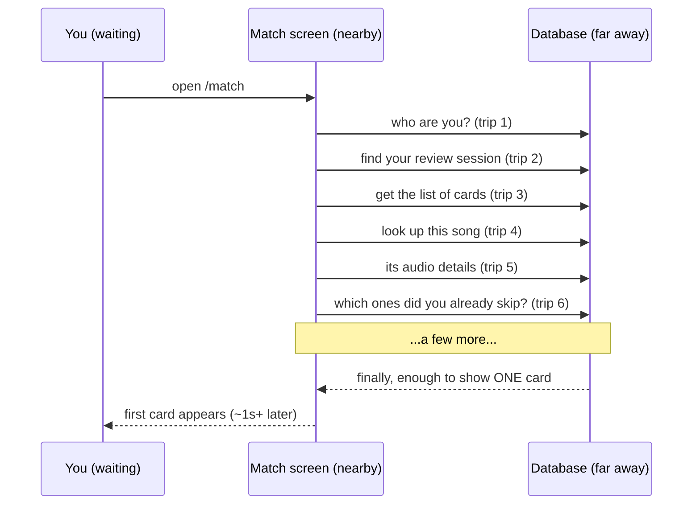
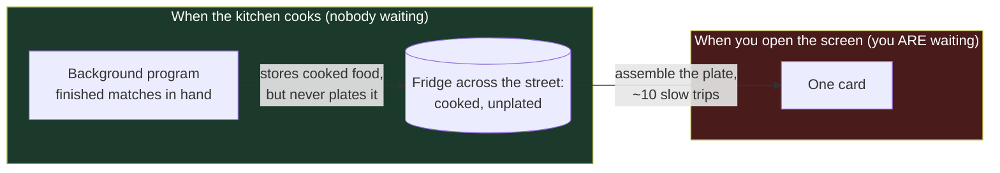
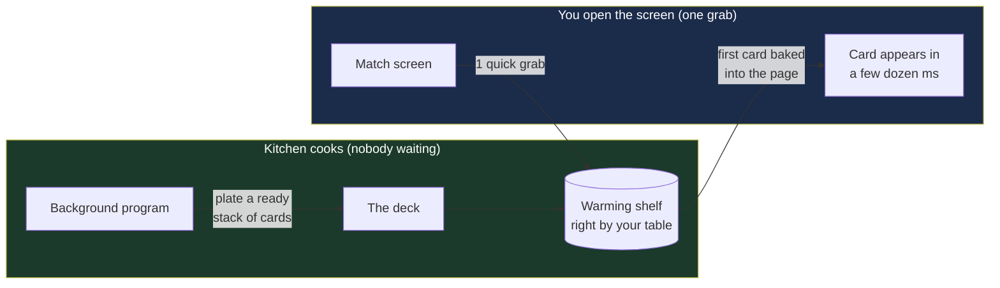

# Why the Match screen is slow — explained in plain words

> A "what's actually going on" doc. The implementation plan is
> `proposals/deck-read-model-plan.md` (which supersedes the request-path tiers in
> `claudedocs/match-perf-root-cause-refactor.md`). This one is for understanding, not doing.

---

## First, what this screen even does

The **Match screen** (`/match`) is where the app shows you its suggestions: *"here are
songs that fit this playlist"* (or the other way around — *"here are playlists this song
belongs in"*). You look at one **card** at a time and swipe: keep it or skip it.

Behind the scenes, a background program has already done the hard thinking. When your
music library changes, it compares every liked song against every playlist and works out
what fits. We call one batch of that thinking a **snapshot** — basically *"the app's
current opinion about what matches what."* That work is heavy, so it runs quietly in the
background, not while you're waiting.

So in theory, opening the Match screen should be instant: the answers are already
computed. In practice it takes a second or more, staring at a spinner. This doc explains
why — and the fix — using one picture you can hold in your head.

---

## The whole problem, as a kitchen

Imagine a restaurant.

- **The kitchen** is that background program. When new ingredients arrive (your library
  changes), the chef cooks a big batch of finished dishes — your matches. **This part is
  fine.** The food really is cooked ahead of time; opening the screen does *not* re-cook it.
- **The fridge is across the street.** The finished food is stored, but far away — every
  trip to grab something takes the same slow walk (~150ms), whether you fetch one item or
  a hundred.
- **The problem:** nobody *plates* the finished dish. So when **you (the diner)** open the
  Match screen and order, **the waiter assembles your plate by running across the street
  and back, one component at a time** — about ten separate trips to put one plate
  together, while you sit and wait.

That's the entire bug in one sentence: **the food is already cooked, but we never plated
it — so we reassemble it the slow way, one cross-the-street trip at a time, every time
someone orders.**

> **Measured on the real "gaming+anime+vibez" playlist:** the 845 suggested songs are
> already computed and stored, and the database hands over all of them in **~5ms**. The
> ~2-second wait is **~10 network trips × ~150ms each** — the walking, not the cooking,
> and not the amount of food. Row count is a red herring; *trip count* is the cause. (One
> path — reviewing *songs* rather than *playlists* — does still rebuild its list on each
> card, the closest thing to real "re-cooking." The same fix covers it.)

---

## Why "assembling it" is so slow

Two things make it worse than it sounds.

**1. Every trip across the street takes the same long walk.**
The screen's code runs at the edge of the network (close to you), but the ingredients
live in a database on a server far away. Each time the code needs something, it makes a
**round trip** — a request out to the database and back. That walk takes about **150
milliseconds no matter how little it grabs.** Grabbing one item costs the same 150ms as
grabbing a thousand. So the number that matters is *how many separate trips you make*,
not how much data moves.

**2. Building your plate takes about ten separate trips.**
Assembling one card isn't one grab — it's a chain of them, each waiting on the last:
check who you are, find your review session, get the list, look up the song, its audio
details, filter out ones you've already dismissed, and so on. Ten-ish trips, one after
another, ~150ms each.

Ten long walks in a row = about a second, *before the first card even appears.* And it
happens **every time you open the screen**, because nothing kept the finished plate around.

There's a second cost hiding here too: all the extra bookkeeping the app keeps *just to
make assemble-on-the-spot safe* — tracking sessions, remembering what it already showed
you, handling half-finished states. That machinery is complicated **because** we insist
on assembling everything at order time. The slowness and the complexity are the same
problem wearing two hats.

---

## The real mistake: never plating the finished work

Here's the key realization. The kitchen — the background program — **had the finished
dishes in its hands.** It knew every match, ranked and ready, the moment it cooked them.
It even stored the cooked food safely. What it *didn't* do is **plate it** — leave a
ready-to-serve dish waiting. So the waiter has to gather the pieces and assemble the plate
himself, the long way, while you wait.

The lesson: **do the work where it's cheap and nobody's waiting (in the kitchen), not
where it's expensive and someone is (at the table).** Cooking happens once, in the
background. Serving happens constantly, while you watch the spinner. We put the effort in
the wrong place.

---

## The fix: plate it once, keep it warm

Change one habit. When the kitchen finishes cooking, it **plates a ready-to-serve stack**
— we call it the **deck**: the next ~10 cards, fully built, nothing left to assemble. It
sets that plate on a warming shelf *right next to your table* (a fast little store at the
edge, near you).

Now opening the Match screen is **one grab**: pick up the ready plate. The first card can
be baked straight into the page as it loads. Swiping through the next few cards costs
*nothing* — they're already on the plate. When you keep or skip a card, the app quietly
updates the plate in the background, off to the side, never while you wait.

Ten slow trips become one quick grab. And because the screen no longer rebuilds anything,
most of that safety bookkeeping can be **deleted** — the app gets faster *and* simpler at
the same time. That double win is the sign we fixed the real cause, not just a symptom.

---

## The one catch (every fix has one)

A pre-plated dish can go **stale** — if the menu changed after we plated, the shelf might
hold a slightly old version. So we tag each plate with a little version stamp; if
something updated underneath it, the app re-plates. And the safety net: **the plate is
always disposable.** It's just a convenient copy — the real records still live in the
database, so a stale or missing plate is only a "cook a fresh one," never lost data.

That's the trade we're accepting on purpose: **instant serving, in exchange for keeping
one extra copy fresh.** Worth it, because the copy can always be rebuilt.

---

## What to remember

1. **Slowness came from the *number of trips*, not slow trips.** Each trip to the
   database is a fixed ~150ms walk. Ten in a row = the spinner. Cut the count, not the
   milliseconds.

2. **Do heavy work where nobody's waiting.** The same task costs almost nothing in the
   background and a full second on the critical path. Cook in the kitchen, not at the table.

3. **Finish the job while you're there.** The program cooked the food and even stored it —
   it just stopped one step short of plating a ready-to-serve dish. Doing that last step at
   write time is the whole fix.

4. **When the fix makes the code *smaller* too, you found the real cause.** A patch adds
   workarounds; a root-cause fix removes the machinery that existed to prop up the wrong
   approach.

> The industry name for "keep a ready-to-read copy that's shaped differently from how you
> store the real data" is a **read model** (or CQRS). You don't need the term — the plate
> on the warming shelf is the whole idea.

---
*See also: `proposals/progressive-match-feed-plan.md`, `architecture.md` · Build plan: `claudedocs/match-perf-root-cause-refactor.md`*
