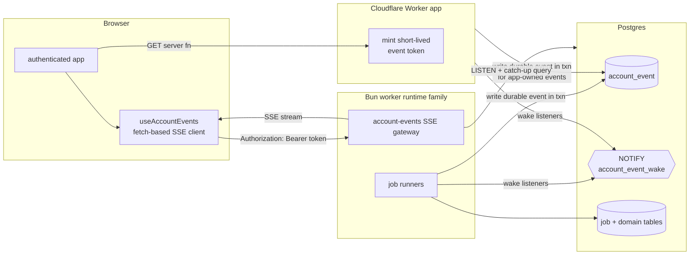

# Account events and browser push

Status: **proposed major follow-up refactor**.

Goal: replace browser polling for background-job freshness with a **portable, account-scoped push system** that keeps PostgreSQL as the source of truth and does **not** make Supabase Realtime part of the core app contract.

---

## 1. Decision summary

### Chosen direction

Build a new **account-events subsystem** with these pieces:

1. a durable Postgres `account_event` outbox for semantic account events
2. `LISTEN` / `NOTIFY` as the low-latency wake-up path, not the durable source of truth
3. a Bun-hosted **SSE gateway** in the worker runtime family (same VPS-side world as the job worker, not the Cloudflare app tier)
4. a browser subscription hook that updates React Query caches and route-specific read models
5. existing polling retained only as a fallback when the stream is unavailable

### Why this, not Supabase Realtime

Supabase Realtime would likely be the shortest path to browser push, but it would also make the app depend on:

- Supabase publications
- Supabase RLS policies for live tables
- Supabase JWT issuance / shape
- Supabase-specific client behavior in a core user-facing path

That is a bad trade if leaving Supabase should stay practical later. This plan depends only on:

- PostgreSQL tables + `LISTEN` / `NOTIFY`
- plain HTTP SSE
- app-issued auth tokens

### Why this, not a Cloudflare-owned SSE/WS fanout layer

Cloudflare Workers can stream SSE responses, but the app tier is intentionally **stateless** and separate from the Bun worker process. If the Cloudflare tier owned long-lived browser connections, it would also need to own **connection coordination** across instances. In practice that means introducing another stateful subsystem such as Durable Objects or another external bus.

That would give us **two** cross-process coordination systems:

- PostgreSQL for jobs and durable state
- Cloudflare coordination for browser fanout

The Bun worker side is already always-on and already talks to Postgres directly. Hosting the push gateway there keeps the stateful coordination boundary in one place.

---

## 2. Current pull points this plan replaces

### 2.1 Core browser polling in scope

| Path | Current behavior | Replacement |
| --- | --- | --- |
| `src/lib/hooks/useActiveJobs.ts` | polls `getActiveJobs()` every 5 s while work is active, 15 s while idle | bootstrap snapshot + SSE-driven cache updates; keep a slow fallback poll only while disconnected |
| `src/routes/_authenticated/route.tsx` (`useActiveJobCompletionEffects`) | infers completion edges from polled booleans, then invalidates queries | consume terminal account events directly in the app shell |
| `src/routes/_authenticated/match.tsx` | bounded 3 s building-recovery poll while `/match` is still `{status:"building"}` | retry deck on `match_snapshot_published`; keep bounded fallback only for cold-start/disconnect |
| `src/routes/_authenticated/match.tsx` (future parked-on-`/match` refresh gap) | no reliable trigger after background append completes | refetch active deck on `match_deck_appended` |
| `src/features/liked-songs/hooks/useLikedSongsPageData.ts` | polls liked-song stats every 5 s while enrichment is running | invalidate stats on enrichment progress / terminal events |
| `src/features/liked-songs/hooks/useLikedSongsCollection.ts` | polls collection every 5 s while any loaded row is unsettled | invalidate or patch collection from enrichment events; retain fallback only when stream is unavailable |

### 2.2 Adjacent account-state polls worth absorbing later

These are not worker-completion-specific, but the same account-events pipe can carry them later:

| Path | Current behavior | Later event |
| --- | --- | --- |
| `src/features/billing/hooks/usePostPurchaseReturn.ts` | polls `getBillingState()` every 2 s for up to 30 s after checkout return | `billing_state_changed` |
| `src/features/onboarding/hooks/useCheckoutPolling.ts` | same 2 s / 30 s billing poll during onboarding | `billing_state_changed` |

### 2.3 Polls explicitly **out of scope** for phase 1

These are browser ↔ extension or browser-local checks, not worker-completion freshness:

| Path | Why it stays separate |
| --- | --- |
| `src/lib/extension/useExtensionSyncStatus.ts` | polls extension-owned `GET_STATUS`; truth lives in the extension, not the Bun worker |
| `src/features/dashboard/hooks/useDashboardSync.ts` | orchestrates extension install / Spotify reconnect / extension sync state |
| `src/features/onboarding/components/InstallExtensionStep.tsx` | polls local extension presence + Spotify connection |
| `src/lib/extension/useSpotifyReconnectState.ts` | polls the extension for token recovery |

### 2.4 Worker-side polling that should gain notify wake-ups too

This doc is primarily about **browser push**, but the same design review found obvious worker wake-up opportunities:

| Path | Current behavior | Future change |
| --- | --- | --- |
| `src/worker/poll.ts` | library-processing jobs poll every 5 s | add `NOTIFY` fast path; keep poll as safety net |
| `src/worker/poll-match-deck-jobs.ts` | deck jobs poll every 5 s | add `NOTIFY` fast path; keep poll as safety net |
| `src/worker/poll-audio-feature-backfill.ts` | audio backfill jobs poll every 5 s | optional later `NOTIFY` fast path |
| `src/worker/poll-extension-sync.ts` + `src/worker/notify-listener.ts` | already uses `LISTEN` / `NOTIFY` as primary wake-up | keep as the pattern to copy |

Notable existing constraint:

- `supabase/migrations/20260706000010_enqueue_match_review_deck_job.sql` explicitly skipped `pg_notify` for deck jobs to keep scope tight.

---

## 3. Deployment constraints that shape the design

Current runtime split:

- **Cloudflare Worker** hosts the TanStack Start app and all HTTP routes / server functions
- **Bun worker** on the VPS claims and executes queued jobs
- both runtimes share PostgreSQL but **do not share memory**

This means a true parked-browser completion signal is **not** a local refactor. It needs a new subsystem that can bridge:

- worker process → durable database state
- durable database state → connected browser clients
- reconnect / missed-event recovery across process restarts and horizontal scale

### Cloudflare-specific notes

Cloudflare Workers support streaming responses and can implement SSE, but that only solves **"can this runtime emit an event stream?"** It does **not** solve:

- where connection state lives
- how a separate Bun worker process reaches the right connected browser
- how multiple app instances coordinate ownership of open streams

Cloudflare Durable Objects exist precisely to add stateful coordination, fanout, and long-lived connection ownership to an otherwise stateless Workers architecture. Adopting them here would mean introducing another stateful control plane beside Postgres.

For this app, Postgres is already the durable shared substrate and the Bun worker is already always-on, so the simpler portable choice is to keep browser push on the **Bun + Postgres** side.

---

## 4. Target architecture



### High-level rules

1. **Postgres stays the source of truth.**
2. **Durable semantic events are stored in `account_event`.**
3. **`NOTIFY` is only a wake-up hint.** If it is missed, the gateway must recover from the outbox.
4. **Browser push is one-way.** Use SSE, not WebSockets.
5. **Cloudflare app tier mints auth tokens, but does not own connection fanout.**
6. **Polling remains as fallback, not the primary freshness path.**

---

## 5. Major architecture change

This plan adds a new first-class subsystem:

### 5.1 `account_event` durable outbox

Proposed shape:

```sql
CREATE TABLE public.account_event (
  id BIGSERIAL PRIMARY KEY,
  account_id UUID NOT NULL REFERENCES account(id) ON DELETE CASCADE,
  type TEXT NOT NULL,
  payload JSONB NOT NULL DEFAULT '{}'::jsonb,
  created_at TIMESTAMPTZ NOT NULL DEFAULT now()
);

CREATE INDEX idx_account_event_account_id_id
  ON public.account_event (account_id, id);
```

Why `BIGSERIAL` instead of UUID:

- gives a simple monotonic replay cursor
- maps cleanly to SSE `id:` fields
- makes reconnect replay (`id > last_seen_id`) cheap

Retention can be short (for example 24–72 h) because the table exists to bridge reconnect gaps, not to become a permanent analytics log.

### 5.2 Account-events gateway

Run a dedicated HTTP SSE handler on the Bun side.

Preferred deployment shape:

- same repository
- same VPS-side runtime family as the worker
- separate module / port / route ownership from job execution
- may live in the same container as the worker if operationally simpler

The crucial requirement is architectural, not process-count-specific:

> the gateway must live in the **always-on Bun world**, not in the stateless Cloudflare request world.

### 5.3 Browser subscription hook

Add a new client hook, likely mounted once from `src/routes/_authenticated/route.tsx`:

- opens the SSE stream
- reconnects with backoff
- carries the last seen event id
- updates React Query caches and triggers invalidations
- tears down cleanly on logout / route shell unmount

### 5.4 Event-writing boundary

Worker and app code that currently only mutates tables or invalidates local caches will need explicit event writes at the boundary where cross-process freshness changes become visible.

---

## 6. Connection and auth model

### 6.1 Use **fetch-based SSE**, not native `EventSource`

Native `EventSource` is attractive, but it cannot attach custom auth headers. In this topology, the browser should not send Better Auth cookies directly to the Bun gateway.

Use a fetch-based SSE client instead:

- `GET /account-events/stream`
- `Accept: text/event-stream`
- `Authorization: Bearer <short-lived-event-token>`
- custom reconnect logic in the hook
- optional `Last-Event-ID` or custom cursor header on reconnect

### 6.2 Short-lived event token

The Cloudflare app mints a short-lived signed token for the gateway.

Recommended claims:

- `sub = accountId`
- `exp` (for example 5 minutes)
- `iat`
- `jti`
- optional session identifier if revocation-by-session becomes necessary later

The Bun gateway validates this token locally. No DB round-trip is required just to open the stream.

### 6.3 Reconnect flow

1. browser notices disconnect
2. browser fetches a fresh event token from the app tier if needed
3. browser reconnects with the last seen event id
4. gateway replays durable events after that id from `account_event`
5. gateway also sends a fresh active-jobs snapshot to repair any missed non-durable progress ticks

---

## 7. Event model

Separate **durable semantic events** from **repairable live snapshots**.

### 7.1 Durable semantic events

These go into `account_event` and are replayable.

Initial set:

- `match_snapshot_published`
- `match_snapshot_failed`
- `match_deck_appended`
- `enrichment_completed`
- `enrichment_stopped`

Later set:

- `billing_state_changed`

### 7.2 Live snapshot / progress events

These do **not** need durable replay if the client can repair from a fresh snapshot.

Initial set:

- `active_jobs_snapshot`
- optional `job_progress_changed`

Rule:

- on initial connect and every reconnect, the gateway sends `active_jobs_snapshot`
- if an intermediate progress tick is missed, the next snapshot repairs the cache

### 7.3 Why keep `firstVisibleMatchReady` derived

`firstVisibleMatchReady` should remain a derived read-model signal.

Do **not** persist it as an event milestone.

Instead:

- refresh it through `getActiveJobs()` snapshots
- invalidate the dependent read models on relevant semantic events

That preserves the existing boundary from `openspec/specs/library-processing/spec.md`: the signal is derived, not promoted to control-plane state.

---

## 8. Where events should be emitted

### 8.1 Library-processing / enrichment

Emit from the worker boundary where the outcome is known.

Primary producers:

- `src/lib/workflows/library-processing/runner.ts` or the helper layer it already uses for `enrichment_completed` / `enrichment_stopped`
- `src/worker/poll.ts` if the final job-settled boundary is easier there

Needed outputs:

- durable `enrichment_completed`
- durable `enrichment_stopped`
- live `active_jobs_snapshot` / `job_progress_changed`

### 8.2 Match snapshot refresh

Emit when the refresh workflow publishes or fails.

Primary producers:

- library-processing change application boundary for `match_snapshot_published` / `match_snapshot_failed`

Needed outputs:

- durable `match_snapshot_published`
- durable `match_snapshot_failed`
- live active-job updates while running

### 8.3 Match deck append

This is the missing event for the parked-on-`/match` UX.

Primary producer:

- `src/worker/poll-match-deck-jobs.ts`
- specifically after successful `append_sessions` settlement, when `appendedCount > 0`

Why here:

- `match_snapshot_published` fires too early for an already-open deck
- the user-visible freshness change is **"new queue items were appended into the active session"**, not just **"a snapshot was published"**

Needed output:

- durable `match_deck_appended`
  - payload: `accountId`, `orientation`, `sessionId`, `snapshotId`, `appendedCount`

### 8.4 Billing

Later producer points:

- Stripe webhook fulfillment boundary
- any direct state transition that changes `getBillingState()`

Needed output:

- durable `billing_state_changed`

---

## 9. React Query / route switch map

### 9.1 Global shell

#### `src/lib/hooks/useActiveJobs.ts`

Current:

- polls `getActiveJobs()` every 5 s / 15 s

Target:

- becomes a thin reader over a cache hydrated by:
  - initial `getActiveJobs()` bootstrap
  - SSE `active_jobs_snapshot`
  - optional `job_progress_changed`
- retains a **slow fallback poll** only while the event stream is disconnected

#### `src/routes/_authenticated/route.tsx`

Current:

- mounts `useActiveJobCompletionEffects(...)`
- infers completion edges from polled booleans

Target:

- mount a single `useAccountEvents(...)` / provider here
- respond to terminal semantic events directly
- keep query invalidation ownership in the shell

### 9.2 Match route

#### `src/routes/_authenticated/match.tsx`

Current:

- bounded 3 s building-recovery poll while still building
- no reliable signal when `append_sessions` lands after a background refresh

Target:

- on `match_snapshot_published`: retry the bounded deck read if the page is still building
- on `match_deck_appended`: invalidate `matchDeckKeys.deck(accountId, orientation)` immediately
- keep the bounded building poll only as a fallback when the stream is unavailable or during first connect race windows

### 9.3 Liked songs

#### `src/features/liked-songs/hooks/useLikedSongsPageData.ts`

Current:

- polls stats every 5 s while enrichment is running

Target:

- invalidate liked-song stats on enrichment progress / terminal events
- derive header progress from active-jobs cache instead of a second poll

#### `src/features/liked-songs/hooks/useLikedSongsCollection.ts`

Current:

- polls the collection every 5 s while any loaded row is unsettled

Target:

- invalidate or patch the collection from enrichment events
- keep a bounded fallback self-heal if the stream is down

### 9.4 Dashboard / consumers

These do not own polling logic, but they consume the polled data and therefore switch indirectly:

- `src/features/dashboard/sections/DashboardHeader.tsx`
- `src/features/liked-songs/LikedSongsPage.tsx`

They should continue reading the same hook contract if possible; the implementation underneath changes.

### 9.5 Billing later

#### `src/features/billing/hooks/usePostPurchaseReturn.ts`
#### `src/features/onboarding/hooks/useCheckoutPolling.ts`

Current:

- 2 s polling for up to 30 s

Later target:

- subscribe to `billing_state_changed`
- fall back to current polling only when the event system is unavailable

---

## 10. Worker wake-up switch map

This plan should also unify worker wake-up around the same **Postgres notify + poll fallback** pattern already used by extension sync.

### Already in place

- `src/worker/notify-listener.ts`
- `src/worker/poll-extension-sync.ts`
- `supabase/migrations/20260612090100_add_extension_sync_orchestration.sql`

### Add next

- library-processing enqueue path → `NOTIFY` wake-up for `src/worker/poll.ts`
- deck-job enqueue path → `NOTIFY` wake-up for `src/worker/poll-match-deck-jobs.ts`
- optional later audio-backfill enqueue path → `NOTIFY` wake-up for `src/worker/poll-audio-feature-backfill.ts`

Rule:

- the poll loops stay in place as the at-most-once-delivery safety net
- the notify path is the low-latency fast path

---

## 11. Horizontal-scale story

This plan is intentionally safe for more than one gateway instance.

### 11.1 Gateways

If multiple Bun gateway instances are running:

- every instance `LISTEN`s to the same wake-up channel
- every instance maintains only its **local** connected clients
- every instance can query `account_event` for replay / catch-up
- no cross-instance in-memory coordination is required

If two instances both receive the same wake-up:

- that is fine
- each instance only pushes to its own local subscribers
- replay is cursor-based per client connection, so duplicate fanout across instances is not a correctness issue

### 11.2 Workers

Worker and gateway can be the same process family or separate sibling processes, as long as both can:

- validate event tokens
- reach Postgres directly
- survive restarts independently

### 11.3 Why this avoids sticky routing requirements

Open streams do not need sticky routing to one globally unique coordinator because:

- Postgres is the durable event source
- client cursors are per-connection
- reconnect to any healthy gateway instance can replay from the last seen durable event id

---

## 12. Rollout plan

### Phase 1 — foundation

1. create `account_event`
2. add an event-write helper in the Bun / server layers
3. add a Bun SSE gateway module
4. add short-lived event token minting in the app tier
5. add a client `useAccountEvents()` hook with reconnect and cursor support

### Phase 2 — replace global polling first

1. bootstrap `useActiveJobs()` from one snapshot
2. drive subsequent updates from the stream
3. mount the subscription in `src/routes/_authenticated/route.tsx`
4. keep a slow fallback poll only while disconnected

### Phase 3 — fix the match deck gap cleanly

1. emit `match_deck_appended`
2. switch `src/routes/_authenticated/match.tsx` to event-driven invalidation
3. keep bounded polling only as fallback

### Phase 4 — liked songs / dashboard

1. remove liked-song stats polling
2. remove liked-song collection polling
3. use stream-driven invalidation / cache updates

### Phase 5 — worker wake-up parity

1. add notify fast path to library-processing jobs
2. add notify fast path to deck jobs
3. optionally add notify fast path to audio backfill

### Phase 6 — billing

1. emit `billing_state_changed`
2. replace checkout polling hooks with stream-first behavior

---

## 13. Non-goals

This subsystem should **not** try to replace everything that is currently called “polling”.

Do not include in the first phase:

- extension install detection
- Spotify web-session detection inside the extension
- general browser-local timers / UI motion timers
- same-request local optimistic invalidation after foreground mutations

It is specifically for **cross-process account freshness**.

---

## 14. Spec follow-up if adopted

Adopting this architecture will require updating specs that currently codify polling-only freshness assumptions, especially:

- `openspec/specs/library-processing/spec.md`
- `openspec/specs/data-flow/spec.md`

Those docs currently describe polling / invalidation as the refresh mechanism and explicitly defer Realtime-style delivery. This plan is the architectural follow-up that would supersede that assumption.

---

## 15. External references

- Cloudflare Workers Streams API — Workers can stream HTTP responses, including SSE: <https://developers.cloudflare.com/workers/runtime-apis/streams/>
- Cloudflare Durable Objects overview — stateful coordination and real-time fanout in Cloudflare’s model: <https://developers.cloudflare.com/durable-objects/>
- Cloudflare Durable Objects WebSocket guidance: <https://developers.cloudflare.com/durable-objects/best-practices/websockets/>
- PostgreSQL `NOTIFY`: <https://www.postgresql.org/docs/current/sql-notify.html>
- PostgreSQL asynchronous notifications (`LISTEN` / `NOTIFY`): <https://www.postgresql.org/docs/current/libpq-notify.html>
- Transactional outbox pattern overview: <https://microservices.io/patterns/data/transactional-outbox.html>
