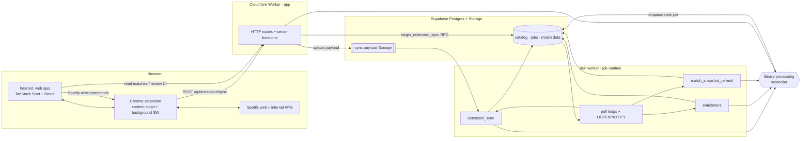
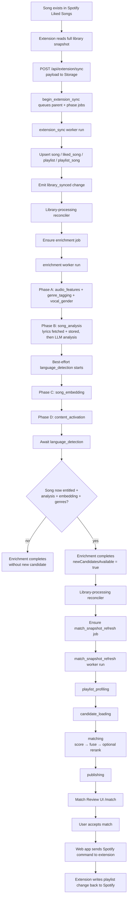

# System Overview

Lean map of the runtime system from Spotify sync to playlist matches.

## 1. Component map

Two runtimes, deliberately split:

- **Cloudflare Worker** runs the TanStack Start app — all HTTP routes and server functions. The sync route streams the payload into Supabase Storage and enqueues jobs via the `begin_extension_sync` RPC; it never parses the library or executes jobs (it stays under the Worker CPU/subrequest ceiling).
- **Bun worker** is a separate long-running process that claims and executes every job. It runs poll loops (woken early by Postgres `LISTEN/NOTIFY` on `job_created`) for `extension_sync`, `enrichment`/`match_snapshot_refresh`, and audio-feature backfill.
- **library-processing reconciler** is the control plane. It runs wherever a change is applied — in the worker when a job completes, in the app for onboarding/billing changes — and decides which job to enqueue next. See [`library-processing.md`](./library-processing.md).

## 2. The three async workflows

| Workflow | Trigger | Main responsibility |
| --- | --- | --- |
| `extension_sync` | Extension posts a library snapshot | Ingest liked songs, playlists, and playlist tracks |
| `enrichment` | Library-processing decides liked-song work is owed | Turn songs into matchable candidates |
| `match_snapshot_refresh` | Library-processing decides match results are stale | Score candidate songs against target playlists and publish matches |

`extension_sync` runs as a parent job plus three phase jobs (liked songs, playlists, playlist tracks). On completion it emits a `library_synced` change that the reconciler turns into enrichment and/or match work.

## 3. End-to-end: from liked song to match

## 4. What enrichment produces

Each enrichment chunk fans out across providers. The orchestrator runs four phases: Phase A (`audio_features` ∥ `genre_tagging`), Phase B (`song_analysis`, which fetches lyrics first), Phase C (`song_embedding`), and Phase D (`content_activation`). Two outputs come from best-effort side-effects rather than accounted stages: vocal-gender resolution runs alongside Phase A and is awaited before Phase B, and language detection is kicked off after Phase B and awaited at the very end (overlapping phases C–D).

| Output | Source | Driver | Gates matching? |
| --- | --- | --- | --- |
| `song.genres` | Last.fm (album tags → artist tags) | `genre_tagging` (Phase A) | **Yes** |
| `song_audio_feature` | ReccoBeats (enqueues an async `youtube_search` backfill job on miss, deferring the song) | `audio_features` (Phase A) | No — optional signal |
| `song_lyrics` | LRCLIB → Genius fallback | `song_analysis` (Phase B) | Indirectly — feeds analysis + language |
| `song_analysis` | Gemini 2.5 Flash (Google Vertex) | `song_analysis` (Phase B) | **Yes** |
| `song_embedding` | Qwen3-Embedding-0.6B via DeepInfra | `song_embedding` (Phase C) | **Yes** |
| `song.language` | `eld` offline detector (from stored lyrics) | language-detection side-effect (after Phase B) | No — app metadata |
| `artist.gender` / `artist.band_gender` → `song.vocal_gender` | MusicBrainz local dump → Wikidata SPARQL | vocal-gender side-effect (Phase A) | No — app metadata |
| `song.release_year` | Spotify (extension-driven during sync) | Sync layer, **not** a server enrichment stage | No — app metadata |
| `account_song_unlock` / entitlement | billing + unlock RPCs | `content_activation` (Phase D) | **Yes** (entitlement gate) |

Genres are song-level only. They come from Last.fm — album tags first, artist tags as fallback, track tags skipped as too sparse. There is no LLM genre classifier and no Spotify artist-genre fetch.

## 5. What makes a song matchable

A liked song becomes a matching candidate when the refresh workflow can load it from the canonical selector `getEntitledDataEnrichedSongIds(accountId)` (the `select_entitled_data_enriched_liked_song_ids` RPC).

In practice that means:

- the song is still liked and is **entitled / unlocked** for the account (active unlock row, active subscription, or self-hosted)
- `song.genres` is populated
- a `song_analysis` row exists
- a `song_embedding` row exists
- audio features are helpful but **not required**

`language`, `vocal_gender`, and `release_year` are app metadata. They are produced during enrichment (release year during sync) but are **not** part of candidate readiness and are **not** used by matching yet.

## 6. Where matching actually happens

Matching does **not** happen during `song_analysis`.

It happens later, in the separate `match_snapshot_refresh` workflow, whose named stages are:

1. `target_song_enrichment` (optional — skipped when not needed)
2. `playlist_profiling`
3. `candidate_loading`
4. `matching` (scoring, fusion, and optional reranking all happen here)
5. `publishing`

The `matching` stage is the point where songs are scored against target playlists.

## 7. Read this next

- [`matching/overview.md`](./matching/overview.md) — the actual matching algorithm
- [`library-processing.md`](./library-processing.md) — why jobs get scheduled when they do
- [`proposals/account-events-and-browser-push-plan.md`](./proposals/account-events-and-browser-push-plan.md) — proposed portable push architecture for replacing browser polling
