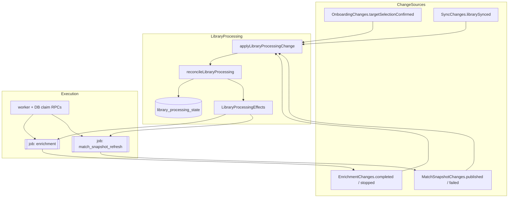
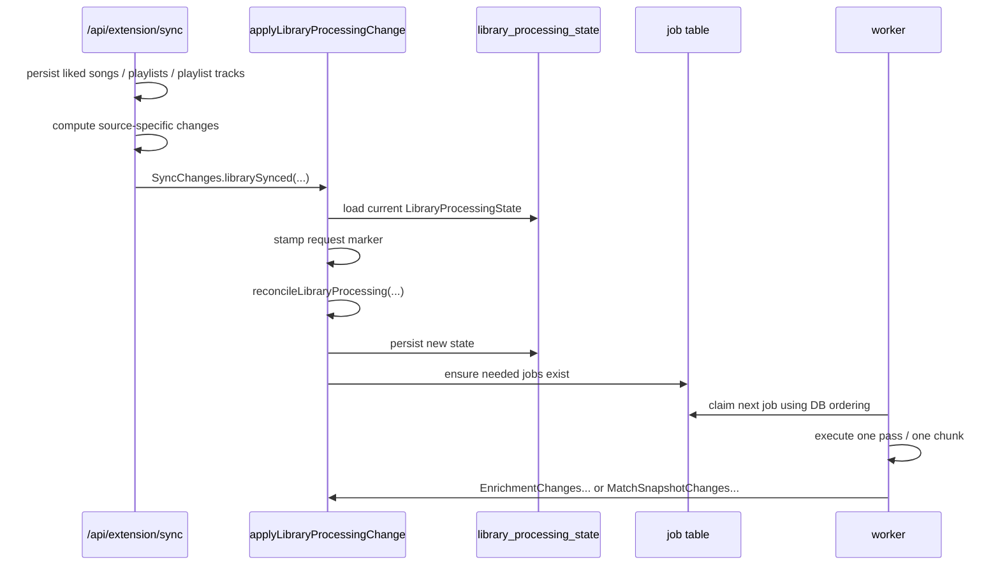

# Library Processing Implementation Plan

## Goal

Centralize follow-on scheduling for:

- `enrichment`
- `matchSnapshotRefresh`

The new design should make scheduling policy easier to understand, easier to evolve, and ready for:

- free-tier limits and pay-as-you-go credits
- future paid queue preference
- fast first-value UX during and after onboarding
- real cost, cache, and queue-value measurement

This plan intentionally keeps the current worker/job execution model, but replaces scattered follow-on decisions with one control plane.

---

## Why This Refactor

Today the decision of "what should happen next for this account?" is split across:

- onboarding target selection
- extension sync
- enrichment trigger helpers
- worker completion
- refresh rerun mechanics

That creates three problems:

1. scheduling policy is hard to reason about
2. enrichment stop semantics are ambiguous
3. the current shape is weak for monetization, queue preference, and measurement

This refactor fixes that by introducing one explicit source of truth for post-sync library processing.

---

## Chosen Design Summary

### Core Control Plane

- domain: `library-processing`
- state record: `LibraryProcessingState`
- DB table: `library_processing_state`
- service entrypoint: `applyLibraryProcessingChange(...)`
- pure reconciler: `reconcileLibraryProcessing(...)`
- side-effect output: `LibraryProcessingEffects`
- input union: `LibraryProcessingChange`

### Scope In V1

`LibraryProcessingState` explicitly models only:

- `enrichment`
- `matchSnapshotRefresh`

It does **not** absorb sync phase tracking.

Sync remains a change source into the scheduler.

### Canonical Workflow Naming

Use these names consistently:

- workflow slice: `matchSnapshotRefresh`
- durable job type / schema prefix: `match_snapshot_refresh`
- change helper group: `MatchSnapshotChanges.*`

Keep these existing terms too:

- `job` for the execution primitive
- `publish` / `published` for writing the match snapshot

A `matchSnapshotRefresh` job still performs a publish.

### Workflow State Shape

Each workflow slice uses:

- `requestedAt`
- `settledAt`
- `activeJobId`

Meaning:

- `requestedAt` = the latest request marker for that workflow
- `settledAt` = the latest request marker that workflow has successfully satisfied
- `activeJobId` = the currently active job for that workflow, if any

A workflow still owes work when:

- `requestedAt` exists
- and `settledAt` is null or older than `requestedAt`

### Row Shape And Creation

`library_processing_state` should be:

- one row per account
- flattened typed columns, not JSONB workflow blobs
- created lazily on first library-processing use
- timestamped with `created_at` and `updated_at`

The workflow pointer columns should be nullable and the active-job pointers should reference `job(id)` with `ON DELETE SET NULL`.

### Early-Value Behavior

Fast first-value behavior should come from:

- scheduler timing
- current enrichment execution strategy
- immediate refresh invalidation when newly added liked songs may already be matchable from shared cache
- later refresh invalidation when enrichment makes new candidates available
- derived UI/read-model signals such as `firstMatchReady`

It should **not** require a separate milestone ladder in `LibraryProcessingState` or a per-job `resultGoal` field.

### Scheduling Model

- synchronous apply-and-reconcile service
- source-specific typed changes
- source-specific adapters/constructors
- `matchSnapshotRefresh` jobs become single-pass
- scheduler decides whether another refresh job is needed
- scheduler decides whether another enrichment chunk job is needed
- source changes stay semantic; `applyLibraryProcessingChange(...)` stamps request markers

### Execution Model

- jobs stay as the execution primitive
- scheduler uses lower-level ensure/create job helpers
- policy-shaped trigger helpers are removed or demoted
- DB claim path enforces ordering

### Priority Model

Queue preference should use neutral bands:

- `low`
- `standard`
- `priority`

Current monetization mapping should live outside the scheduler:

- free → `low`
- credits → `standard`
- supporter → `priority`

### Derived Product Signal

The FE-facing "can I show the user a real match yet?" signal should stay derived, not stored in `LibraryProcessingState`.

Recommended derived signal:

- `firstMatchReady`

Meaning:

- the latest published snapshot for the current account has at least one match

### Measurement Scope

This refactor includes minimal first-class execution measurements, but not billing or credits.

---

## Design Principles

1. **One control plane for follow-on scheduling**  
   Scheduling policy lives in one place.

2. **Jobs stay as execution primitives**  
   We are not replacing the worker/job system.

3. **State should describe durable freshness, not FE milestones**  
   `LibraryProcessingState` should answer whether workflows are caught up, not whether the user has already seen their first magic moment.

4. **Source changes stay source-shaped**  
   Sources report what changed. The scheduler decides what that means for freshness.

5. **Request markers belong to the control plane**  
   Change helpers do not carry request timestamps. `applyLibraryProcessingChange(...)` stamps the request marker when it applies a change.

6. **Queue preference must not hardcode pricing copy**  
   Product tiers map into neutral queue bands outside the scheduler.

7. **Early-value behavior should come from freshness-based scheduling, cache-aware refresh opportunities, and derived read models**  
   Not from milestone-heavy state.

8. **Measurement belongs in execution, not in billing logic**  
   We measure now, charge later.

---

## Target Architecture



### Sync As A Change Source, Not A Controlled Workflow



---

## Core Domain Model

### LibraryProcessingState

The control-plane shape should look like this:

```ts
interface LibraryProcessingWorkflowState {
  requestedAt: string | null;
  settledAt: string | null;
  activeJobId: string | null;
}

interface LibraryProcessingState {
  accountId: string;
  enrichment: LibraryProcessingWorkflowState;
  matchSnapshotRefresh: LibraryProcessingWorkflowState;
  createdAt: string;
  updatedAt: string;
}
```

### Staleness Rule

A workflow still owes work when:

- `requestedAt` exists
- and `settledAt` is null or older than `requestedAt`

### Critical Correctness Detail

When a job completes successfully, `settledAt` must be set to:

- the request marker that job was trying to satisfy

not:

- wall-clock completion time

This prevents a newer change arriving during job execution from being accidentally masked.

### Request Marker Ownership

Source helpers should not invent timestamps for control-plane freshness.

Instead:

- `SyncChanges.librarySynced(...)` and other helpers create semantic changes
- `applyLibraryProcessingChange(...)` stamps the request marker when applying the change
- jobs that settle stale workflows carry the specific marker they were created to satisfy

### Job Metadata Requirement

Jobs that satisfy `LibraryProcessingState` freshness should carry:

- a generic nullable request-marker column on `job` used only by:
  - `enrichment`
  - `match_snapshot_refresh`

The exact column name can be finalized during implementation.

Queue-claimed jobs should also carry:

- a nullable numeric `queue_priority` column on `job`

That column is only needed for the jobs that participate in worker claim ordering. Sync phase jobs do not need queue priority.

### LibraryProcessingEffects

The pure reconciler should stay minimal and intent-level.

Recommended effect variants:

```ts
type LibraryProcessingEffect =
  | {
      kind: "ensure_enrichment_job";
      accountId: string;
      satisfiesRequestedAt: string;
    }
  | {
      kind: "ensure_match_snapshot_refresh_job";
      accountId: string;
      satisfiesRequestedAt: string;
    };
```

Rules:

- ensure-job effects should carry the exact request marker the job is being created to satisfy
- state updates such as advancing `requestedAt`, `settledAt`, or clearing `activeJobId` belong in reconciliation/state persistence, not as separate imperative effects
- queue priority should be resolved during effect execution, not inside the pure reconciler output
- `needsTargetSongEnrichment` should be derived from current DB state during match-snapshot-refresh job ensuring, not stored in `LibraryProcessingState`

---

## Change Sources And Input Contracts

### Typed Change Union

All external inputs into the control plane should become a `LibraryProcessingChange`.

Use `kind` as the discriminant field.

Recommended exact union shape:

```ts
type LibraryProcessingChange =
  | {
      kind: "onboarding_target_selection_confirmed";
      accountId: string;
    }
  | {
      kind: "library_synced";
      accountId: string;
      changes: {
        likedSongs: {
          added: boolean;
          removed: boolean;
        };
        targetPlaylists: {
          trackMembershipChanged: boolean;
          profileTextChanged: boolean;
          removed: boolean;
        };
      };
    }
  | {
      kind: "enrichment_completed";
      accountId: string;
      jobId: string;
      requestSatisfied: boolean;
      newCandidatesAvailable: boolean;
    }
  | {
      kind: "enrichment_stopped";
      accountId: string;
      jobId: string;
      reason: "local_limit" | "error";
    }
  | {
      kind: "match_snapshot_published";
      accountId: string;
      jobId: string;
    }
  | {
      kind: "match_snapshot_failed";
      accountId: string;
      jobId: string;
    };
```

This is the core pre-monetization union shape. If monetization adds new sources of follow-on work, extend the union rather than bypassing the control plane — for example billing-shaped changes such as `songs_unlocked` or `unlimited_activated`.

### Grouped Source Helpers

Use grouped source helpers to create valid changes:

- `OnboardingChanges.*`
- `SyncChanges.*`
- `EnrichmentChanges.*`
- `MatchSnapshotChanges.*`

Examples:

- `OnboardingChanges.targetSelectionConfirmed(...)`
- `SyncChanges.librarySynced(...)`
- `EnrichmentChanges.completed(...)`
- `EnrichmentChanges.stopped(...)`
- `MatchSnapshotChanges.published(...)`
- `MatchSnapshotChanges.failed(...)`

These helpers should produce the exact `LibraryProcessingChange` shapes above and should not invent control-plane request markers.

### Sync Contract

One sync request should emit one aggregated `library_synced` change with source-shaped booleans:

```ts
{
  kind: "library_synced",
  accountId: string,
  changes: {
    likedSongs: {
      added: boolean,
      removed: boolean,
    },
    targetPlaylists: {
      trackMembershipChanged: boolean,
      profileTextChanged: boolean,
      removed: boolean,
    },
  },
}
```

Rules for this change:

- one sync request emits one aggregated change
- the change is backend-internal, not FE state
- the change carries no timestamp or request marker
- all booleans are required
- all-false is a valid no-processing-change sync result
- `targetPlaylists.removed` means a processing-relevant target playlist removal, not just any playlist removal

### Why These Helpers Matter

This is the boundary where source-specific invariants should live.

Examples:

- onboarding target selection is an **initial confirmation flow**, not a generic edit flow
- sync emits one aggregated change per request and does not directly schedule follow-on work in multiple places
- target-side correctness depends on exact track-membership changes, not broad metadata buckets
- enrichment outcomes must distinguish successful satisfaction vs local stop vs error
- match snapshot outcomes should stay expressed in publish/published terms

### Important Product Invariant To Preserve

For onboarding specifically:

- target selection is initial confirmation, not a generic edit flow
- empty selection / skip remains an onboarding concern and should not emit a library-processing change
- current early-value behavior should be preserved when targets are first confirmed by reconciling against current library state, not by special onboarding-only durable fields

---

## Scheduler And Reconciliation Model

### Public Service Boundary

`applyLibraryProcessingChange(...)` should:

1. load `LibraryProcessingState`
2. stamp a new request marker for this apply cycle
3. apply the incoming `LibraryProcessingChange`
4. call `reconcileLibraryProcessing(...)`
5. persist the new state
6. execute `LibraryProcessingEffects`

### Pure Reconciler Responsibility

`reconcileLibraryProcessing(...)` should decide:

- whether `requestedAt` should advance for a workflow
- whether `settledAt` should advance for a workflow
- whether active job refs should be updated or cleared
- whether the workflow is stale and another job should exist
- whether target existence gates refresh invalidation in the current state
- whether that job should be requested now or deferred according to current scheduler policy

### Important Semantic Fix

The new model must distinguish:

- enrichment success that **did** satisfy the job's request marker
- enrichment success that **did not** satisfy the job's request marker yet
- enrichment stop because of `local_limit`
- enrichment stop because of `error`

The current ambiguous "completed" outcome from enrichment chaining should be removed.

### Failure Handling In V1

For this refactor, failure handling should stay intentionally bounded.

On enrichment or match-snapshot-refresh failure:

- clear `activeJobId`
- do **not** advance `settledAt`
- leave the workflow stale
- do **not** auto-reensure immediately inside this refactor

Retry policy can be layered on later without changing the core freshness model.

---

## Execution Model

### Jobs Stay

We are keeping the existing `job` table and worker architecture.

### What Changes

The scheduler becomes the owner of **should another job exist to satisfy stale workflow state?**

That means:

- `matchSnapshotRefresh` jobs become single-pass
- `rerunRequested` stops being the orchestration mechanism
- enrichment worker reports outcomes back to the scheduler
- scheduler decides whether another enrichment chunk job should exist
- scheduler decides whether another `matchSnapshotRefresh` job should exist

### What Stays Workflow-Local

The enrichment workflow still owns:

- chunk-size progression (`1 -> 5 -> 10 -> 25 -> 50` today)
- chunk execution details
- artifact/stage logic

That chunk progression should be treated as the **current execution strategy**, not as a control-plane contract.

The `matchSnapshotRefresh` workflow still owns:

- playlist profiling
- candidate loading
- matching
- snapshot publication

### Early Refresh Policy

This refactor should preserve early value without baking chunk thresholds into architecture state.

Chosen policy:

- liked-song additions can invalidate `matchSnapshotRefresh` immediately **when targets currently exist** because some added songs may already be matchable from shared cache
- enrichment can invalidate `matchSnapshotRefresh` again only when `newCandidatesAvailable === true`
- `newCandidatesAvailable` means enrichment caused at least one liked song for the account to become newly matchable by refresh
- the target-existence gate belongs in the scheduler/service layer, not in `EnrichmentChanges.*`

### Lower-Level Job Helpers

The scheduler should use lower-level ensure/create helpers rather than policy-shaped trigger helpers.

In practice this means we should retire or demote helpers that encode follow-on policy, such as refresh-after-drain helpers.

### Execution Data Plane: DB-Side Candidate Selection

This refactor should also explicitly fix the current enrichment candidate-selection scalability problem in:

- `src/lib/workflows/enrichment-pipeline/batch.ts`

Current problem:

- batch selection computes large app-side exclusion sets of already-enriched songs
- those IDs are sent to PostgREST with `.not("song_id", "in", ...)`
- with enough excluded UUIDs, the request URL can exceed PostgREST/Supabase limits and fail
- the current shape is also inefficient because it scans for all processed songs and excludes them instead of directly selecting songs that still need work

The control-plane refactor does **not** solve this implicitly. It should be paired with an explicit execution/data-plane change:

- add DB-side enrichment selectors using SQL/RPC or equivalent DB-native querying
- avoid app-side giant exclusion lists entirely
- directly select the next liked songs that still need enrichment
- keep this as workflow-local execution logic, not `LibraryProcessingState`

Recommended selectors:

1. **Full pipeline selector** for enrichment chunk selection  
   Returns the next liked songs for an account that are **not yet fully enriched**.

   Current semantic definition of "fully enriched":

   - has `song_audio_feature`
   - has non-empty `song.genres`
   - has `song_analysis`
   - has `song_embedding`
   - has account-scoped `item_status` for:
     - `account_id`
     - `item_type = 'song'`
     - `item_id = song_id`

2. **Data-enrichment selector** for match-snapshot candidate loading  
   Returns liked songs that satisfy the same shared-artifact requirements, but **without** the account-scoped `item_status` requirement.

   This preserves the current behavior where songs can already be refresh-eligible from shared/global cache before account-scoped enrichment completion is written.

Terminal failures should ideally be folded into the full pipeline selector as part of the same DB-side filtering logic rather than passed as an additional app-side exclusion list.

This is intentionally a targeted selector replacement, not a rewrite of the enrichment execution engine.

---

## Priority Model

### Purpose

Priority should be real end-to-end in this refactor, not just a future seam.

### Bands

Core queue bands are:

- `low`
- `standard`
- `priority`

### Meaning

- `queuePriority` answers: **who should be favored in queue ordering?**

### Current Monetization Mapping

Outside the scheduler, current plan mapping should be:

- free → `low`
- credits → `standard`
- supporter → `priority`

### DB Representation And Claim Ordering

In storage:

- use a nullable numeric `queue_priority` column on `job`
- populate it for the queue-claimed worker jobs that need ordering

Claim ordering should be enforced in the DB claim path / claim RPCs:

1. `queue_priority` descending
2. `created_at` ascending

### Monetization Boundary

The mapping from account plan/entitlement into queue bands should live outside the scheduler, via something like:

- `resolveQueuePriority(...)`

This keeps current pricing copy out of the control-plane model.

---

## Derived Product And UI Signals

These should **not** be stored in `LibraryProcessingState` if they are only UX/read-model concerns.

### First Visible Match

Recommended derived signal:

- `firstMatchReady`

Meaning:

- the latest published snapshot for the account has at least one match

### Why It Stays Derived

This avoids bloating the control plane with one-off first-value milestone state while still supporting the UX you care about.

### FE Exposure Path

In v1:

- derive `firstMatchReady` from the existing read model / server-function layer
- include it in the dashboard/onboarding loader path that already feeds the UI
- let the existing active-job polling + query invalidation pattern trigger refetches when background work finishes

This refactor does **not** need new SSE just to expose `firstMatchReady`.

---

## Progress And State Boundaries

### Control Plane

`LibraryProcessingState` owns:

- when work was last requested
- when work was last settled
- what active job is currently associated with that workflow

### Execution Progress

Job progress JSON should remain execution-specific.

That means:

- enrichment progress describes enrichment-owned stages only
- match-snapshot-refresh progress describes refresh-owned execution only
- control-plane intent such as request markers and queue priority should not live in job progress JSON

---

## Measurement Scope

This refactor includes minimal first-class execution measurements, but not billing.

### Grain

Record one durable measurement row per claimed job attempt for:

- `enrichment`
- `match_snapshot_refresh`

Retries should produce additional measurement rows.

### Shared Core

Use typed shared columns for at least:

- `job_id`
- `account_id`
- `workflow`
- `queue_priority`
- `attempt_number`
- `queued_at`
- `started_at`
- `finished_at`
- `outcome`
- `created_at`

Use a small `details` JSONB column for workflow-specific metrics.

### Enrichment Details

Enrichment `details` should capture a small per-stage summary with:

- `readyCount`
- `doneCount`
- `succeededCount`
- `failedCount`

### Match Snapshot Refresh Details

`matchSnapshotRefresh` `details` should capture only:

- `published`
- `isEmpty`

### Do Not Implement Here

- credit charging
- ledger writes
- pricing enforcement
- final billing policy

The purpose of this refactor is to make those future systems easier and safer to build.

---

## Proposed Module Layout

```text
src/lib/workflows/library-processing/
  types.ts
  service.ts
  reconciler.ts
  queries.ts
  queue-priority.ts
  changes/
    onboarding.ts
    sync.ts
    enrichment.ts
    match-snapshot.ts
```

Notes:

- keep the domain cohesive around `LibraryProcessingState`
- do not use barrel exports
- keep lower-level job ensure helpers outside this folder if they remain part of the job data/execution layer

---

## Migration Strategy

Use a **state-first staged cutover**.

### Cutover Assumptions For This Refactor

This refactor should assume a hard cut:

- no legacy compatibility layer
- no preserving in-flight enrichment / refresh jobs across the cutover
- no temporary dual source of truth for orchestration state
- no temporary old/new naming split for refresh workflow semantics

Implementation should also assume:

- both modeled workflows cut over together:
  - `enrichment`
  - `matchSnapshotRefresh`
- forward-only migrations, with aggressive cleanup where easy
- create migration files through the Supabase CLI (for example `supabase migration new ...`), not by hand-rolling migration filenames
- old orchestration pointers and old policy-shaped trigger helpers are removed in the same cut
- measurement architecture is decided now, but durable measurement writes can land in a second pass immediately after the control-plane cutover

### Phase 1: Foundation

- [ ] create `library_processing_state` table with flattened workflow columns plus `created_at` / `updated_at`
- [ ] add data access helpers for `LibraryProcessingState`
- [ ] add queue-priority support to queue-claimed jobs
- [ ] add the generic nullable job request-marker column used by `enrichment` and `match_snapshot_refresh`
- [ ] update claim RPCs / claim queries to order by queue priority
- [ ] add DB-side enrichment selectors / RPCs for:
  - [ ] next not-fully-enriched liked songs
  - [ ] data-enriched liked-song candidates for match snapshot refresh
- [ ] ensure selector semantics match current artifact requirements exactly
- [ ] add workflow-specific progress types

### Phase 2: Core Library Processing Domain

- [ ] implement `applyLibraryProcessingChange(...)`
- [ ] implement `reconcileLibraryProcessing(...)`
- [ ] implement `LibraryProcessingEffects`
- [ ] add grouped change helpers:
  - [ ] `OnboardingChanges.*`
  - [ ] `SyncChanges.*`
  - [ ] `EnrichmentChanges.*`
  - [ ] `MatchSnapshotChanges.*`
- [ ] add `resolveQueuePriority(...)`

### Phase 3: Replace Policy-Shaped Trigger Boundaries

- [ ] introduce lower-level ensure/create job helpers for enrichment and match-snapshot refresh
- [ ] stop routing scheduler behavior through policy-shaped trigger helpers
- [ ] move active enrichment/refresh refs into `LibraryProcessingState`
- [ ] stop using `user_preferences` job-pointer fields as orchestration source of truth

### Phase 4: Worker Cutover

- [ ] make `matchSnapshotRefresh` jobs single-pass
- [ ] remove refresh rerun-loop orchestration from job execution
- [ ] switch enrichment batch selection from app-side exclusion lists to the new DB-side selectors
- [ ] switch match-snapshot candidate loading to the DB-side data-enrichment selector
- [ ] remove app-side giant exclusion-list query construction from `batch.ts`
- [ ] fold terminal-failure exclusion into DB-side selection where practical
- [ ] make enrichment outcomes explicit with:
  - [ ] `requestSatisfied`
  - [ ] `newCandidatesAvailable`
  - [ ] `local_limit`
  - [ ] `error`
- [ ] have worker outcomes call back into `applyLibraryProcessingChange(...)`
- [ ] let the scheduler decide whether another enrichment chunk job should exist
- [ ] let the scheduler decide whether another `matchSnapshotRefresh` job should exist
- [ ] on successful job completion, set `settledAt` to the request marker the job satisfied

### Phase 5: Boundary Cutover

- [ ] update onboarding target selection flow to emit `OnboardingChanges.*`
- [ ] update sync route to emit the new aggregated `SyncChanges.librarySynced(...)`
- [ ] remove direct follow-on scheduling decisions from onboarding and sync
- [ ] remove refresh-after-drain style policy helpers

### Phase 6: Derived Signals And Cleanup

- [ ] expose derived `firstMatchReady` through the existing read-model path
- [ ] update FE invalidation/refetch wiring to use existing active-job polling for UI refresh
- [ ] remove obsolete pointer reads/writes from old orchestration paths
- [ ] remove no-longer-needed rerun and duplicate trigger logic
- [ ] update tests and architecture docs

### Phase 7: Measurement

- [ ] create minimal durable measurement storage
- [ ] write one execution measurement row per claimed job attempt
- [ ] capture the agreed enrichment stage summaries in measurement details
- [ ] capture `matchSnapshotRefresh` `published` / `isEmpty` details

---

## Explicit Boundaries And Non-Goals

### In Scope

- centralize follow-on scheduling for enrichment and match-snapshot refresh
- introduce `LibraryProcessingState`
- add end-to-end queue ordering inputs
- split workflow progress types
- replace app-side enrichment candidate exclusion with DB-side selectors that directly choose songs still needing work
- add minimal execution measurements

### Out Of Scope

- moving sync phase tracking into `LibraryProcessingState`
- rewriting the enrichment execution engine end-to-end
- rewriting the match-snapshot refresh execution engine end-to-end
- implementing billing or credits
- turning the local worker limit into product behavior
- baking the current chunk sequence into architecture policy
- introducing new SSE transport just for first-match readiness

Note: replacing the current app-side enrichment selector/exclusion approach with DB-side selectors is **in scope** as a targeted scalability and correctness fix. It is not considered an execution-engine rewrite.

### Sync Boundary

Sync remains responsible for:

- ingesting extension payloads
- writing library data
- phase-job UI tracking
- computing sync changes

Sync stops being responsible for direct follow-on scheduling policy.

---

## Risks And Things To Watch

1. **Mixed architecture during cutover**  
   Avoid leaving old trigger-policy logic alive longer than necessary.

2. **State drift between control plane and execution layer**  
   Active refs must have one clear source of truth.

3. **Settling the wrong request marker**  
   `settledAt` must reflect the marker the job satisfied, not generic completion time.

4. **Priority semantics becoming product-copy-coupled**  
   Keep pricing-plan names out of scheduler state and job shape.

5. **Source changes getting broadened again**  
   Preserve exact processing-relevant changes instead of drifting back to broad metadata buckets.

6. **Over-triggering refresh work**  
   Immediate refresh invalidation should stay tied to real cache-hit possibility and later enrichment should only re-invalidate refresh when `newCandidatesAvailable` is true.

7. **Leaving the batch selector scalability bug alive during cutover**  
   The control-plane refactor should not ship while `batch.ts` still depends on giant app-side exclusion lists that can exceed PostgREST URL limits.

---

## Open Inputs To Review During Implementation

These do not block the architectural direction, but should be refined as implementation starts:

- exact `library_processing_state` column names and migration/backfill details
- exact name of the generic job request-marker column
- exact measurement table name and retention strategy
- exact SQL/RPC shape for the full enrichment selector and the data-enrichment selector
- whether terminal-failure filtering should be fully folded into the selector in the first pass or in the immediate follow-up pass
- whether any schema cleanup should be done eagerly vs left inert when PostgreSQL makes cleanup awkward

---

## End State

After this refactor, the architecture should read like this:

- change sources report meaningful library-processing changes
- `LibraryProcessingState` is the source of truth for workflow freshness
- the scheduler reconciles `requestedAt` vs `settledAt`
- jobs remain the execution primitive
- workers execute one pass at a time and report outcomes back
- queue ordering is explicit and monetization-ready
- cache-hit eligible songs can surface early through freshness-based refresh scheduling
- first visible match remains a derived product/read-model signal
- execution measurement exists without dragging billing policy into orchestration
